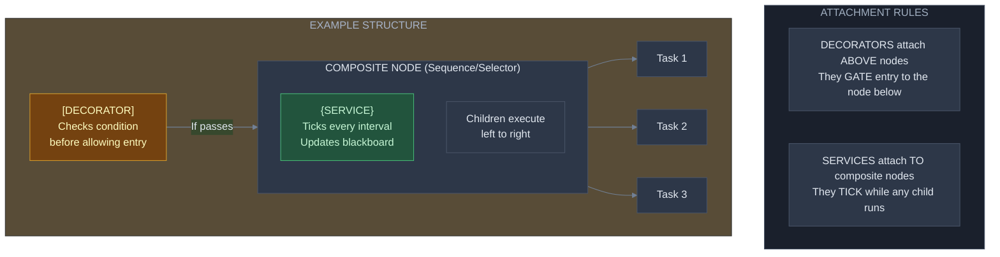
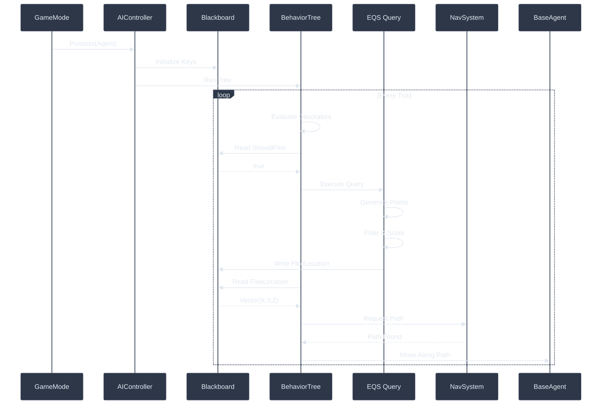

# EQS Migration Guide for WizardJam
## Environment Query System Integration with Behavior Trees

**Author:** Marcus Daley
**Technical Review:** Nick Penney AAA Coding Standards
**Engine:** Unreal Engine 5.4
**Last Updated:** January 2026

---

## Table of Contents

1. [Why EQS Now?](#why-eqs-now)
2. [How EQS Fits Into Unreal's AI Stack](#how-eqs-fits-into-unreals-ai-stack)
3. [Your Existing EQS Assets](#your-existing-eqs-assets)
4. [Core Concepts Before You Start](#core-concepts-before-you-start)
5. [Behavior Tree Execution Order](#behavior-tree-execution-order)
6. [Step-by-Step: Creating Your First EQS-Driven Branch](#step-by-step-creating-your-first-eqs-driven-branch)
7. [Blackboard Keys Reference](#blackboard-keys-reference)
8. [Common Migration Pitfalls](#common-migration-pitfalls)
9. [Architecture Diagrams](#architecture-diagrams)
10. [C++ Integration Patterns](#c-integration-patterns)

---

## Why EQS Now?

### The Problem With Hard-Coded Location Logic

Your current AI makes decisions like "find a collectible" or "flee from player" using direct perception queries in Services or Tasks. This works, but creates problems:

```
Current Pattern (BTService_FindCollectible):
┌─────────────────────────────────────────────────────────────┐
│ Service ticks → Loops through perceived actors →            │
│ Filters by class → Filters by distance → Picks nearest →    │
│ Writes to blackboard                                        │
└─────────────────────────────────────────────────────────────┘
```

**Problems with this approach:**

1. **Single-criteria selection**: You pick the "nearest" collectible, but what if a farther one is safer to reach?
2. **No spatial reasoning**: The AI doesn't consider obstacles, height differences, or enemy positions
3. **Hard to iterate**: Changing selection logic requires C++ recompilation
4. **Not designer-friendly**: Level designers can't tune AI behavior without programmer help

### The EQS Solution

EQS separates **WHERE to look** from **HOW to score** locations:

```
EQS Pattern:
┌─────────────────────────────────────────────────────────────┐
│ Generator creates candidate points →                         │
│ Tests filter out invalid points →                           │
│ Scoring functions rank remaining points →                   │
│ Best point returned to blackboard                           │
└─────────────────────────────────────────────────────────────┘
```

**Benefits:**

1. **Multi-criteria scoring**: Weight distance, safety, visibility, height all at once
2. **Visual debugging**: EQS shows colored spheres in-editor for every scored location
3. **Designer iteration**: Adjust weights in Blueprint without C++ changes
4. **Reusable queries**: One EQS query works for flee, patrol, and cover selection

### When To Use EQS vs. Direct Perception

| Use Direct Perception (Services) | Use EQS |
|----------------------------------|---------|
| Finding a specific actor by class | Finding the best location to move to |
| Checking if player is visible | Choosing between multiple valid positions |
| Simple "nearest enemy" targeting | Flee points, cover positions, patrol routes |
| Binary yes/no checks | Weighted multi-factor decisions |

**Your BTService_FindCollectible is fine** for finding collectibles because you want a specific actor. But **BTTask_EnemyFlee should use EQS** because you need the best flee location considering multiple factors.

---

## How EQS Fits Into Unreal's AI Stack

Understanding the full AI stack prevents confusion about what controls what.

### The Complete AI Stack Hierarchy

```
┌─────────────────────────────────────────────────────────────────────────┐
│                         GAME MODE                                        │
│   QuidditchGameMode: Spawns agents, assigns roles, manages match state  │
└─────────────────────────────────────────────────────────────────────────┘
                                    │
                                    │ Spawns & Possesses
                                    ▼
┌─────────────────────────────────────────────────────────────────────────┐
│                         AI CONTROLLER                                    │
│   AIC_QuidditchController: Owns Blackboard, runs BehaviorTree,          │
│   handles Perception, provides team interface                            │
└─────────────────────────────────────────────────────────────────────────┘
                                    │
                    ┌───────────────┼───────────────┐
                    │               │               │
                    ▼               ▼               ▼
            ┌───────────┐   ┌───────────┐   ┌───────────────┐
            │ BLACKBOARD│   │ PERCEPTION│   │ BEHAVIOR TREE │
            │           │   │           │   │               │
            │ Key-value │   │ Sight     │   │ Decision tree │
            │ memory    │   │ Hearing   │   │ of tasks      │
            └───────────┘   └───────────┘   └───────────────┘
                    │               │               │
                    │               │               │ Runs queries
                    │               │               ▼
                    │               │       ┌───────────────┐
                    │               │       │      EQS      │
                    │               │       │               │
                    │               │       │ Spatial query │
                    │               │       │ system        │
                    │               │       └───────────────┘
                    │               │               │
                    └───────────────┴───────────────┘
                                    │
                                    │ All write to
                                    ▼
                            ┌───────────────┐
                            │  BLACKBOARD   │
                            │  (shared)     │
                            └───────────────┘
                                    │
                                    │ Tasks read from
                                    ▼
                            ┌───────────────┐
                            │    PAWN       │
                            │  BaseAgent    │
                            └───────────────┘
```

### Data Flow For An EQS-Driven Decision

```
1. BehaviorTree reaches node that needs a location
              │
              ▼
2. BTTask_RunEQSQuery executes EQS_SafeLocation query
              │
              ▼
3. EQS generates candidate points around the AI
              │
              ▼
4. EQS tests filter out points (too close to enemy, inside wall)
              │
              ▼
5. EQS scoring ranks remaining points (prefer far from threat, near cover)
              │
              ▼
6. Best point written to Blackboard key "FleeLocation"
              │
              ▼
7. BTTask_MoveTo reads "FleeLocation" and navigates
```

### Key Insight: EQS Doesn't Move The AI

EQS only **finds locations**. It writes a result to the Blackboard. A separate MoveTo task reads that location and actually moves the pawn. This separation is intentional - it allows you to:

- Run a query but decide not to move based on other conditions
- Use the same location for multiple purposes (move there, then face it, then attack from it)
- Cache locations and reuse them across ticks

---

## Your Existing EQS Assets

You already have these EQS assets in `/Content/Both/DoNotConvert/`:

### EQS_SafeLocation.uasset

**Purpose:** Find a safe flee location away from threats

**Likely Configuration:**
- Generator: Points around the querier (AI)
- Test: Distance from player (prefer farther)
- Test: Pathfinding validity (can actually walk there)
- Test: Visibility (prefer not visible to threat)

### EnvQueryContext_Player.uasset

**Purpose:** Custom context that returns the player's location

**Usage:** EQS tests can reference "Player" instead of just "Querier" (the AI). This lets you score locations based on distance to player, visibility to player, etc.

### NewEnvQuery.uasset

**Purpose:** Template or work-in-progress query

---

## Core Concepts Before You Start

### Generators: Where To Look

Generators create the candidate points that EQS will evaluate.

| Generator Type | What It Does | Use Case |
|---------------|--------------|----------|
| Points: Grid | Regular grid around a location | Cover search, patrol points |
| Points: Donut | Ring of points at specific radius | Surrounding behavior, flanking |
| Points: Pathing Grid | Points on NavMesh only | Any ground-based movement |
| Actors Of Class | All actors of a specific class | Finding interactables, collectibles |
| Perceived Actors | Only actors AI has perceived | Targeting perceived threats |

### Tests: Filter and Score

Tests evaluate each candidate point. They can **filter** (remove invalid points) or **score** (rank valid points).

| Test Type | Filter/Score | What It Checks |
|-----------|--------------|----------------|
| Distance | Both | How far from a context (player, self, etc.) |
| Trace | Filter | Line-of-sight check (can see target?) |
| Pathfinding | Filter | Can AI actually walk there? |
| Dot | Score | Direction alignment (facing toward/away) |
| GameplayTags | Filter | Does actor have specific tags? |

### Contexts: Reference Points

Contexts define **what** you're measuring distance/visibility to.

| Context | What It References |
|---------|-------------------|
| Querier | The AI running the query |
| EnvQueryContext_Player | Your custom player context |
| Item | The point being evaluated (used in tests) |

### Scoring: How Tests Combine

Each test has a **Scoring Factor** that determines its weight:

```
Final Score = (Test1 Score × Weight1) + (Test2 Score × Weight2) + ...
```

The point with the highest final score wins.

---

## Behavior Tree Execution Order

Understanding execution order prevents the most common wiring mistakes.

### Left-To-Right, Depth-First

Behavior Trees execute children **left-to-right**. The leftmost child runs first.

```
        ┌─────────┐
        │ ROOT    │
        └────┬────┘
             │
        ┌────┴────┐
        │ SELECTOR │  ← Tries children left-to-right until one succeeds
        └────┬────┘
             │
    ┌────────┼────────┐
    │        │        │
    ▼        ▼        ▼
 ┌──────┐ ┌──────┐ ┌──────┐
 │ Try  │ │ Try  │ │ Try  │
 │ 1st  │ │ 2nd  │ │ 3rd  │
 └──────┘ └──────┘ └──────┘
```

### Composite Node Types

| Node Type | Behavior | Succeeds When | Fails When |
|-----------|----------|---------------|------------|
| **Selector** | Tries children until one succeeds | Any child succeeds | All children fail |
| **Sequence** | Runs children until one fails | All children succeed | Any child fails |
| **Simple Parallel** | Runs main task + background task | Main task finishes | - |

### Where Decorators and Services Attach

**Decorators:** Attach to the **top** of a node. They gate whether the node can run.

**Services:** Attach to **composite nodes** (Selector/Sequence). They tick while any child is active.

```
        ┌─────────────────────────┐
        │ [Decorator: HasChannel] │  ← Gates the entire selector
        ├─────────────────────────┤
        │ {Service: FindTarget}   │  ← Ticks while selector is active
        ├─────────────────────────┤
        │       SELECTOR          │
        └───────────┬─────────────┘
                    │
          ┌─────────┼─────────┐
          │         │         │
          ▼         ▼         ▼
       ┌─────┐  ┌─────┐  ┌─────┐
       │Task1│  │Task2│  │Task3│
       └─────┘  └─────┘  └─────┘
```

---

## Step-by-Step: Creating Your First EQS-Driven Branch

Let's migrate your `BTTask_EnemyFlee` to use EQS properly. We'll create the full branch from scratch.

### Step 1: Verify Your EQS Query Asset

1. Open `/Content/Both/DoNotConvert/EQS_SafeLocation.uasset`
2. Verify it has:
   - A **Generator** (probably Points: Pathing Grid or Points: Donut)
   - A **Distance test** referencing your EnvQueryContext_Player
   - Optionally a **Trace test** for visibility

If the query is empty, we'll configure it in Step 6.

### Step 2: Create or Open Your Blackboard Asset

1. In Content Browser, navigate to `/Content/Blueprints/AI/`
2. Find your Blackboard asset (likely `BB_Standard` or `BB_QuidditchAI`)
3. Double-click to open

**Add these keys if missing:**

| Key Name | Key Type | Purpose |
|----------|----------|---------|
| FleeLocation | Vector | EQS result: best flee position |
| ThreatActor | Object (Actor) | The enemy/player to flee from |
| ShouldFlee | Bool | Decorator check: health below threshold |

**To add a key:**
1. Click **New Key** button in Blackboard editor
2. Select type (Vector, Object, Bool)
3. Name it exactly as shown above
4. For Object types, set Base Class to `AActor`

### Step 3: Create The Flee Branch In Behavior Tree

1. Open your Behavior Tree asset (e.g., `BT_Standard` or create `BT_QuidditchAI`)
2. Locate your root Selector (or create one)

**We will create this structure:**

```
ROOT
 └── SELECTOR (main decision)
      ├── [SEQUENCE: Flee Branch] ← We're building this
      │    ├── Decorator: Blackboard (ShouldFlee == true)
      │    ├── Task: Run EQS Query (EQS_SafeLocation → FleeLocation)
      │    └── Task: Move To (FleeLocation)
      │
      └── [Other branches...]
```

### Step 4: Add The Flee Sequence

1. **Right-click** on your main Selector
2. Select **Add Composite → Sequence**
3. This creates a child Sequence node

**In the Details panel for this Sequence:**
- Node Name: `Flee From Threat`

### Step 5: Add The Decorator (Gate)

1. **Right-click** on the Flee Sequence node
2. Select **Add Decorator → Blackboard**
3. This attaches a decorator above the Sequence

**In the Details panel for the Decorator:**

| Property | Value | Why |
|----------|-------|-----|
| Blackboard Key | `ShouldFlee` | The bool key we check |
| Key Query | Is Set | We want true = flee |
| Observer Aborts | Both | Abort if condition changes mid-execution |

**Understanding Observer Aborts:**

| Value | Meaning |
|-------|---------|
| None | Never abort, finish current execution |
| Self | Abort this branch if condition becomes false |
| Lower Priority | Abort branches to the right if this becomes true |
| Both | Abort self if false, abort others if true |

For flee behavior, use **Both** so:
- If health recovers mid-flee, stop fleeing (Self)
- If health drops while doing something else, interrupt and flee (Lower Priority)

### Step 6: Add The EQS Query Task

1. **Right-click** on the Flee Sequence
2. Select **Add Task → Run EQS Query**
3. Drag this task to be the **first child** (leftmost) of the Sequence

**In the Details panel for Run EQS Query:**

| Property | Value | Why |
|----------|-------|-----|
| Query Template | `EQS_SafeLocation` | Your EQS asset |
| Blackboard Key | `FleeLocation` | Where to store result |
| Run Mode | Single Best Item | We want one location |
| Query Config | (leave default) | Runtime parameters if needed |

### Step 7: Configure The EQS Query Asset (If Empty)

If `EQS_SafeLocation` needs setup:

1. **Double-click** to open `EQS_SafeLocation.uasset`

**Add Generator:**
1. Right-click in graph → **Add Generator**
2. Select **Points: Pathing Grid**
3. In Details panel:
   - Grid Half Size: `1000` (searches 1000 units around AI)
   - Space Between: `200` (point every 200 units)
   - Generate Around: `Querier` (the AI itself)

**Add Distance Test:**
1. Right-click in graph → **Add Test**
2. Select **Distance**
3. In Details panel:
   - Distance To: `EnvQueryContext_Player` (your custom context)
   - Test Purpose: **Score Only** (don't filter, just rank)
   - Scoring Equation: **Inverse Linear** (farther = higher score)
   - Scoring Factor: `1.0`

**Add Pathfinding Test:**
1. Right-click → **Add Test**
2. Select **Pathfinding**
3. In Details panel:
   - Test Purpose: **Filter Only** (remove unreachable points)
   - Context: `Querier`
   - Path From Context: `true`

**Add Trace Test (optional, for visibility):**
1. Right-click → **Add Test**
2. Select **Trace**
3. In Details panel:
   - Test Purpose: **Score Only**
   - Context: `EnvQueryContext_Player`
   - Bool Match: `false` (prefer NOT visible to player)
   - Scoring Factor: `0.5` (less important than distance)

### Step 8: Add The MoveTo Task

1. **Right-click** on the Flee Sequence
2. Select **Add Task → Move To**
3. Drag this task to be the **second child** (right of EQS task)

**In the Details panel for Move To:**

| Property | Value | Why |
|----------|-------|-----|
| Blackboard Key | `FleeLocation` | The EQS result |
| Acceptable Radius | `100` | How close is "arrived" |
| Observe Blackboard Value | `true` | Update if location changes |
| Allow Strafe | `false` | Face movement direction |

### Step 9: Connect The ShouldFlee Logic

Something needs to set `ShouldFlee = true`. Add a **Service** to your main Selector:

1. **Right-click** on the root Selector
2. Select **Add Service → New Blueprint Service** (or use existing)
3. Name it `BTService_CheckFleeCondition`

**In the Service Blueprint:**
- On Tick:
  1. Get controlled pawn
  2. Get health component/value
  3. If health < FleeThreshold (e.g., 30%):
     - Set Blackboard Bool `ShouldFlee` = true
     - Set Blackboard Object `ThreatActor` = perceived threat
  4. Else:
     - Set `ShouldFlee` = false

### Final Branch Structure

```
┌──────────────────────────────────────────────────────────────┐
│                         ROOT SELECTOR                         │
│  {Service: BTService_CheckFleeCondition}                     │
└──────────────────────────────────────────────────────────────┘
                              │
         ┌────────────────────┼────────────────────┐
         │                    │                    │
         ▼                    ▼                    ▼
┌─────────────────┐  ┌─────────────────┐  ┌─────────────────┐
│ FLEE SEQUENCE   │  │ ATTACK SEQUENCE │  │ PATROL SEQUENCE │
│ [Blackboard:    │  │ [Blackboard:    │  │                 │
│  ShouldFlee]    │  │  HasTarget]     │  │                 │
├─────────────────┤  ├─────────────────┤  ├─────────────────┤
│ 1. Run EQS      │  │ 1. Move To      │  │ 1. Find Patrol  │
│    Query        │  │    Target       │  │    Point        │
│ 2. Move To      │  │ 2. Attack       │  │ 2. Move To      │
│    FleeLocation │  │                 │  │ 3. Wait         │
└─────────────────┘  └─────────────────┘  └─────────────────┘

Execution: Flee checked FIRST (leftmost). If ShouldFlee is false,
           selector moves right to Attack. If no target, moves to Patrol.
```

---

## Blackboard Keys Reference

### Required Keys for EQS Integration

| Key Name | Type | Set By | Read By |
|----------|------|--------|---------|
| `FleeLocation` | Vector | Run EQS Query task | Move To task |
| `ThreatActor` | Object (AActor) | Service (perception) | EQS context, decorators |
| `ShouldFlee` | Bool | Service (health check) | Blackboard decorator |
| `TargetActor` | Object (AActor) | Service (perception) | Move To, Attack tasks |
| `TargetLocation` | Vector | Various | Move To task |
| `PerceivedCollectible` | Object (AActor) | BTService_FindCollectible | Move To, Interact tasks |
| `IsFlying` | Bool | BTTask_MountBroom | Decorators, services |
| `SelfActor` | Object (AActor) | Controller setup | EQS contexts |

### Key Type Selection Guide

| If You Need | Use Type | Notes |
|-------------|----------|-------|
| A position in 3D space | Vector | EQS results, patrol points |
| A reference to an actor | Object (AActor base) | Targets, collectibles |
| A yes/no flag | Bool | State checks, conditions |
| A class reference | Class | Spawn types |
| A gameplay tag | Name | Channel names, ability IDs |
| A numeric value | Float or Int | Health %, ammo count |

---

## Common Migration Pitfalls

### Pitfall 1: EQS Query Returns No Results

**Symptom:** Move To task fails immediately, AI stands still

**Causes:**
1. Generator radius too small (no points generated)
2. All points filtered out by tests (pathfinding fails, all visible)
3. NavMesh doesn't cover the area

**Debug Steps:**
1. In editor, select AI and press `'` (apostrophe) to open AI debugger
2. Select "EQS" tab to see query visualization
3. Red spheres = filtered out, Green = valid, Bright green = winner
4. If all red, check your filter tests
5. If no spheres at all, check generator radius and NavMesh coverage

### Pitfall 2: EQS Task Completes But Location Is Wrong

**Symptom:** AI moves to unexpected location

**Causes:**
1. Scoring weights favor wrong criteria
2. Context pointing to wrong actor
3. Inverse scoring when you want direct (or vice versa)

**Fix:**
- Check Scoring Equation: Inverse Linear = farther is better, Linear = closer is better
- Verify Context references the correct actor (Player vs Querier)
- Adjust Scoring Factors to weight important criteria higher

### Pitfall 3: Blackboard Key Not Updated

**Symptom:** Move To says "target not set" despite EQS running

**Causes:**
1. EQS task Blackboard Key property not set
2. Key type mismatch (EQS writes Vector, key is Object)
3. Query returned no valid results (no best item)

**Fix:**
1. Open EQS task Details panel, verify Blackboard Key is assigned
2. Ensure key type matches: Run EQS Query writes a **Vector** for location queries
3. Check EQS debugger for valid results

### Pitfall 4: Flee Branch Never Triggers

**Symptom:** AI ignores low health, continues attacking

**Causes:**
1. Decorator not set up correctly
2. Service not setting ShouldFlee to true
3. Branch order wrong (attack branch is to the LEFT of flee)

**Fix:**
1. Verify decorator Key Query setting
2. Add print/log in service to confirm health check runs
3. **Move flee branch to the LEFT** of attack branch (higher priority)

### Pitfall 5: AI Flees Forever

**Symptom:** AI reaches flee location but keeps fleeing

**Causes:**
1. Observer Aborts not set (doesn't re-evaluate when health recovers)
2. Service keeps ShouldFlee true even after reaching safety
3. Move To Acceptable Radius too small (never "arrives")

**Fix:**
1. Set Observer Aborts = Both on the flee decorator
2. Add distance check in service: if far from threat, clear ShouldFlee
3. Increase Acceptable Radius (try 150-200)

### Pitfall 6: FBlackboardKeySelector Silent Failure (C++ Only)

**Symptom:** Custom C++ task compiles, runs, but blackboard never updates

**Root Cause:** Missing initialization in constructor and/or InitializeFromAsset

**Mandatory Pattern for C++ BT Nodes:**

```cpp
// HEADER
UPROPERTY(EditAnywhere, Category = "Blackboard")
FBlackboardKeySelector OutputKey;

// Override required
virtual void InitializeFromAsset(UBehaviorTree& Asset) override;

// CONSTRUCTOR
UMyBTTask::UMyBTTask()
{
    // Step 1: Tell editor what key types are valid
    OutputKey.AddVectorFilter(this,
        GET_MEMBER_NAME_CHECKED(UMyBTTask, OutputKey));
}

// CPP
void UMyBTTask::InitializeFromAsset(UBehaviorTree& Asset)
{
    Super::InitializeFromAsset(Asset);

    // Step 2: Resolve key name to actual blackboard slot
    if (UBlackboardData* BBAsset = GetBlackboardAsset())
    {
        OutputKey.ResolveSelectedKey(*BBAsset);
    }
}
```

**Without both steps, IsSet() returns false and writes silently fail.**

---

## Architecture Diagrams

### Diagram 1: Full Quidditch AI Behavior Tree with EQS

```mermaid
%%{init: {'theme': 'base', 'themeVariables': { 'primaryColor': '#2d3748', 'primaryTextColor': '#e2e8f0', 'primaryBorderColor': '#4a5568', 'lineColor': '#718096', 'secondaryColor': '#1a202c', 'tertiaryColor': '#2d3748', 'background': '#1a202c'}}}%%
flowchart TB
    subgraph ROOT["ROOT SELECTOR"]
        direction TB
        R[Selector]
    end

    subgraph SVC["Attached Services"]
        S1["{Service: CheckFleeCondition}<br/>Ticks every 0.5s<br/>Sets ShouldFlee bool"]
        S2["{Service: FindCollectible}<br/>Updates PerceivedCollectible"]
    end

    R --> SVC

    subgraph FLEE["🔴 FLEE BRANCH (Priority 1 - Leftmost)"]
        direction TB
        F_DEC["[Decorator: Blackboard]<br/>Key: ShouldFlee == true<br/>Observer Aborts: Both"]
        F_SEQ[Sequence]
        F_EQS["Task: Run EQS Query<br/>Query: EQS_SafeLocation<br/>Output: FleeLocation"]
        F_MOV["Task: Move To<br/>Key: FleeLocation<br/>Radius: 150"]

        F_DEC --> F_SEQ
        F_SEQ --> F_EQS
        F_SEQ --> F_MOV
    end

    subgraph ACQUIRE["🟡 ACQUIRE BROOM (Priority 2)"]
        direction TB
        A_DEC["[Decorator: Blackboard]<br/>Key: HasBroom == false"]
        A_SEQ[Sequence]
        A_SVC["{Service: FindCollectible}<br/>Class: BroomCollectible"]
        A_MOV["Task: Move To<br/>Key: PerceivedCollectible"]
        A_INT["Task: Interact<br/>Key: PerceivedCollectible"]

        A_DEC --> A_SEQ
        A_SEQ --> A_SVC
        A_SEQ --> A_MOV
        A_SEQ --> A_INT
    end

    subgraph FLIGHT["🟢 FLIGHT BRANCH (Priority 3)"]
        direction TB
        FL_DEC["[Decorator: HasChannel]<br/>Channel: Broom"]
        FL_SEQ[Sequence]
        FL_MNT["Task: Mount Broom<br/>Calls SetFlightEnabled(true)"]
        FL_EQS["Task: Run EQS Query<br/>Query: EQS_FlightPath<br/>Output: TargetLocation"]
        FL_FLY["Task: Control Flight<br/>Key: TargetLocation"]

        FL_DEC --> FL_SEQ
        FL_SEQ --> FL_MNT
        FL_SEQ --> FL_EQS
        FL_SEQ --> FL_FLY
    end

    subgraph IDLE["⚪ IDLE (Priority 4 - Fallback)"]
        direction TB
        I_WAIT["Task: Wait<br/>Duration: 2.0s"]
    end

    R --> FLEE
    R --> ACQUIRE
    R --> FLIGHT
    R --> IDLE

    style ROOT fill:#2d3748,stroke:#4a5568,color:#e2e8f0
    style FLEE fill:#742a2a,stroke:#c53030,color:#feb2b2
    style ACQUIRE fill:#744210,stroke:#d69e2e,color:#fefcbf
    style FLIGHT fill:#22543d,stroke:#48bb78,color:#c6f6d5
    style IDLE fill:#2d3748,stroke:#718096,color:#e2e8f0
```



**Reading This Diagram:**
- **Execution flows left-to-right** through branches at the same level
- **Flee Branch (red)** is leftmost = highest priority, checked first
- If Flee decorator fails (ShouldFlee == false), Selector tries Acquire Branch
- **Services** (curly braces {}) tick continuously while their parent is active
- **Decorators** (square brackets []) gate entry to their branch

### Diagram 2: EQS Query Execution Flow

```mermaid
%%{init: {'theme': 'base', 'themeVariables': { 'primaryColor': '#2d3748', 'primaryTextColor': '#e2e8f0', 'primaryBorderColor': '#4a5568', 'lineColor': '#718096', 'secondaryColor': '#1a202c', 'tertiaryColor': '#2d3748'}}}%%
flowchart LR
    subgraph BT["BEHAVIOR TREE"]
        T1["Run EQS Query Task<br/>Starts Query"]
    end

    subgraph EQS["EQS QUERY EXECUTION"]
        direction TB
        G["GENERATOR<br/>Points: Pathing Grid<br/>Creates 50 candidates"]
        G --> |"50 points"| F1
        F1["FILTER TEST<br/>Pathfinding<br/>Remove unreachable"]
        F1 --> |"35 points remain"| F2
        F2["FILTER TEST<br/>Trace to Player<br/>Remove visible spots"]
        F2 --> |"20 points remain"| S1
        S1["SCORE TEST<br/>Distance to Player<br/>Inverse Linear"]
        S1 --> |"20 scored points"| S2
        S2["SCORE TEST<br/>Distance to Querier<br/>Linear (prefer close)"]
        S2 --> |"Final scores"| BEST
        BEST["SELECT BEST<br/>Highest combined score"]
    end

    subgraph BB["BLACKBOARD"]
        KEY["FleeLocation<br/>= Winner Position"]
    end

    T1 --> G
    BEST --> KEY

    style BT fill:#2d3748,stroke:#4a5568,color:#e2e8f0
    style EQS fill:#1a202c,stroke:#4a5568,color:#e2e8f0
    style BB fill:#22543d,stroke:#48bb78,color:#c6f6d5
```



### Diagram 3: Service vs Decorator Attachment Points



### Diagram 4: EQS Data Flow Through AI Stack



---

## C++ Integration Patterns

### Pattern 1: Custom EQS Context (EnvQueryContext_Player)

Your `EnvQueryContext_Player` should look like this:

```cpp
// EnvQueryContext_Player.h
#pragma once

#include "CoreMinimal.h"
#include "EnvironmentQuery/EnvQueryContext.h"
#include "EnvQueryContext_Player.generated.h"

// Returns the player pawn location for EQS tests
UCLASS()
class YOURPROJECT_API UEnvQueryContext_Player : public UEnvQueryContext
{
    GENERATED_BODY()

public:
    virtual void ProvideContext(FEnvQueryInstance& QueryInstance,
        FEnvQueryContextData& ContextData) const override;
};

// EnvQueryContext_Player.cpp
#include "EnvQueryContext_Player.h"
#include "EnvironmentQuery/EnvQueryTypes.h"
#include "EnvironmentQuery/Items/EnvQueryItemType_Actor.h"
#include "Kismet/GameplayStatics.h"

void UEnvQueryContext_Player::ProvideContext(FEnvQueryInstance& QueryInstance,
    FEnvQueryContextData& ContextData) const
{
    APawn* PlayerPawn = UGameplayStatics::GetPlayerPawn(QueryInstance.World, 0);

    if (PlayerPawn)
    {
        UEnvQueryItemType_Actor::SetContextHelper(ContextData, PlayerPawn);
    }
}
```

### Pattern 2: Running EQS From C++ Task

If you need more control than the built-in Run EQS Query task:

```cpp
// In your custom BTTask header
UPROPERTY(EditAnywhere, Category = "EQS")
UEnvQuery* FleeQuery;

UPROPERTY(EditAnywhere, Category = "Blackboard")
FBlackboardKeySelector ResultLocationKey;

// In ExecuteTask
EBTNodeResult::Type UBTTask_CustomFlee::ExecuteTask(
    UBehaviorTreeComponent& OwnerComp, uint8* NodeMemory)
{
    AAIController* AIController = OwnerComp.GetAIOwner();
    if (!AIController || !FleeQuery)
    {
        return EBTNodeResult::Failed;
    }

    // Store reference for callback
    CachedOwnerComp = &OwnerComp;

    // Run query asynchronously
    FEnvQueryRequest QueryRequest(FleeQuery, AIController->GetPawn());
    QueryRequest.Execute(EEnvQueryRunMode::SingleResult,
        this, &UBTTask_CustomFlee::OnQueryFinished);

    // Return InProgress - we'll finish in callback
    return EBTNodeResult::InProgress;
}

void UBTTask_CustomFlee::OnQueryFinished(TSharedPtr<FEnvQueryResult> Result)
{
    if (!CachedOwnerComp)
    {
        return;
    }

    if (Result->IsSuccessful() && Result->Items.Num() > 0)
    {
        // Get best location
        FVector BestLocation = Result->GetItemAsLocation(0);

        // Write to blackboard
        UBlackboardComponent* BB = CachedOwnerComp->GetBlackboardComponent();
        if (BB)
        {
            BB->SetValueAsVector(ResultLocationKey.SelectedKeyName, BestLocation);
        }

        // Signal success
        FinishLatentTask(*CachedOwnerComp, EBTNodeResult::Succeeded);
    }
    else
    {
        // Query failed or no valid results
        FinishLatentTask(*CachedOwnerComp, EBTNodeResult::Failed);
    }
}
```

### Pattern 3: EQS-Aware Flee Task (Fixing Your BTTask_EnemyFlee)

Your existing `BTTask_EnemyFlee` has the structure but commented-out callback. Here's the complete fixed version:

```cpp
// BTTask_EnemyFlee.h
#pragma once

#include "CoreMinimal.h"
#include "BehaviorTree/BTTaskNode.h"
#include "EnvironmentQuery/EnvQueryTypes.h"
#include "BTTask_EnemyFlee.generated.h"

class UEnvQuery;
class UBlackboardComponent;

DECLARE_LOG_CATEGORY_EXTERN(LogFleeBehavior, Log, All);

UCLASS()
class YOURPROJECT_API UBTTask_EnemyFlee : public UBTTaskNode
{
    GENERATED_BODY()

public:
    UBTTask_EnemyFlee();

    virtual EBTNodeResult::Type ExecuteTask(UBehaviorTreeComponent& OwnerComp,
        uint8* NodeMemory) override;
    virtual void InitializeFromAsset(UBehaviorTree& Asset) override;

protected:
    // EQS query asset to find flee location
    UPROPERTY(EditAnywhere, Category = "EQS")
    UEnvQuery* FleeLocationQuery;

    // Blackboard key to store the flee location result
    UPROPERTY(EditAnywhere, Category = "Blackboard")
    FBlackboardKeySelector FleeLocationKey;

    // Search radius for flee points (passed to EQS if needed)
    UPROPERTY(EditAnywhere, Category = "AI")
    float FleeRadius = 1000.0f;

private:
    void OnEQSQueryFinished(TSharedPtr<FEnvQueryResult> Result);

    UPROPERTY()
    UBehaviorTreeComponent* CachedOwnerComp;
};

// BTTask_EnemyFlee.cpp
#include "BTTask_EnemyFlee.h"
#include "AIController.h"
#include "BehaviorTree/BlackboardComponent.h"
#include "BehaviorTree/BehaviorTreeComponent.h"
#include "BehaviorTree/Blackboard/BlackboardKeyType_Vector.h"
#include "EnvironmentQuery/EnvQuery.h"
#include "EnvironmentQuery/EnvQueryManager.h"

DEFINE_LOG_CATEGORY(LogFleeBehavior);

UBTTask_EnemyFlee::UBTTask_EnemyFlee()
{
    NodeName = "Flee (EQS)";
    bNotifyTick = false;

    // CRITICAL: Initialize blackboard key selector filter
    FleeLocationKey.AddVectorFilter(this,
        GET_MEMBER_NAME_CHECKED(UBTTask_EnemyFlee, FleeLocationKey));
}

void UBTTask_EnemyFlee::InitializeFromAsset(UBehaviorTree& Asset)
{
    Super::InitializeFromAsset(Asset);

    // CRITICAL: Resolve key at runtime
    if (UBlackboardData* BBAsset = GetBlackboardAsset())
    {
        FleeLocationKey.ResolveSelectedKey(*BBAsset);
    }
}

EBTNodeResult::Type UBTTask_EnemyFlee::ExecuteTask(
    UBehaviorTreeComponent& OwnerComp, uint8* NodeMemory)
{
    AAIController* AIController = OwnerComp.GetAIOwner();
    if (!AIController)
    {
        UE_LOG(LogFleeBehavior, Warning, TEXT("No AI Controller"));
        return EBTNodeResult::Failed;
    }

    if (!FleeLocationQuery)
    {
        UE_LOG(LogFleeBehavior, Warning, TEXT("No Flee Query assigned"));
        return EBTNodeResult::Failed;
    }

    APawn* Pawn = AIController->GetPawn();
    if (!Pawn)
    {
        return EBTNodeResult::Failed;
    }

    // Cache for callback
    CachedOwnerComp = &OwnerComp;

    // Execute the EQS query
    FEnvQueryRequest QueryRequest(FleeLocationQuery, Pawn);
    QueryRequest.Execute(EEnvQueryRunMode::SingleResult,
        this, &UBTTask_EnemyFlee::OnEQSQueryFinished);

    UE_LOG(LogFleeBehavior, Log, TEXT("Started flee EQS query"));

    return EBTNodeResult::InProgress;
}

void UBTTask_EnemyFlee::OnEQSQueryFinished(TSharedPtr<FEnvQueryResult> Result)
{
    if (!CachedOwnerComp)
    {
        UE_LOG(LogFleeBehavior, Warning, TEXT("Lost behavior tree reference"));
        return;
    }

    if (!Result.IsValid())
    {
        UE_LOG(LogFleeBehavior, Warning, TEXT("Invalid EQS result"));
        FinishLatentTask(*CachedOwnerComp, EBTNodeResult::Failed);
        return;
    }

    if (Result->IsSuccessful() && Result->Items.Num() > 0)
    {
        FVector FleeLocation = Result->GetItemAsLocation(0);

        UE_LOG(LogFleeBehavior, Log, TEXT("Found flee location: %s"),
            *FleeLocation.ToString());

        // Write to blackboard
        UBlackboardComponent* BB = CachedOwnerComp->GetBlackboardComponent();
        if (BB && FleeLocationKey.IsSet())
        {
            BB->SetValueAsVector(FleeLocationKey.SelectedKeyName, FleeLocation);
            FinishLatentTask(*CachedOwnerComp, EBTNodeResult::Succeeded);
        }
        else
        {
            UE_LOG(LogFleeBehavior, Warning, TEXT("Blackboard key not set"));
            FinishLatentTask(*CachedOwnerComp, EBTNodeResult::Failed);
        }
    }
    else
    {
        UE_LOG(LogFleeBehavior, Warning, TEXT("EQS query found no valid flee points"));
        FinishLatentTask(*CachedOwnerComp, EBTNodeResult::Failed);
    }
}
```

---

## Quick Reference: Node Creation Checklist

### Creating a Decorator

1. Right-click parent node → Add Decorator → [Type]
2. Set **Blackboard Key** (what condition to check)
3. Set **Key Query** (Is Set, Is Not Set, equals value)
4. Set **Observer Aborts** (None, Self, Lower Priority, Both)
5. For custom decorators: ensure `CalculateRawConditionValue` returns bool

### Creating a Service

1. Right-click composite node → Add Service → [Type]
2. Set **Interval** (how often to tick, e.g., 0.5s)
3. Set **Random Deviation** (adds randomness to interval)
4. For custom services: implement `TickNode` to update blackboard

### Creating a Task

1. Right-click composite node → Add Task → [Type]
2. Configure task-specific properties in Details panel
3. For Run EQS Query: set Query Template and Blackboard Key
4. For Move To: set Blackboard Key and Acceptable Radius

### Creating an EQS Query

1. Content Browser → Right-click → AI → Environment Query
2. Add Generator (defines search space)
3. Add Tests (filter invalid, score valid)
4. For each test, set Purpose (Filter Only, Score Only, Filter and Score)
5. Adjust Scoring Factor to weight importance

---

## Summary

**Key Takeaways:**

1. **EQS finds locations, doesn't move AI** - Always pair with Move To
2. **Left-to-right execution** - Higher priority branches go LEFT
3. **Decorators gate, Services tick** - Different attachment points, different purposes
4. **Observer Aborts enable reactivity** - Use "Both" for interrupt-and-resume behaviors
5. **FBlackboardKeySelector needs two-step init** - Constructor filter + InitializeFromAsset resolve
6. **Debug with AI Debugger** - Press `'` in PIE to visualize EQS results

Your existing `EQS_SafeLocation` and `EnvQueryContext_Player` are ready to use. The main migration work is wiring them into your Behavior Tree with proper decorators and the Run EQS Query task.

---

*This guide follows Nick Penney AAA Coding Standards and WizardJam development philosophy: quality-first, reusable systems, proper architecture.*
