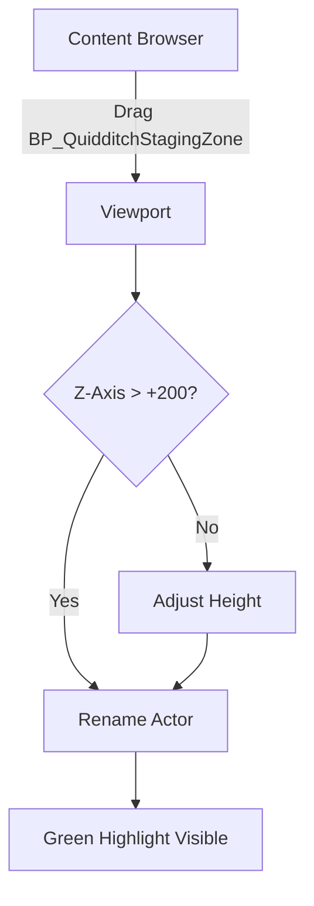
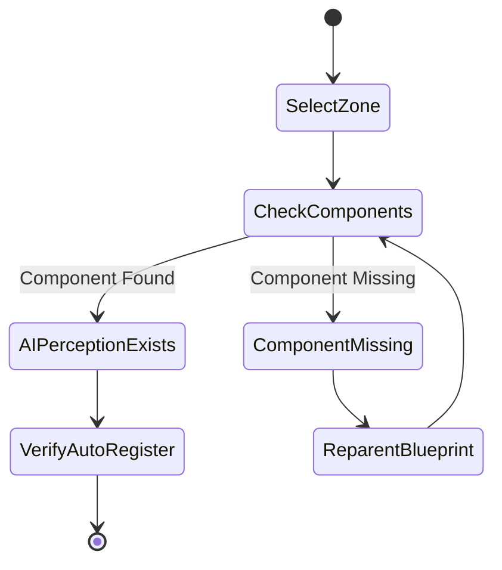
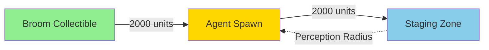

# MRC-001: Initialize Staging Zone and Agent Positions

**System:** Quidditch Match Initialization
**Subsystem:** Staging Zone Placement and Configuration
**Periodicity:** Perform during level setup or when adding new team positions
**Estimated Time:** 15 minutes
**Difficulty:** Intermediate

---

## Purpose

This procedure establishes the spatial reference points for AI agent positioning before match start using the Bee-and-Flower pattern. The QuidditchStagingZone broadcasts its existence via gameplay tags and perception stimuli, allowing AI controllers to autonomously detect and navigate to their designated positions.

---

## Safety Precautions

- [ ] **CRITICAL**: Ensure all changes are saved before PIE testing to prevent configuration loss
- [ ] **WARNING**: Do not place multiple staging zones with identical TeamHint/RoleHint combinations - causes agent confusion
- [ ] **CAUTION**: Verify NavMesh generation is complete before testing ground navigation (Seeker uses flight, but other roles may require NavMesh)
- [ ] **NOTE**: Keep staging zones above ground level for flying agents (Z-axis minimum +200 units recommended)

---

## Tools and Materials Required

| Tool/Asset | Location | Purpose |
|------------|----------|---------|
| BP_QuidditchStagingZone | Content/Blueprints/Quidditch/ | Staging zone actor |
| BP_QuidditchAgent | Content/Blueprints/AI/ | AI-controlled pawn |
| World Outliner | UE5 Editor Window | Actor placement and selection |
| Details Panel | UE5 Editor Window | Property configuration |
| AI Perception Debugger | Console: `showdebug perception` | Verify stimuli detection |

**Reference Files:**
- `Source/END2507/Public/Code/Quidditch/QuidditchStagingZone.h`
- `Source/END2507/Private/Code/Quidditch/QuidditchStagingZone.cpp`
- `Source/END2507/Private/Code/AI/AIC_QuidditchController.cpp`

---

## Procedure

### Step 1: Place Staging Zone Actor

**Objective:** Position BP_QuidditchStagingZone in level with appropriate spatial clearance

1.1. Open target level in UE5 Editor (e.g., `L_QuidditchPitch`)

1.2. Drag `BP_QuidditchStagingZone` from Content Browser into viewport
   - **Initial Placement**: Position at visible location above ground (Z > +200)
   - **Spacing**: Maintain 1000+ unit separation between team zones for clear visual distinction

1.3. Rename actor in World Outliner using convention: `StagingZone_Team[A|B]_[Role]`
   - Example: `StagingZone_TeamA_Seeker`

1.4. Verify actor has green selection highlight (indicates active placement)

**Visual Confirmation:**


---

### Step 2: Configure Team and Role Identifiers

**Objective:** Set integer properties that AI controllers use for zone filtering

2.1. Select staging zone actor in World Outliner

2.2. In Details Panel, locate **Quidditch** category

2.3. Set **TeamHint** property:
   - TeamA = `1`
   - TeamB = `2`
   - **RULE**: TeamHint values MUST match `QuidditchGameMode::GetAgentTeam(ABaseAgent*)` return values

2.4. Set **RoleHint** property (Seeker vertical slice):
   - Seeker = `1`
   - Chaser = `2` (future)
   - Beater = `3` (future)
   - Keeper = `4` (future)

2.5. Verify both properties display in Details Panel without warning icons

**Configuration Table:**

| Property | Type | Seeker TeamA Value | Seeker TeamB Value |
|----------|------|-------------------|-------------------|
| TeamHint | int32 | 1 | 2 |
| RoleHint | int32 | 1 | 1 |

---

### Step 3: Verify AI Perception Stimuli Source

**Objective:** Confirm UAIPerceptionStimuliSourceComponent broadcasts zone location to AI perception system

3.1. With staging zone selected, expand **Components** panel in Details

3.2. Locate `AIPerceptionStimuliSource` component
   - **Expected**: Component should be listed, not greyed out
   - **If Missing**: Re-parent Blueprint or verify C++ constructor initialized component

3.3. Click `AIPerceptionStimuliSource` component to view properties

3.4. Verify **Auto Register as Source** is checked (default: true)

3.5. Run console command in editor: `showdebug perception`
   - **Expected Result**: Staging zone appears as perception stimuli when agent is within SightRadius

**Component Verification:**


---

### Step 4: Adjust Trigger Volume Radius for Flight Navigation

**Objective:** Ensure overlap volume accommodates high-speed flying agents

4.1. Select `SphereCollision` component in staging zone's component hierarchy

4.2. In Details Panel, locate **Shape** category

4.3. Set **Sphere Radius**:
   - **Default**: 300.0 (suitable for walking agents)
   - **Recommended for Flight**: 500.0 - 800.0 (accounts for high-speed overshoot)
   - **RATIONALE**: Flying agents approach at 600+ units/sec, need larger acceptance radius

4.4. Enable **Show for Collision** viewport option (Viewport > Show > Collision)
   - **Visual Check**: Green sphere should be clearly visible around zone center

4.5. Test radius with ruler tool:
   - Viewport Menu > Tools > Measure
   - Verify sphere radius matches Details Panel value

**Flight Acceptance Radius Calculation:**
- Agent Speed: 600 units/sec
- Tick Rate: 60 FPS
- Single Frame Distance: 600 / 60 = 10 units
- Safety Factor: 3x (for latency/overshoot)
- **Recommended Radius**: 10 * 3 * 10 = 300 baseline → **500+ for comfort**

---

### Step 5: Place and Configure Seeker Agent Pawn

**Objective:** Position BaseAgent actor with correct team/role assignment for zone testing

5.1. Drag `BP_QuidditchAgent` into level
   - **Position**: 2000 units away from staging zone (within SightRadius)
   - **Orientation**: Facing toward staging zone (not required, but aids visual debugging)

5.2. Rename agent: `Agent_TeamA_Seeker_01`

5.3. In Details Panel, set **AI Controller Class** = `AIC_QuidditchController`

5.4. Set agent properties (location varies by BP implementation):
   - **Team**: 1 (TeamA) - MUST match StagingZone TeamHint
   - **Role**: 1 (Seeker) - MUST match StagingZone RoleHint

5.5. Verify `BP_BroomCollectible` is placed within agent's perception range (default: 2000 units)

**Agent Placement Diagram:**


---

## Verification and Testing

### Pre-Flight Checklist

- [ ] Staging zone placed above Z +200
- [ ] TeamHint = 1, RoleHint = 1 (for Seeker TeamA)
- [ ] AIPerceptionStimuliSource component active
- [ ] SphereCollision radius >= 500
- [ ] Agent TeamHint/RoleHint match zone values
- [ ] Broom collectible within 2000 units of agent

### PIE Test Sequence

1. Press **Play in Editor (PIE)**

2. Monitor Output Log for initialization messages:
   ```
   LogQuidditchStagingZone: StagingZone_TeamA_Seeker registered with GameMode (Team=1, Role=1)
   LogAIC_QuidditchController: Controller possessed pawn Agent_TeamA_Seeker_01
   LogAIC_QuidditchController: Bound to pawn overlap events
   ```

3. Open **Gameplay Debugger** (apostrophe key `'`)
   - Select agent pawn
   - Navigate to **Perception** tab
   - **Expected**: Staging zone appears in "Currently Perceived" list

4. Wait for agent to:
   - Perceive broom collectible
   - Navigate to broom
   - Pickup broom
   - Mount broom
   - Fly toward staging zone

5. When agent enters staging zone sphere:
   - **Expected Log**: `LogAIC_QuidditchController: Agent reached staging zone (Team=1, Role=1)`
   - **Expected BB Update**: `ReachedStagingZone = true`, `IsReady = true`

6. Verify GameMode received notification:
   ```
   LogQuidditchGameMode: Agent reached staging zone (1/1 required)
   ```

### Troubleshooting Guide

| Symptom | Probable Cause | Solution |
|---------|---------------|----------|
| Agent ignores staging zone | TeamHint/RoleHint mismatch | Verify zone and agent values match exactly |
| "Perceived Actors" empty | Perception not registered | Check AIPerceptionStimuliSource Auto Register |
| Agent overshoots zone | Sphere radius too small | Increase to 600-800 for flight speeds |
| No overlap trigger | Collision channel mismatch | Verify SphereCollision uses Pawn channel |

---

## Related MRC Cross-References

- **MRC-002**: Bind Pawn Overlap Events with Correct Delegate Handling (implements overlap logic)
- **MRC-003**: Validate RequiredAgentOverride Logic (configures match start requirements)
- **MRC-004**: Test Seeker Pathing and Snitch Acquisition (full vertical slice test)

---

## AAA Standards Rationale

### Why Bee-and-Flower Pattern?

**Traditional Approach (Tight Coupling):**
- GameMode holds array of spawn points
- AI queries GameMode: "Where should I go?"
- Requires GameMode to know all role assignments
- Fails when new roles added without code changes

**Bee-and-Flower Pattern (Loose Coupling):**
- Staging zones broadcast existence via tags + perception
- AI autonomously filters zones: "Is this my zone?"
- GameMode only receives notifications: "Agent X arrived"
- Adding new roles = add new zone actors, zero code changes

**Production Benefits:**
1. **Designer Empowerment**: Level designers place zones without programmer intervention
2. **Modular AI**: AIC_QuidditchController works with ANY actor implementing overlap + TeamHint/RoleHint
3. **Scalability**: 7v7 Quidditch (14 agents) needs 14 zones - no code changes required
4. **Debugging**: Visual zone placement in viewport aids spatial reasoning vs abstract spawn transforms
5. **Reusability**: Pattern applicable to football, CTF, team-based objectives in other projects

**Alternative Considered:**
- **Nav Mesh Query Zones**: Rejected - flight navigation doesn't use Nav Mesh, and designer iteration is slower
- **Hardcoded Spawn Transforms**: Rejected - violates "no hardcoded values" standard, breaks when level geometry changes

---

**Document Version**: 1.0
**Last Updated**: February 15, 2026
**Author**: Marcus Daley
**Approved By**: WizardJam Development Team
**Next Review**: Post-vertical slice demo
