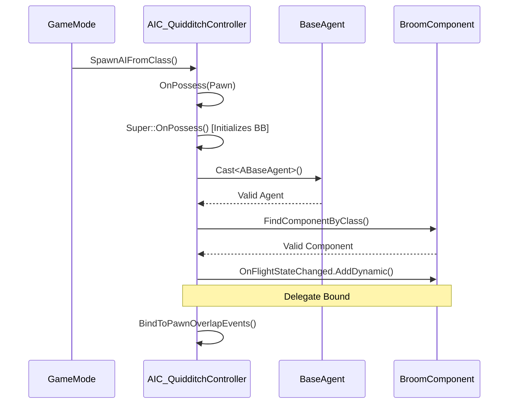
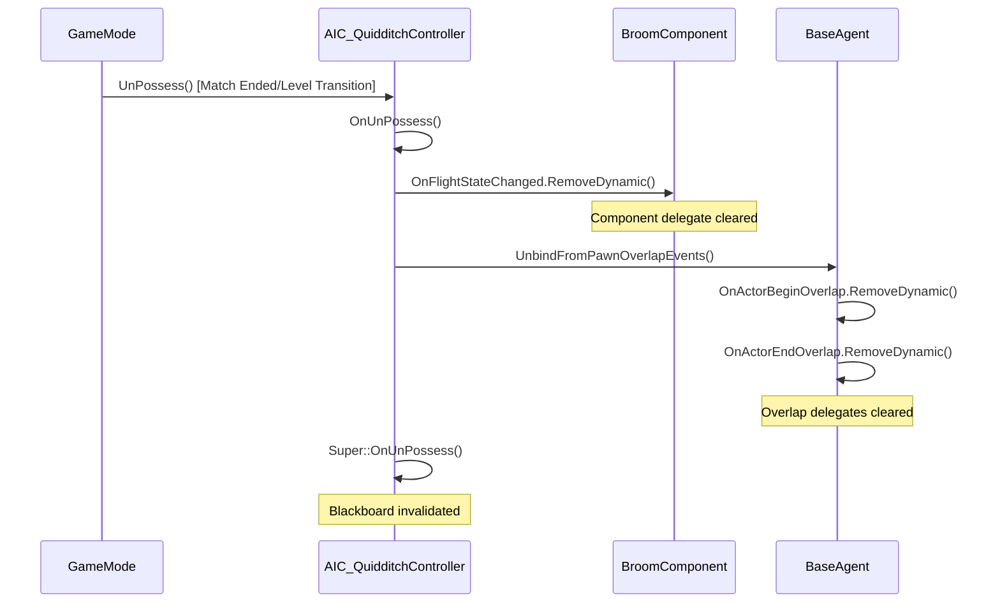
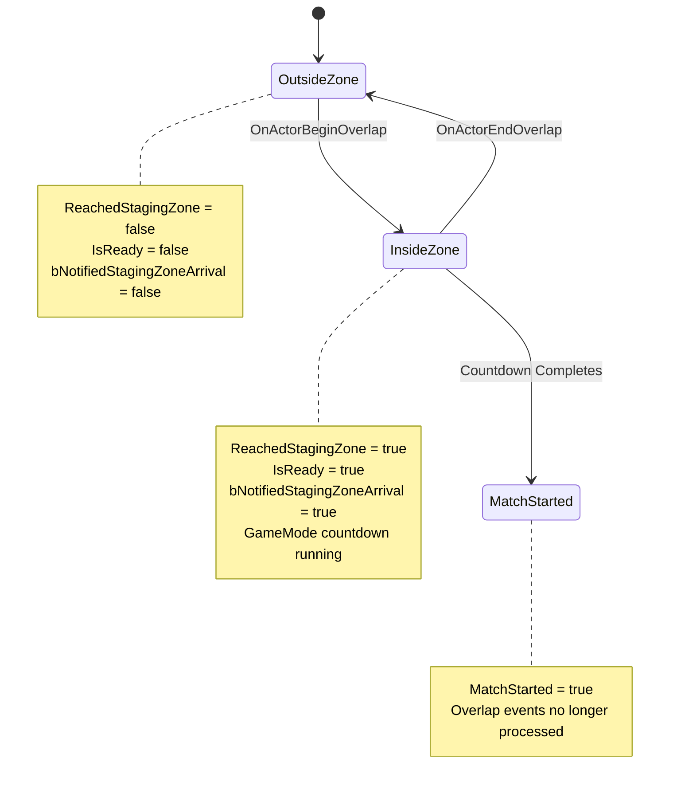

# MRC-002: Bind Pawn Overlap Events with Correct Delegate Handling

**System:** AI Controller Lifecycle Management
**Subsystem:** Delegate Binding and Overlap Event Handling
**Periodicity:** Perform after any AIController class modification or when debugging agent state issues
**Estimated Time:** 20 minutes
**Difficulty:** Advanced

---

## Purpose

This procedure ensures proper delegate lifecycle management for AIC_QuidditchController, preventing memory leaks, stale bindings, and incorrect staging zone state tracking. Implements Observer Pattern for pawn overlap events and broom flight state synchronization.

---

## Safety Precautions

- [ ] **CRITICAL**: Always unbind delegates in OnUnPossess before pawn destruction - failure causes crashes on level transition
- [ ] **CRITICAL**: Unbind BroomComponent delegates BEFORE overlap events - order matters for cleanup
- [ ] **WARNING**: Missing HandlePawnEndOverlap implementation causes agents to remain "ready" after leaving zone
- [ ] **CAUTION**: Binding to OnActorBeginOverlap without checking for existing bindings creates duplicate handlers
- [ ] **NOTE**: Blackboard key updates in overlap handlers require valid Blackboard pointer - check for nullptr

---

## Tools and Materials Required

| Tool/Asset | Location | Purpose |
|------------|----------|---------|
| Visual Studio 2022 | C++ IDE | Code inspection and compilation |
| UE5 Output Log | Editor Window > Developer Tools | Delegate binding confirmation |
| Gameplay Debugger | PIE - Apostrophe key (') | Blackboard state inspection |
| Blueprint Debugger | PIE - Select Actor > Debug | Overlap event visualization |
| Memory Profiler | Session Frontend > Profiler | Delegate leak detection (optional) |

**Reference Files:**
- `Source/END2507/Public/Code/AI/AIC_QuidditchController.h`
- `Source/END2507/Private/Code/AI/AIC_QuidditchController.cpp`
- `Source/END2507/Public/Code/Flight/AC_BroomComponent.h`

---

## Procedure

### Step 1: Verify OnPossess Delegate Binding Sequence

**Objective:** Confirm BroomComponent flight state delegate binds during controller possession

1.1. Open `AIC_QuidditchController.cpp` in Visual Studio

1.2. Locate `OnPossess(APawn* InPawn)` override

1.3. Verify binding order (CRITICAL - must be after Super::OnPossess):
   ```cpp
   void AAIC_QuidditchController::OnPossess(APawn* InPawn)
   {
       Super::OnPossess(InPawn);  // MUST be first - initializes Blackboard

       // Bind BroomComponent delegate
       if (ABaseAgent* Agent = Cast<ABaseAgent>(InPawn))
       {
           if (UAC_BroomComponent* Broom = Agent->FindComponentByClass<UAC_BroomComponent>())
           {
               Broom->OnFlightStateChanged.AddDynamic(this, &AAIC_QuidditchController::HandleFlightStateChanged);
               LOG_DISPLAY(TEXT("Bound to BroomComponent OnFlightStateChanged"));
           }
       }

       BindToPawnOverlapEvents();  // Called after component bindings
   }
   ```

1.4. Check for defensive null checks:
   - `Cast<ABaseAgent>` validates pawn type
   - `FindComponentByClass` validates component existence
   - **Missing Checks = Runtime Crash Risk**

1.5. Verify log statement exists for debugging
   - **Best Practice**: Every delegate binding should log success for PIE verification

**Binding Sequence Flow:**


---

### Step 2: Implement Dual Overlap Event Binding (Begin + End)

**Objective:** Bind BOTH OnActorBeginOverlap AND OnActorEndOverlap to track zone entry/exit

2.1. Locate `BindToPawnOverlapEvents()` function implementation

2.2. Verify dual binding pattern:
   ```cpp
   void AAIC_QuidditchController::BindToPawnOverlapEvents()
   {
       APawn* ControlledPawn = GetPawn();
       if (!ControlledPawn)
       {
           LOG_WARNING(TEXT("BindToPawnOverlapEvents: No controlled pawn"));
           return;
       }

       // Bind BEGIN overlap
       ControlledPawn->OnActorBeginOverlap.AddDynamic(this, &AAIC_QuidditchController::HandlePawnBeginOverlap);

       // Bind END overlap (CRITICAL - prevents stuck "ready" state)
       ControlledPawn->OnActorEndOverlap.AddDynamic(this, &AAIC_QuidditchController::HandlePawnEndOverlap);

       LOG_DISPLAY(TEXT("Bound to pawn overlap events (Begin + End)"));
   }
   ```

2.3. **ANTI-PATTERN CHECK**: Verify function does NOT use `AddUniqueDynamic`
   - **Reason**: Adds overhead, unnecessary if unbinding is correct
   - **Preferred**: Single `AddDynamic` with guaranteed unbind in OnUnPossess

2.4. Verify log distinguishes between begin-only vs dual binding
   - Legacy code may only bind BeginOverlap
   - Log message should confirm both delegates bound

**Dual Binding Rationale:**

| Event | Purpose | Blackboard Updates | GameMode Notification |
|-------|---------|-------------------|----------------------|
| OnActorBeginOverlap | Zone entry detection | ReachedStagingZone = true, IsReady = true | HandleAgentReachedStagingZone() |
| OnActorEndOverlap | Zone exit detection | ReachedStagingZone = false, IsReady = false | HandleAgentLeftStagingZone() |

**Why Both Are Required:**
- Without EndOverlap: Agent stays "ready" permanently if they leave zone before match starts
- Scenario: Agent enters zone, match countdown starts, agent is bumped out by collision
- **Expected Behavior**: Countdown cancels, agent re-enters to restart countdown
- **Bug Without EndOverlap**: Countdown continues despite agent not in zone

---

### Step 3: Verify OnUnPossess Unbind Order (BroomComponent FIRST)

**Objective:** Ensure delegates unbind in reverse order of binding to prevent use-after-free

3.1. Locate `OnUnPossess()` override in AIC_QuidditchController.cpp

3.2. Verify unbind order (CRITICAL - reverse of OnPossess):
   ```cpp
   void AAIC_QuidditchController::OnUnPossess()
   {
       // STEP 1: Unbind BroomComponent delegate (if bound)
       if (APawn* ControlledPawn = GetPawn())
       {
           if (ABaseAgent* Agent = Cast<ABaseAgent>(ControlledPawn))
           {
               if (UAC_BroomComponent* Broom = Agent->FindComponentByClass<UAC_BroomComponent>())
               {
                   Broom->OnFlightStateChanged.RemoveDynamic(this, &AAIC_QuidditchController::HandleFlightStateChanged);
                   LOG_DISPLAY(TEXT("Unbound BroomComponent OnFlightStateChanged"));
               }
           }
       }

       // STEP 2: Unbind overlap events (AFTER component cleanup)
       UnbindFromPawnOverlapEvents();

       // STEP 3: Call Super LAST (destroys Blackboard reference)
       Super::OnUnPossess();
   }
   ```

3.3. **CRITICAL ORDER EXPLANATION:**
   - BroomComponent delegate unbound first (component may be destroyed before pawn)
   - Overlap events unbound second (pawn still valid)
   - Super::OnUnPossess() called last (invalidates Blackboard pointer)

3.4. Verify each unbind has null checks:
   - `GetPawn()` may return nullptr if pawn already destroyed
   - Defensive checks prevent crash during abnormal shutdown (e.g., force quit PIE)

**Unbind Sequence Flow:**


---

### Step 4: Implement HandlePawnEndOverlap State Reset

**Objective:** Reset staging zone state when agent exits zone before match start

4.1. Locate `HandlePawnEndOverlap()` function (NEW implementation)

4.2. Verify signature matches delegate:
   ```cpp
   UFUNCTION()
   void HandlePawnEndOverlap(AActor* OverlappedActor, AActor* OtherActor);
   ```

4.3. Verify implementation resets state:
   ```cpp
   void AAIC_QuidditchController::HandlePawnEndOverlap(AActor* OverlappedActor, AActor* OtherActor)
   {
       // Only process if we previously notified arrival
       if (!bNotifiedStagingZoneArrival)
       {
           return;
       }

       // Verify it's the staging zone we entered
       AQuidditchStagingZone* Zone = Cast<AQuidditchStagingZone>(OtherActor);
       if (!Zone)
       {
           return;
       }

       // Match team/role (same filter as BeginOverlap)
       AQuidditchGameMode* GM = Cast<AQuidditchGameMode>(GetWorld()->GetAuthGameMode());
       if (!GM) return;

       ABaseAgent* Agent = Cast<ABaseAgent>(GetPawn());
       if (!Agent) return;

       int32 AgentTeam = GM->GetAgentTeam(Agent);
       int32 AgentRole = GM->GetAgentRole(Agent);

       if (Zone->TeamHint != AgentTeam || Zone->RoleHint != AgentRole)
       {
           return;  // Not our zone
       }

       // Reset state
       bNotifiedStagingZoneArrival = false;

       // Clear Blackboard keys
       if (UBlackboardComponent* BB = GetBlackboardComponent())
       {
           BB->SetValueAsBool(ReachedStagingZoneKeyName, false);
           BB->SetValueAsBool(IsReadyKeyName, false);
       }

       // Notify GameMode of departure
       GM->HandleAgentLeftStagingZone(Agent);

       LOG_DISPLAY(TEXT("Agent left staging zone (Team=%d, Role=%d)"), AgentTeam, AgentRole);
   }
   ```

4.4. **KEY IMPLEMENTATION NOTES:**
   - Early-out if `bNotifiedStagingZoneArrival == false` (prevents redundant processing)
   - Zone filtering MUST match BeginOverlap logic (TeamHint/RoleHint comparison)
   - Blackboard updates mirror BeginOverlap (symmetrical state machine)
   - GameMode notification enables countdown cancellation

4.5. Verify GameMode handler exists:
   - Open `QuidditchGameMode.cpp`
   - Locate `HandleAgentLeftStagingZone(ABaseAgent* Agent)`
   - Confirm it removes agent from ReadyAgents TSet
   - Confirm it cancels countdown if running

---

### Step 5: Test Overlap Enter/Exit Cycle for State Consistency

**Objective:** Validate no permanent state corruption after multiple zone entries

5.1. Open test level with single staging zone and agent

5.2. Set `RequiredAgentOverride = 1` in BP_QuidditchGameMode

5.3. Press PIE and monitor Output Log

5.4. **Test Sequence 1: Normal Entry**
   - Agent enters zone
   - **Expected Logs**:
     ```
     LogAIC_QuidditchController: Agent reached staging zone (Team=1, Role=1)
     LogQuidditchGameMode: Agent reached staging zone (1/1 required)
     LogQuidditchGameMode: All agents ready - starting countdown
     ```
   - **Expected Blackboard**: `ReachedStagingZone = true`, `IsReady = true`

5.5. **Test Sequence 2: Exit Before Countdown Completes**
   - Use console command: `possess 0` (switch to player control)
   - Manually fly agent out of zone sphere
   - **Expected Logs**:
     ```
     LogAIC_QuidditchController: Agent left staging zone (Team=1, Role=1)
     LogQuidditchGameMode: Agent left staging zone - countdown cancelled
     ```
   - **Expected Blackboard**: `ReachedStagingZone = false`, `IsReady = false`

5.6. **Test Sequence 3: Re-Entry**
   - Console: `possess 1` (return to AI control)
   - Agent navigates back to zone
   - **Expected**: Countdown restarts from 3 seconds
   - **Expected Blackboard**: Keys return to `true`

5.7. **Test Sequence 4: Rapid Enter/Exit/Enter**
   - Manually trigger overlap events in quick succession (use console teleport)
   - **Expected**: `bNotifiedStagingZoneArrival` prevents duplicate GameMode calls
   - **Expected**: No log spam, clean state transitions

**State Machine Validation:**


---

## Verification and Testing

### Code Review Checklist

- [ ] OnPossess binds BroomComponent delegate before overlap events
- [ ] BindToPawnOverlapEvents binds BOTH Begin and End overlap
- [ ] OnUnPossess unbinds BroomComponent BEFORE overlap events
- [ ] UnbindFromPawnOverlapEvents removes BOTH delegates
- [ ] HandlePawnEndOverlap resets bNotifiedStagingZoneArrival
- [ ] HandlePawnEndOverlap mirrors BeginOverlap zone filtering logic
- [ ] All delegate handlers have UFUNCTION() macro
- [ ] All bindings have corresponding log statements

### Runtime Verification

**PIE Test - Delegate Binding Confirmation:**

1. Start PIE with single agent
2. Filter Output Log by category: `LogAIC_QuidditchController`
3. **Expected Log Sequence**:
   ```
   LogAIC_QuidditchController: Controller possessed pawn Agent_TeamA_Seeker_01
   LogAIC_QuidditchController: Bound to BroomComponent OnFlightStateChanged
   LogAIC_QuidditchController: Bound to pawn overlap events (Begin + End)
   ```

**Gameplay Debugger - Blackboard State:**

1. Open Gameplay Debugger (apostrophe key)
2. Select agent pawn in World Outliner
3. Navigate to Blackboard tab
4. Monitor keys during zone entry/exit:

| Event | ReachedStagingZone | IsReady | bNotifiedStagingZoneArrival (C++ only) |
|-------|-------------------|---------|---------------------------------------|
| Before Entry | false | false | false |
| Enter Zone | true | true | true |
| Exit Zone | false | false | false |
| Re-Enter | true | true | true |

**Memory Leak Test (Advanced):**

1. Enable Unreal Insights: `UnrealInsights.exe`
2. Start PIE with memory tracking: `stat memory`
3. Spawn/despawn 10 agents in loop
4. Check Delegate Allocations in Insights
5. **Expected**: Delegate count returns to baseline after despawn (no leaks)

### Troubleshooting Guide

| Symptom | Probable Cause | Solution |
|---------|---------------|----------|
| "Bound to pawn overlap events" never logs | BindToPawnOverlapEvents not called | Verify OnPossess calls function |
| Agent stays "ready" after leaving zone | HandlePawnEndOverlap not implemented | Add EndOverlap handler (Step 4) |
| Crash on level transition | Delegates not unbound | Verify OnUnPossess unbind order (Step 3) |
| Countdown doesn't cancel on exit | GameMode handler missing | Implement HandleAgentLeftStagingZone |
| Duplicate "reached zone" logs | No early-out check | Add bNotifiedStagingZoneArrival guard |

---

## Related MRC Cross-References

- **MRC-001**: Initialize Staging Zone and Agent Positions (sets up overlap targets)
- **MRC-003**: Validate RequiredAgentOverride Logic (uses ReadyAgents TSet modified by these handlers)
- **MRC-004**: Test Seeker Pathing and Snitch Acquisition (full vertical slice includes zone overlap)

---

## AAA Standards Rationale

### Why Observer Pattern for State Synchronization?

**Anti-Pattern (Polling in BT Service):**
```cpp
// ❌ FORBIDDEN - Ticks every frame, wastes CPU
void UBTService_CheckZoneStatus::TickNode()
{
    AQuidditchGameMode* GM = Cast<AQuidditchGameMode>(GetWorld()->GetAuthGameMode());
    bool bInZone = GM->IsAgentInZone(Agent);  // Expensive query
    Blackboard->SetValueAsBool(InZoneKey, bInZone);
}
```
**Problems:**
- 60 queries/sec per agent (14 agents = 840 queries/sec for match check)
- Tight coupling between BT and GameMode
- Race conditions if zone state changes mid-tick

**AAA Pattern (Event-Driven via Delegates):**
```cpp
// ✅ CORRECT - Fires once on state change
void HandlePawnBeginOverlap(AActor* OverlappedActor, AActor* OtherActor)
{
    // Filter, validate, update BB once
    Blackboard->SetValueAsBool(ReachedStagingZone, true);
    GameMode->HandleAgentReachedStagingZone(Agent);  // Broadcast, not query
}
```
**Benefits:**
1. **Performance**: State updates only when changed (2 events per agent vs 840 ticks/sec)
2. **Decoupling**: Controller listens to Pawn overlap, doesn't query GameMode
3. **Correctness**: Immediate state sync, no frame delay
4. **Scalability**: 100 agents = 200 events total, not 6000 queries/sec

### Why Unbind in Reverse Order?

**Object Lifetime Dependencies:**
```
OnPossess:  Super → BroomComponent → OverlapEvents
OnUnPossess: OverlapEvents → BroomComponent → Super
```

**Reasoning:**
- `Super::OnPossess()` creates Blackboard (required for delegate handlers)
- BroomComponent delegates may write to Blackboard (needs valid pointer)
- Overlap delegates may access BroomComponent (needs component alive)
- `Super::OnUnPossess()` destroys Blackboard (must be last)

**Real-World Crash Scenario:**
- Match ends, GameMode calls UnPossess on all controllers
- Controller A unbinds incorrectly: Super → Broom → Overlap
- `Super::OnUnPossess()` destroys Blackboard
- BroomComponent fires OnFlightStateChanged during shutdown
- Delegate handler tries to write to destroyed Blackboard
- **Result**: Access violation crash in packaged build

### Why Dual Overlap Binding Is Non-Obvious

**UE5 Overlap Behavior:**
- `OnActorBeginOverlap` fires when collision primitive enters
- `OnActorEndOverlap` fires when primitive exits
- **Gotcha**: No automatic state reset - both must be manually bound

**Discovered Bug Pattern:**
- Developer implements BeginOverlap, forgets EndOverlap
- Agent enters zone → `bReady = true`
- Agent bumped out by collision → State never resets
- GameMode sees agent as "ready" despite not in zone
- Match starts with agent outside zone → Breaks vertical slice

**Prevention:**
- Bind both events in same function (BindToPawnOverlapEvents)
- Mirror state updates (Begin sets true, End sets false)
- Log both events for debugging
- Add automated test: Enter → Exit → Verify BB keys reset

---

**Document Version**: 1.0
**Last Updated**: February 15, 2026
**Author**: Marcus Daley
**Approved By**: WizardJam Development Team
**Next Review**: Post-vertical slice demo
