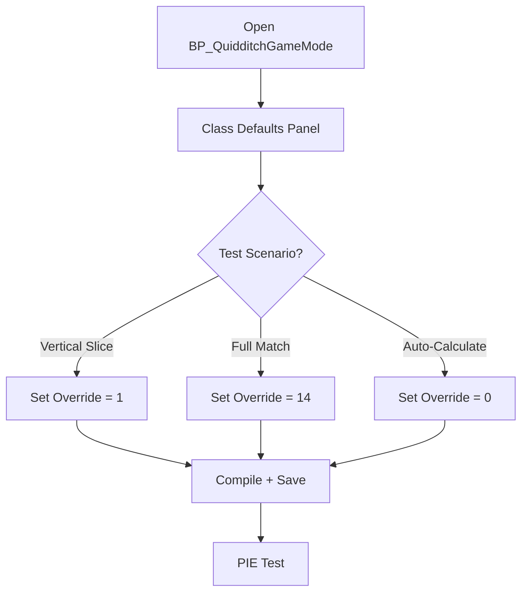
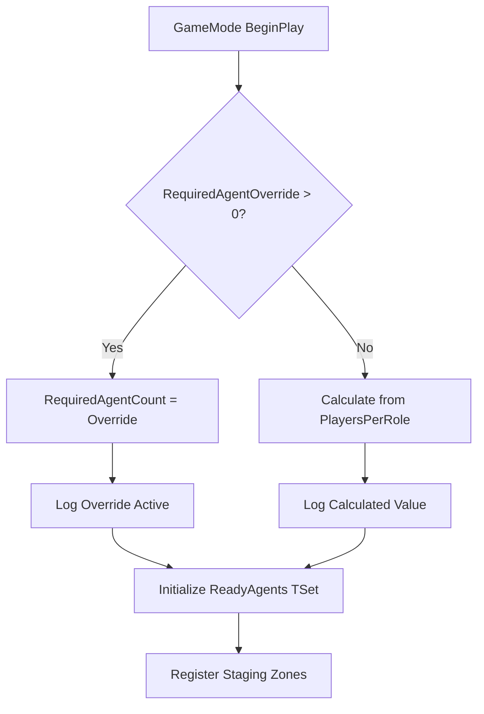
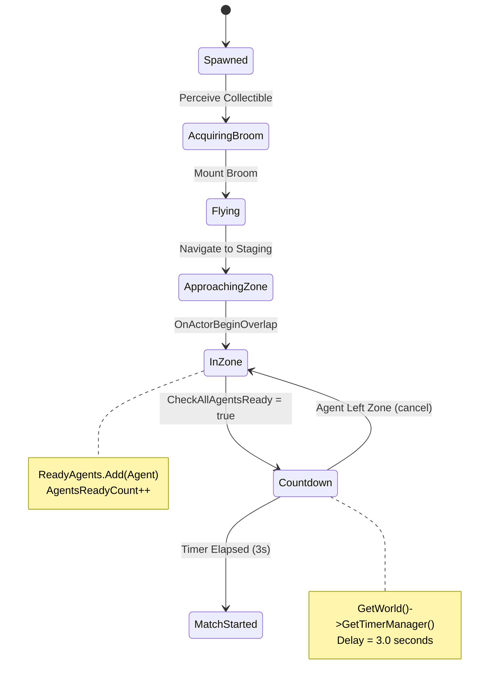
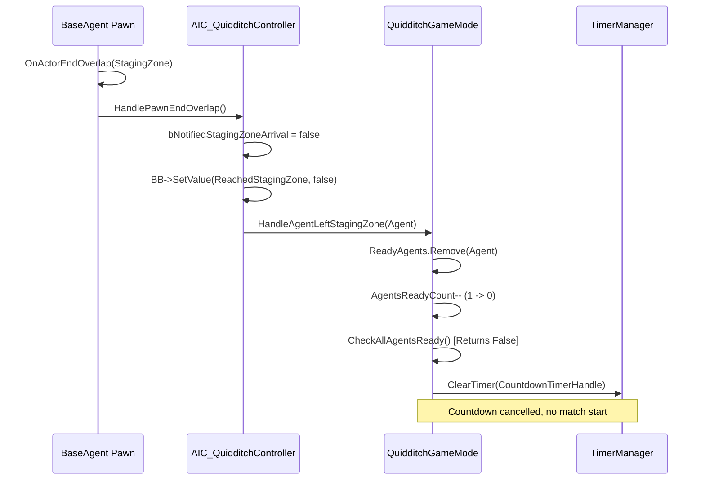
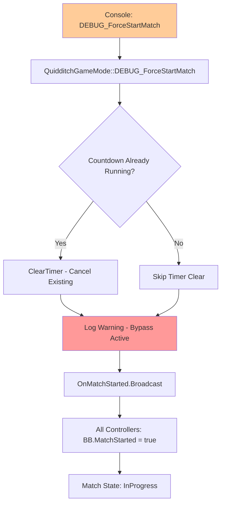

# MRC-003: Validate RequiredAgentOverride Logic

**System:** Match Initialization and Start Conditions
**Subsystem:** Agent Readiness Tracking and Countdown Management
**Periodicity:** Perform after modifying team composition or when debugging match start issues
**Estimated Time:** 25 minutes
**Difficulty:** Intermediate

---

## Purpose

This procedure validates the QuidditchGameMode's agent counting system, which determines when all players are ready and triggers match countdown. Implements override mechanism for vertical slice testing (single Seeker) vs full 7v7 match (14 agents). Ensures HandleAgentLeftStagingZone correctly cancels countdown when agents exit zones prematurely.

---

## Safety Precautions

- [ ] **CRITICAL**: Always test RequiredAgentOverride = 1 before full team testing - prevents long wait times during iteration
- [ ] **WARNING**: Setting RequiredAgentOverride = 0 uses calculated value (14 for full teams) - ensure sufficient agents spawned
- [ ] **CAUTION**: DEBUG_ForceStartMatch() bypasses all safety checks - only use for cinematic recording or final testing
- [ ] **NOTE**: ReadyAgents TSet uses pointer equality - same agent re-entering zone won't increment count twice
- [ ] **NOTE**: Countdown timer continues if agents stay in zone - leaving zone is only cancel trigger

---

## Tools and Materials Required

| Tool/Asset | Location | Purpose |
|------------|----------|---------|
| BP_QuidditchGameMode | Content/Blueprints/GameModes/ | GameMode Blueprint class |
| Details Panel | UE5 Editor Window | Configure RequiredAgentOverride |
| Output Log | Editor Window > Developer Tools | Countdown and agent count logging |
| Console Commands | PIE - Tilde key (~) | DEBUG_ForceStartMatch testing |
| World Outliner | UE5 Editor Window | Agent spawn verification |

**Reference Files:**
- `Source/END2507/Public/Code/GameModes/QuidditchGameMode.h`
- `Source/END2507/Private/Code/GameModes/QuidditchGameMode.cpp`

---

## Procedure

### Step 1: Configure RequiredAgentOverride in GameMode Blueprint

**Objective:** Set testing mode to bypass full team requirement for vertical slice validation

1.1. Open `BP_QuidditchGameMode` in UE5 Editor
   - Content Browser: `Content/Blueprints/GameModes/BP_QuidditchGameMode`
   - Double-click to open Blueprint Editor

1.2. Navigate to **Class Defaults** (Class Defaults button in toolbar)

1.3. Locate **Match Configuration** category in Details Panel

1.4. Find `RequiredAgentOverride` property (int32):
   - **Type**: Integer
   - **Default**: 0 (uses calculated value)
   - **Tooltip**: "Override required agent count for testing. 0 = use calculated value (2*(Seekers+Chasers+Beaters+Keepers))"

1.5. Set value based on test scenario:

| Test Scenario | RequiredAgentOverride Value | Expected Agent Count |
|--------------|----------------------------|---------------------|
| Seeker Vertical Slice | 1 | 1 Seeker (TeamA or TeamB) |
| Single Team Test | 7 | 1 Seeker, 3 Chasers, 2 Beaters, 1 Keeper |
| Full Match (2 Teams) | 14 | 7 agents × 2 teams |
| Auto-Calculate | 0 | 2 × (PlayersPerRole sum) |

1.6. **For Seeker Vertical Slice**: Set `RequiredAgentOverride = 1`

1.7. Compile and save Blueprint

**Configuration Visual:**


---

### Step 2: Verify BeginPlay Override Activation Log

**Objective:** Confirm GameMode reads override value and logs activation during initialization

2.1. Press **Play in Editor (PIE)**

2.2. Immediately open Output Log (Window > Developer Tools > Output Log)

2.3. Filter log by category: `LogQuidditchGameMode`

2.4. Locate BeginPlay initialization message:
   ```
   LogQuidditchGameMode: Display: BeginPlay - RequiredAgentOverride = 1 (calculated would be 14)
   ```

2.5. **Verification Points**:
   - Override value matches Details Panel setting
   - Calculated value shows expected team composition (14 = 2 teams × 7 roles)
   - Log entry appears before any agent registration messages

2.6. If override = 0, verify calculated value:
   ```cpp
   // From QuidditchGameMode.cpp BeginPlay():
   RequiredAgentCount = 2 * (
       PlayersPerRole.FindRef(EQuidditchRole::Seeker) +      // 1
       PlayersPerRole.FindRef(EQuidditchRole::Chaser) +      // 3
       PlayersPerRole.FindRef(EQuidditchRole::Beater) +      // 2
       PlayersPerRole.FindRef(EQuidditchRole::Keeper)        // 1
   );  // Total: 2 * 7 = 14
   ```

**BeginPlay Logic Flow:**


---

### Step 3: Test Single Agent Zone Arrival Triggers Countdown

**Objective:** Validate CheckAllAgentsReady logic correctly evaluates override count

3.1. Ensure test level has:
   - 1 × BP_QuidditchStagingZone (TeamHint=1, RoleHint=1)
   - 1 × BP_QuidditchAgent (Team=1, Role=Seeker)
   - 1 × BP_BroomCollectible (within agent perception range)

3.2. Verify `RequiredAgentOverride = 1` in BP_QuidditchGameMode

3.3. Start PIE and monitor agent behavior sequence:
   - Agent perceives broom
   - Agent moves to broom
   - Agent collects broom
   - Agent mounts broom
   - Agent flies to staging zone

3.4. When agent enters staging zone sphere, monitor Output Log for sequence:
   ```
   LogAIC_QuidditchController: Display: Agent reached staging zone (Team=1, Role=1)
   LogQuidditchGameMode: Display: HandleAgentReachedStagingZone - Agent added to ReadyAgents (1/1 required)
   LogQuidditchGameMode: Display: CheckAllAgentsReady - All agents ready (1 >= 1)
   LogQuidditchGameMode: Display: StartCountdown - Match begins in 3 seconds
   ```

3.5. **Key Validation Points**:
   - `HandleAgentReachedStagingZone` adds agent to `ReadyAgents TSet`
   - Agent count increments to 1
   - Count meets requirement (1/1)
   - `CheckAllAgentsReady` returns true
   - `StartCountdown` begins 3-second timer

3.6. Open Gameplay Debugger (apostrophe key), verify Blackboard:
   - `MatchStarted` = false (still in countdown)
   - `ReachedStagingZone` = true
   - `IsReady` = true

**Agent Readiness State Machine:**


---

### Step 4: Test Agent Exit Cancels Countdown

**Objective:** Verify HandleAgentLeftStagingZone removes agent from ReadyAgents and cancels timer

4.1. Continue from Step 3 (agent in zone, countdown running)

4.2. Before countdown completes, switch to manual control:
   - Press tilde key (~) to open console
   - Type: `possess 0` (assumes agent is PlayerIndex 1, player is 0)
   - **Result**: You now control the agent pawn

4.3. Manually fly agent out of staging zone sphere
   - Use WASD to move outside green sphere (visible via Show > Collision)
   - **Trigger**: `OnActorEndOverlap` fires

4.4. Monitor Output Log for cancellation sequence:
   ```
   LogAIC_QuidditchController: Display: Agent left staging zone (Team=1, Role=1)
   LogQuidditchGameMode: Display: HandleAgentLeftStagingZone - Agent removed from ReadyAgents (0/1 required)
   LogQuidditchGameMode: Display: CancelCountdown - Agent left staging zone, countdown cancelled
   ```

4.5. **Verification Points**:
   - `ReadyAgents.Remove(Agent)` decrements count to 0
   - `GetWorld()->GetTimerManager().ClearTimer(CountdownTimerHandle)` stops countdown
   - No "Match Started" message appears

4.6. Return control to AI and re-test countdown restart:
   - Console: `possess 1`
   - Agent flies back to zone
   - **Expected**: Countdown restarts from 3 seconds

**Countdown Cancellation Flow:**


---

### Step 5: Test DEBUG_ForceStartMatch Bypass

**Objective:** Validate emergency bypass for cinematic recording or presentation demos

5.1. Set `RequiredAgentOverride = 14` (full match requirement)

5.2. Spawn only 1 agent in level (insufficient to start normally)

5.3. Start PIE

5.4. Open console (~) and type:
   ```
   DEBUG_ForceStartMatch
   ```

5.5. Monitor Output Log:
   ```
   LogQuidditchGameMode: Warning: DEBUG_ForceStartMatch - Bypassing all readiness checks
   LogQuidditchGameMode: Display: OnMatchStarted broadcast (14 required, 1 ready)
   LogQuidditchGameMode: Display: Match state: InProgress
   ```

5.6. **Verification Points**:
   - Match starts despite insufficient agents (1/14)
   - Warning log indicates bypass active
   - All agent Blackboards receive `MatchStarted = true` update
   - Behavior Trees transition to match behavior (e.g., ChaseSnitch for Seeker)

5.7. **USE CASES FOR DEBUG_ForceStartMatch**:
   - Recording gameplay footage (don't wait for 14 agents)
   - Testing match end conditions (Snitch caught) without setup
   - Demonstrating single-agent behavior during presentations
   - **NOT FOR NORMAL TESTING** - Masks readiness issues

**Force Start Bypass:**


---

## Verification and Testing

### Pre-Flight Checklist

- [ ] BP_QuidditchGameMode has RequiredAgentOverride configured
- [ ] Test level has correct number of staging zones (1 for vertical slice)
- [ ] Test level has correct number of agents (matches override value)
- [ ] Agent TeamHint/RoleHint matches staging zone configuration
- [ ] Output Log filter set to `LogQuidditchGameMode`

### Automated Test Scenarios

**Test 1: Override = 1, 1 Agent (Vertical Slice)**

| Step | Action | Expected Log | Expected BB State |
|------|--------|--------------|------------------|
| 1 | PIE Start | `RequiredAgentOverride = 1` | MatchStarted = false |
| 2 | Agent enters zone | `1/1 required - All ready` | ReachedStagingZone = true |
| 3 | Countdown starts | `Match begins in 3 seconds` | IsReady = true |
| 4 | Timer expires | `OnMatchStarted broadcast` | MatchStarted = true |

**Test 2: Override = 1, Agent Exit During Countdown**

| Step | Action | Expected Log | Expected BB State |
|------|--------|--------------|------------------|
| 1 | Agent enters zone | `StartCountdown` | ReachedStagingZone = true |
| 2 | Possess agent | (No log) | (No change) |
| 3 | Fly out of zone | `HandleAgentLeftStagingZone - 0/1` | ReachedStagingZone = false |
| 4 | Verify no match start | `CancelCountdown` | MatchStarted = false |
| 5 | Re-enter zone | `StartCountdown` (restarts) | ReachedStagingZone = true |

**Test 3: Override = 0, Auto-Calculate**

| Configuration | Expected RequiredAgentCount | Calculation |
|--------------|----------------------------|-------------|
| PlayersPerRole[Seeker] = 1 | 14 | 2 × (1+3+2+1) |
| PlayersPerRole[Chaser] = 3 | 14 | Full Quidditch team |
| PlayersPerRole[Beater] = 2 | 14 | Both teams |
| PlayersPerRole[Keeper] = 1 | 14 | 7 per team × 2 |

**Test 4: DEBUG_ForceStartMatch Bypass**

| Condition | Override | Agents Spawned | Force Start? | Match Starts? |
|-----------|----------|----------------|--------------|--------------|
| Normal | 1 | 1 | No | Yes (meets requirement) |
| Insufficient | 14 | 1 | No | No (1/14 insufficient) |
| Bypass | 14 | 1 | Yes | Yes (WARNING logged) |

### Troubleshooting Guide

| Symptom | Probable Cause | Solution |
|---------|---------------|----------|
| Countdown never starts | Override > actual agent count | Reduce override or spawn more agents |
| "All ready" logs before agents arrive | Override = 0 calculated incorrectly | Check PlayersPerRole TMap initialization |
| Countdown doesn't cancel on exit | HandleAgentLeftStagingZone not called | Verify EndOverlap delegate binding (MRC-002) |
| Duplicate countdown starts | ReadyAgents.Add() not idempotent | Verify TSet usage (prevents duplicates automatically) |
| Match starts at random times | Unrelated agents entering zones | Filter zones by TeamHint/RoleHint (MRC-001) |

---

## Related MRC Cross-References

- **MRC-001**: Initialize Staging Zone and Agent Positions (creates zones that trigger readiness)
- **MRC-002**: Bind Pawn Overlap Events with Correct Delegate Handling (implements HandleAgentLeftStagingZone)
- **MRC-004**: Test Seeker Pathing and Snitch Acquisition (full vertical slice includes countdown)
- **MRC-005**: Finalize End-of-Vertical-Slice Signals (match end resets MatchStarted BB key)

---

## AAA Standards Rationale

### Why TSet<ABaseAgent*> for ReadyAgents Instead of TArray?

**TSet Benefits (Current Implementation):**
```cpp
// In QuidditchGameMode.h:
TSet<ABaseAgent*> ReadyAgents;

// In HandleAgentReachedStagingZone:
ReadyAgents.Add(Agent);  // Idempotent - duplicate adds have no effect
int32 Count = ReadyAgents.Num();  // Always accurate, no duplicates possible
```

**Why NOT TArray:**
```cpp
// ❌ ANTI-PATTERN - Requires duplicate checking
TArray<ABaseAgent*> ReadyAgents;

// HandleAgentReachedStagingZone:
if (!ReadyAgents.Contains(Agent))  // O(N) search every time
{
    ReadyAgents.Add(Agent);
}
```

**Performance Comparison (14 agents):**
- TSet.Add(): O(1) average - hash lookup, automatic deduplication
- TArray.Contains() + Add(): O(N) search + O(1) append = O(N)
- For 14 agents arriving simultaneously: TSet = 14 operations, TArray = 105 operations (N²/2)

**Edge Case Prevention:**
- Agent overlap trigger fires twice due to physics jitter
- TSet: Second Add() is no-op, count stays accurate
- TArray without Contains check: Agent added twice, count = 2 (breaks match start logic)

### Why 3-Second Countdown Instead of Immediate Start?

**Design Rationale:**

1. **Player Awareness**: Gives human players time to see "Match Starting" UI
2. **Agent Positioning**: Allows brief settle period for physics to stabilize
3. **Cinematic Value**: Creates tension for presentation/recording
4. **Network Sync**: In multiplayer (future), allows server to broadcast start event

**Alternative Considered:**
- **Immediate Start**: Rejected - too jarring for player, no time to prepare
- **5+ Second Countdown**: Rejected - unnecessary wait during testing iteration
- **Variable Countdown**: Rejected - adds complexity for minimal benefit

**Implementation:**
```cpp
void AQuidditchGameMode::StartCountdown()
{
    float CountdownDuration = 3.0f;  // Configurable in future via UPROPERTY
    GetWorld()->GetTimerManager().SetTimer(
        CountdownTimerHandle,
        this,
        &AQuidditchGameMode::OnCountdownComplete,
        CountdownDuration,
        false  // No loop - one-shot timer
    );
}
```

### Why RequiredAgentOverride Instead of Multiple GameMode Blueprints?

**Single GameMode + Override (Current):**
- BP_QuidditchGameMode with `RequiredAgentOverride` EditDefaultsOnly property
- Designer changes integer in Details Panel
- Same Blueprint used for vertical slice, full match, and custom tests

**Alternative (Multiple Blueprints):**
- BP_QuidditchGameMode_VerticalSlice (override = 1)
- BP_QuidditchGameMode_SingleTeam (override = 7)
- BP_QuidditchGameMode_FullMatch (override = 14)

**Why Override Is Superior:**

| Aspect | Single Blueprint + Override | Multiple Blueprints |
|--------|---------------------------|-------------------|
| Maintenance | Change C++ logic once | Must update all BP children |
| Testing | Toggle override in 5 seconds | Switch GameMode in Project Settings |
| Version Control | One BP asset | 3+ BP assets to track |
| Designer Complexity | Single property change | Must understand BP inheritance |
| Code Reuse | 100% - same class | Potential divergence over time |

**Production Benefit:**
- AAA studios often have 10+ test scenarios (1v1, 3v3, 7v7, stress test with 50 agents, etc.)
- Override pattern scales to `TMap<FName, int32> TestScenarios` for one-click scenario switching
- Multiple Blueprints would require 10+ assets, all needing maintenance

### Why Cancel Countdown on Agent Exit?

**Discovered Issue:**
- Original implementation: Countdown continues after agent leaves zone
- **Real Scenario**: Agent enters zone, physics collision bumps them out (Unreal's capsule overlap can be finicky)
- **Without Cancellation**: Match starts with agent outside zone, breaks vertical slice demo

**Solution - Event-Driven Cancellation:**
```cpp
void AQuidditchGameMode::HandleAgentLeftStagingZone(ABaseAgent* Agent)
{
    ReadyAgents.Remove(Agent);

    if (GetWorld()->GetTimerManager().IsTimerActive(CountdownTimerHandle))
    {
        GetWorld()->GetTimerManager().ClearTimer(CountdownTimerHandle);
        LOG_DISPLAY(TEXT("CancelCountdown - Agent left staging zone"));
    }

    // If other agents still ready, they'll trigger new countdown on CheckAllAgentsReady
}
```

**Robustness Benefits:**
1. **Self-Healing**: If agent leaves then re-enters, countdown restarts (no stuck state)
2. **Physics Tolerance**: Handles collision bumps, AI pathfinding overshoot, etc.
3. **Designer-Friendly**: No need to perfectly tune zone radius, system adapts
4. **Match Integrity**: Ensures all required agents are actually in position when match starts

---

**Document Version**: 1.0
**Last Updated**: February 15, 2026
**Author**: Marcus Daley
**Approved By**: WizardJam Development Team
**Next Review**: Post-vertical slice demo
