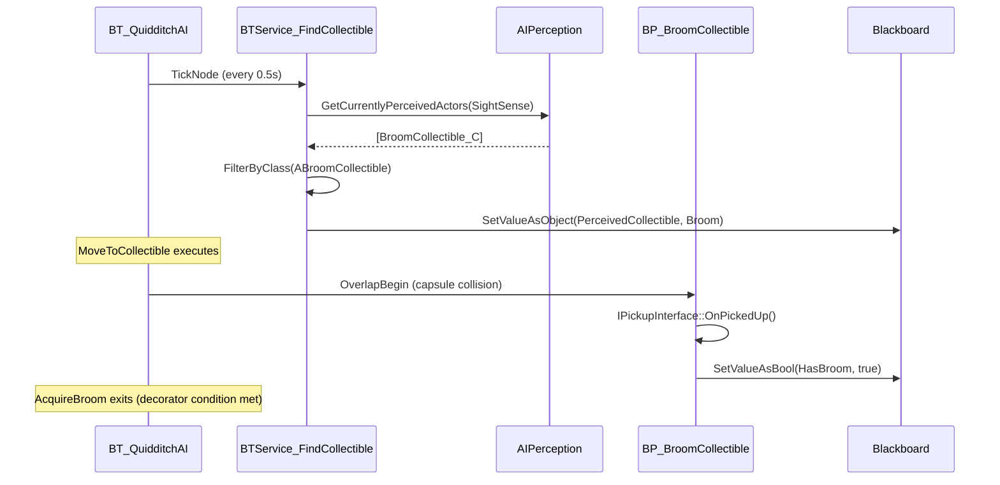
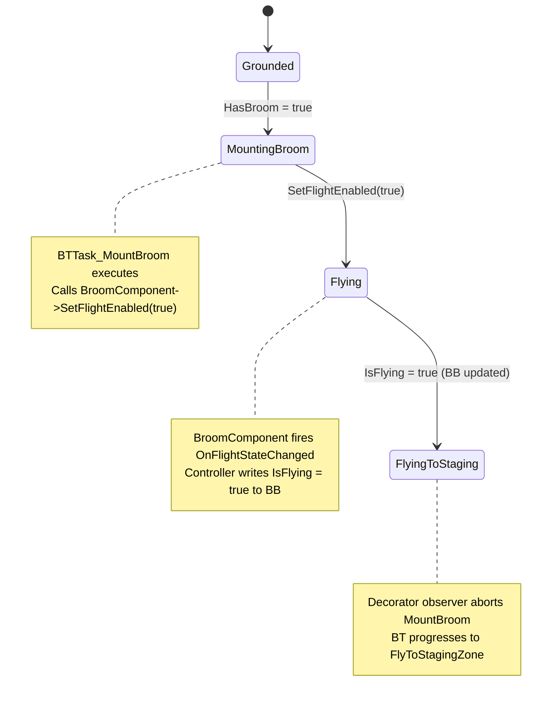
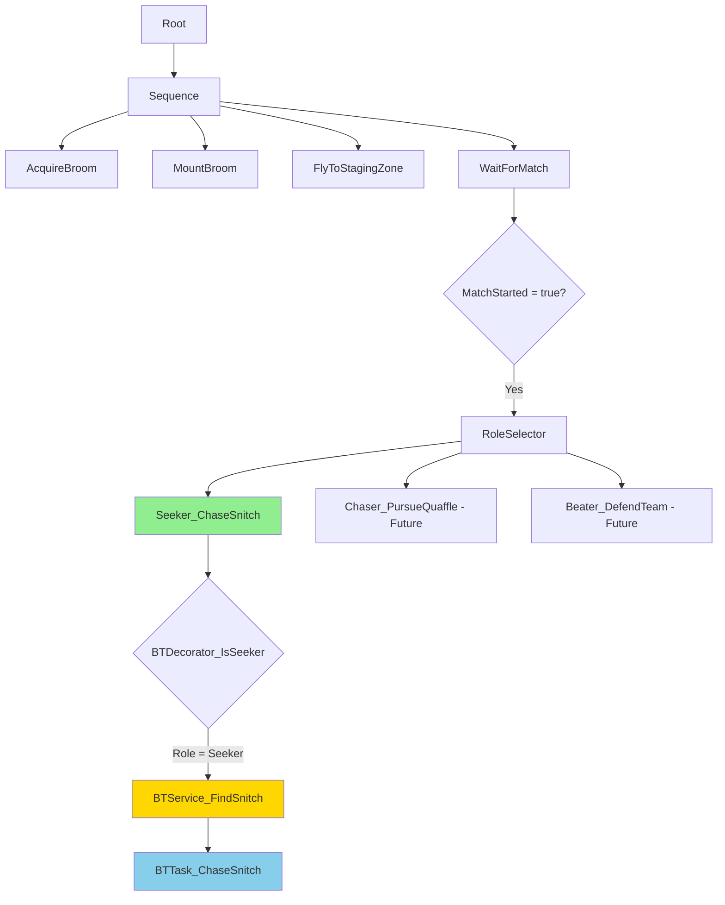

# MRC-004: Test Seeker Pathing and Snitch Acquisition

**System:** AI Behavior Tree - Seeker Vertical Slice
**Subsystem:** Perception, Navigation, Flight Control, and Snitch Chase
**Periodicity:** Perform after BT modifications or when debugging AI navigation issues
**Estimated Time:** 35 minutes
**Difficulty:** Advanced

---

## Purpose

This procedure validates the complete Seeker AI vertical slice from spawn to Snitch capture. Covers behavior tree execution through 5 distinct phases: AcquireBroom, MountBroom, FlyToStaging, WaitForMatch, and ChaseSnitch. Ensures proper blackboard key synchronization, flight physics integration, and Snitch pursuit using direct velocity control.

---

## Safety Precautions

- [ ] **CRITICAL**: Verify NavMesh is NOT used for flight navigation - uses direct MoveComponent->Velocity assignment
- [ ] **CRITICAL**: Ensure SnitchBall has UAIPerceptionStimuliSourceComponent - silent failure if missing
- [ ] **WARNING**: BTTask_ChaseSnitch uses TickTask for continuous pursuit - high CPU if many Seekers active
- [ ] **CAUTION**: Vertical input (pitch) in flight requires normalized direction vector - unnormalized causes physics explosion
- [ ] **NOTE**: AI perception SightRadius for Snitch = 2000 units - must be > broom perception (prevents config confusion)

---

## Tools and Materials Required

| Tool/Asset | Location | Purpose |
|------------|----------|---------|
| BT_QuidditchAI | Content/AI/BehaviorTrees/ | Behavior Tree asset |
| BB_QuidditchAI | Content/AI/Blackboards/ | Blackboard asset |
| BP_BroomCollectible | Content/Blueprints/Collectibles/ | Broom pickup actor |
| BP_GoldenSnitch | Content/Blueprints/Quidditch/ | Snitch ball actor |
| Gameplay Debugger | PIE - Apostrophe (') | BT/BB state visualization |
| AI Perception Debugger | Console: `showdebug perception` | Perception stimulus verification |
| Behavior Tree Editor | Double-click BT asset | Node configuration inspection |

**Reference Files:**
- `Source/END2507/Private/Code/AI/Quidditch/BTService_FindCollectible.cpp`
- `Source/END2507/Private/Code/AI/Quidditch/BTTask_MountBroom.cpp`
- `Source/END2507/Private/Code/AI/Quidditch/BTTask_FlyToStagingZone.cpp`
- `Source/END2507/Private/Code/AI/Quidditch/BTService_FindSnitch.cpp`
- `Source/END2507/Private/Code/AI/Quidditch/BTTask_ChaseSnitch.cpp`
- `Source/END2507/Private/Code/Flight/AC_BroomComponent.cpp`
- `Source/END2507/Private/Code/Quidditch/SnitchBall.cpp`

---

## Procedure

### Step 1: Verify Broom Collectible Perception and Pickup

**Objective:** Confirm AI detects BP_BroomCollectible and successfully executes IPickupInterface

1.1. Place `BP_BroomCollectible` in test level
   - **Position**: Within 2000 units of agent spawn (default SightRadius)
   - **Height**: Any Z-value (agent is grounded at this phase)

1.2. Open `BT_QuidditchAI` in Behavior Tree Editor

1.3. Locate **AcquireBroom** composite node (root's first child)

1.4. Verify child nodes in sequence:
   - `BTService_FindCollectible` (attached to composite)
     - Blackboard Key: `PerceivedCollectible` (Object, AActor base)
     - SightConfig: SightRadius = 2000.0
   - `BTTask_MoveToCollectible`
     - Blackboard Key: `PerceivedCollectible`
     - AcceptanceRadius: 150.0
   - `BTDecorator_HasBroom` (exit condition)
     - Blackboard Key: `HasBroom` (Bool)
     - Observer Aborts: Self

1.5. Start PIE with single Seeker agent

1.6. Open Gameplay Debugger (apostrophe key), select agent

1.7. Monitor **Perception** tab for stimulus detection:
   ```
   Currently Perceived:
     BP_BroomCollectible_C (Sight, Age: 0.5s)
   ```

1.8. Monitor **Blackboard** tab for key updates:
   ```
   PerceivedCollectible: BP_BroomCollectible_C [AActor*]
   HasBroom: false
   ```

1.9. Wait for agent to reach broom (uses UE5 AI MoveTo)

1.10. Verify Output Log shows pickup:
   ```
   LogBroomCollectible: Display: OnPickedUp - Agent collected broom
   LogAIC_QuidditchController: Display: HandleBroomAcquired - HasBroom = true
   ```

1.11. Verify Blackboard updates:
   ```
   HasBroom: true  (triggers AcquireBroom exit)
   ```

**Broom Acquisition Flow:**


---

### Step 2: Test Broom Mounting and Flight Activation

**Objective:** Validate BTTask_MountBroom calls BroomComponent->SetFlightEnabled(true)

2.1. With agent possessing broom (HasBroom = true), verify BT progresses to **MountBroom** phase

2.2. Open Behavior Tree Debugger (Gameplay Debugger > BehaviorTree tab)

2.3. Verify active node highlights:
   - **AcquireBroom**: Greyed out (completed)
   - **MountBroom**: Green (active)

2.4. Monitor child nodes in MountBroom composite:
   - `BTTask_MountBroom` (instant task)
     - **Action**: Calls `BroomComponent->SetFlightEnabled(true)`
     - **Success Condition**: IsFlying blackboard key = true
   - `BTDecorator_IsFlying` (exit condition)
     - Blackboard Key: `IsFlying` (Bool)
     - Observer Aborts: Self

2.5. Verify Output Log shows flight activation:
   ```
   LogBTTask_MountBroom: Display: ExecuteTask - Calling SetFlightEnabled(true)
   LogAC_BroomComponent: Display: SetFlightEnabled - Flight mode activated
   LogAIC_QuidditchController: Display: HandleFlightStateChanged - IsFlying = true
   ```

2.6. Verify Blackboard updates:
   ```
   IsFlying: true  (triggers MountBroom exit)
   ```

2.7. Visual confirmation:
   - Agent pawn tilts forward (flight pose)
   - Movement switches from ground capsule to flying movement component
   - Agent gains vertical mobility (can move up/down)

2.8. **CRITICAL CHECK - Delegate Binding**:
   - Open `AIC_QuidditchController.cpp`
   - Verify `OnPossess` binds `BroomComponent->OnFlightStateChanged`
   - Verify `HandleFlightStateChanged` writes to `IsFlying` blackboard key
   - **Failure Symptom**: BT stuck in MountBroom, IsFlying never updates

**Flight Activation State Machine:**


---

### Step 3: Validate Flight Navigation to Staging Zone (Direct Velocity Control)

**Objective:** Confirm BTTask_FlyToStagingZone uses direct velocity, NOT NavMesh MoveTo

3.1. Place `BP_QuidditchStagingZone` in level (see MRC-001)
   - **Height**: Z = +500 or higher (requires vertical navigation)
   - **Distance**: 3000+ units from broom spawn (tests sustained flight)

3.2. With agent in flight mode (IsFlying = true), verify BT enters **FlyToStagingZone** phase

3.3. Open `BTTask_FlyToStagingZone.cpp` in Visual Studio

3.4. Verify TickTask implementation uses direct velocity:
   ```cpp
   EBTNodeResult::Type UBTTask_FlyToStagingZone::TickTask(UBehaviorTreeComponent& OwnerComp, uint8* NodeMemory, float DeltaSeconds)
   {
       AAIController* AIC = OwnerComp.GetAIOwner();
       APawn* Pawn = AIC->GetPawn();
       UMovementComponent* MoveComp = Pawn->GetMovementComponent();

       FVector TargetLocation = Blackboard->GetValueAsVector(StagingZoneLocationKey);
       FVector CurrentLocation = Pawn->GetActorLocation();
       FVector Direction = (TargetLocation - CurrentLocation).GetSafeNormal();  // CRITICAL: Normalized

       float Speed = 600.0f;  // Match AC_BroomComponent MaxFlightSpeed
       MoveComp->Velocity = Direction * Speed;  // Direct assignment, NOT AIMoveTo

       float Distance = FVector::Dist(CurrentLocation, TargetLocation);
       if (Distance <= AcceptanceRadius)
       {
           return EBTNodeResult::Succeeded;
       }

       return EBTNodeResult::InProgress;  // Continue ticking
   }
   ```

3.5. **KEY IMPLEMENTATION NOTES**:
   - `GetSafeNormal()` prevents division-by-zero if already at target
   - Speed matches BroomComponent's MaxFlightSpeed (configurable)
   - NO calls to `AIController->MoveToLocation()` (NavMesh-based)
   - TickTask returns InProgress until distance <= AcceptanceRadius

3.6. Monitor agent flight path in viewport:
   - **Expected**: Smooth diagonal line toward staging zone (ignores obstacles)
   - **NOT Expected**: Stepped pathfinding, ground-hugging behavior

3.7. Verify Output Log shows navigation progress:
   ```
   LogBTTask_FlyToStagingZone: Display: TickTask - Distance to staging: 2845.3 units
   LogBTTask_FlyToStagingZone: Display: TickTask - Distance to staging: 1523.7 units
   LogBTTask_FlyToStagingZone: Display: ExecuteTask - Reached staging zone (Distance: 142.5 <= 500.0)
   ```

3.8. Verify Blackboard updates on arrival:
   ```
   ReachedStagingZone: true  (set by overlap handler, not BT task)
   IsReady: true
   ```

**Flight Navigation vs NavMesh Comparison:**

| Aspect | Direct Velocity (Current) | NavMesh MoveTo (Incorrect) |
|--------|--------------------------|---------------------------|
| Vertical Movement | Full 3D freedom | Limited to NavMesh Z-axis |
| Obstacle Avoidance | None (flies through) | Paths around obstacles |
| Performance | Low (simple vector math) | High (pathfinding queries) |
| NavMesh Dependency | None | Requires NavMeshBoundsVolume |
| Suitable For | Flying agents, projectiles | Walking agents, vehicles |

---

### Step 4: Configure Seeker BT Branch for Snitch Detection

**Objective:** Wire BTDecorator_IsSeeker and BTService_FindSnitch into BT_QuidditchAI

4.1. Open `BT_QuidditchAI` in Behavior Tree Editor

4.2. Locate **WaitForMatch** composite node (after FlyToStagingZone)

4.3. Verify child nodes:
   - `BTDecorator_Blackboard` (entry condition)
     - Blackboard Key: `MatchStarted` (Bool)
     - Key Query: Is Set, Value = true
   - `BTService_UpdateMatchState` (optional - keeps BB synced)

4.4. Create Seeker-specific branch:
   - Add Selector node as child of WaitForMatch
   - Name: "RoleSelector"

4.5. Add Seeker sequence:
   - Child 1 of RoleSelector: Sequence node
   - Name: "Seeker_ChaseSnitch"
   - Attach `BTDecorator_IsSeeker` decorator:
     - **Logic**: Checks if `GetAgentRole() == EQuidditchRole::Seeker`
     - **Type**: C++ decorator (not Blackboard-based)

4.6. Add Snitch detection service to Seeker sequence:
   - Right-click "Seeker_ChaseSnitch" → Add Service → `BTService_FindSnitch`
   - Configure service properties:
     - Interval: 0.5s (tick twice per second)
     - RandomDeviation: 0.1s
     - Blackboard Keys:
       - `SnitchActorKey` (Object, AActor base)
       - `SnitchLocationKey` (Vector)
       - `SnitchVelocityKey` (Vector)

4.7. Add chase task:
   - Child of "Seeker_ChaseSnitch": `BTTask_ChaseSnitch`
   - Blackboard Keys:
     - `SnitchLocationKey` (Vector)
     - `SnitchVelocityKey` (Vector)

4.8. Save Behavior Tree

**Seeker BT Branch Diagram:**


---

### Step 5: Execute Full Vertical Slice - Spawn to Snitch Catch

**Objective:** Run complete Seeker AI sequence and verify Snitch capture mechanics

5.1. Level setup:
   - 1 × BP_BroomCollectible (Z = ground level)
   - 1 × BP_QuidditchStagingZone (Z = +500, TeamHint=1, RoleHint=1)
   - 1 × BP_GoldenSnitch (Z = +800, flying path configured)
   - 1 × BP_QuidditchAgent (Team=1, Role=Seeker, AIController=AIC_QuidditchController)

5.2. Configure BP_QuidditchGameMode:
   - `RequiredAgentOverride = 1`

5.3. Start PIE and monitor full sequence

5.4. **Phase 1 - Broom Acquisition (15-30 seconds)**:
   - Output Log: `PerceivedCollectible set to BP_BroomCollectible_C`
   - Agent navigates to broom
   - Output Log: `HasBroom = true`

5.5. **Phase 2 - Flight Activation (1-2 seconds)**:
   - Output Log: `SetFlightEnabled(true)`
   - Agent tilts forward, gains altitude
   - Output Log: `IsFlying = true`

5.6. **Phase 3 - Staging Navigation (20-40 seconds)**:
   - Agent flies diagonal path to staging zone
   - Output Log: `Distance to staging: [decreasing values]`
   - Agent enters staging zone sphere
   - Output Log: `ReachedStagingZone = true, IsReady = true`

5.7. **Phase 4 - Match Countdown (3 seconds)**:
   - Output Log: `All agents ready - starting countdown`
   - Output Log: `Match begins in 3 seconds`
   - Timer expires
   - Output Log: `OnMatchStarted broadcast`
   - Blackboard: `MatchStarted = true`

5.8. **Phase 5 - Snitch Chase (variable duration)**:
   - BTService_FindSnitch detects BP_GoldenSnitch
   - Output Log: `SnitchLocationKey updated: X=[...] Y=[...] Z=[...]`
   - Output Log: `SnitchVelocityKey updated: X=[...] Y=[...] Z=[...]`
   - BTTask_ChaseSnitch begins ticking
   - Agent pursues Snitch with boost input

5.9. **Phase 6 - Snitch Capture**:
   - Agent closes distance to <= 100 units (CatchRadius)
   - Output Log: `BTTask_ChaseSnitch: Snitch caught!`
   - Output Log: `QuidditchGameMode::NotifySnitchCaught - Team 1 scored 150 points`
   - Output Log: `OnSnitchCaught.Broadcast`
   - Output Log: `Match state: Ended`
   - Blackboard: `MatchStarted = false` (all agents)

5.10. Verify SnitchBall disables:
   - Snitch mesh hidden (SetActorHiddenInGame)
   - Collision disabled
   - Movement stopped

**Full Vertical Slice Timeline:**

```mermaid
gantt
    title Seeker AI Vertical Slice - Execution Timeline
    dateFormat  s
    axisFormat  %Ss

    section Broom
    Perceive + Navigate    :a1, 0, 20s
    Pickup                 :a2, after a1, 1s

    section Flight
    Mount Broom            :b1, after a2, 2s
    Fly to Staging         :b2, after b1, 30s

    section Match Start
    Enter Staging Zone     :c1, after b2, 1s
    Countdown (3s)         :c2, after c1, 3s

    section Snitch Chase
    Detect Snitch          :d1, after c2, 2s
    Pursue                 :d2, after d1, 45s
    Catch                  :d3, after d2, 1s

    section End
    Score + Broadcast      :e1, after d3, 1s
```


---

## Verification and Testing

### Blackboard Key State Table (Full Vertical Slice)

| Phase | PerceivedCollectible | HasBroom | IsFlying | ReachedStagingZone | IsReady | MatchStarted | SnitchLocation | SnitchVelocity |
|-------|---------------------|----------|----------|-------------------|---------|-------------|---------------|---------------|
| Spawn | null | false | false | false | false | false | (0,0,0) | (0,0,0) |
| Broom Perceived | BroomActor* | false | false | false | false | false | (0,0,0) | (0,0,0) |
| Broom Collected | BroomActor* | **true** | false | false | false | false | (0,0,0) | (0,0,0) |
| Flight Activated | BroomActor* | true | **true** | false | false | false | (0,0,0) | (0,0,0) |
| In Staging Zone | BroomActor* | true | true | **true** | **true** | false | (0,0,0) | (0,0,0) |
| Match Started | BroomActor* | true | true | true | true | **true** | (0,0,0) | (0,0,0) |
| Snitch Detected | BroomActor* | true | true | true | true | true | **(X,Y,Z)** | **(Vx,Vy,Vz)** |
| Snitch Caught | BroomActor* | true | true | true | true | **false** | (X,Y,Z) | (0,0,0) |

### Critical Code Checkpoints

**BTService_FindSnitch.cpp - Perception Query**:
```cpp
void UBTService_FindSnitch::TickNode(UBehaviorTreeComponent& OwnerComp, uint8* NodeMemory, float DeltaSeconds)
{
    UAIPerceptionComponent* PerceptionComp = AIC->GetPerceptionComponent();
    TArray<AActor*> PerceivedActors;
    PerceptionComp->GetCurrentlyPerceivedActors(SightSense, PerceivedActors);

    for (AActor* Actor : PerceivedActors)
    {
        if (ASnitchBall* Snitch = Cast<ASnitchBall>(Actor))
        {
            Blackboard->SetValueAsObject(SnitchActorKey, Snitch);
            Blackboard->SetValueAsVector(SnitchLocationKey, Snitch->GetActorLocation());
            Blackboard->SetValueAsVector(SnitchVelocityKey, Snitch->GetVelocity());
            return;  // Found Snitch, stop searching
        }
    }

    // Snitch not perceived - clear keys
    Blackboard->ClearValue(SnitchActorKey);
}
```

**BTTask_ChaseSnitch.cpp - Predictive Pursuit**:
```cpp
EBTNodeResult::Type UBTTask_ChaseSnitch::TickTask(UBehaviorTreeComponent& OwnerComp, uint8* NodeMemory, float DeltaSeconds)
{
    FVector SnitchLocation = Blackboard->GetValueAsVector(SnitchLocationKey);
    FVector SnitchVelocity = Blackboard->GetValueAsVector(SnitchVelocityKey);

    // Predictive targeting: lead the Snitch based on its velocity
    float PredictionTime = 0.5f;  // Aim where Snitch will be in 0.5 seconds
    FVector PredictedLocation = SnitchLocation + (SnitchVelocity * PredictionTime);

    FVector CurrentLocation = Pawn->GetActorLocation();
    FVector Direction = (PredictedLocation - CurrentLocation).GetSafeNormal();

    // Apply boost for faster pursuit
    float BoostSpeed = 900.0f;  // Higher than normal flight speed
    MoveComp->Velocity = Direction * BoostSpeed;

    // Vertical input (pitch) for altitude changes
    FVector UpVector = Pawn->GetActorUpVector();
    float VerticalInput = FVector::DotProduct(Direction, UpVector);
    BroomComponent->AddPitchInput(VerticalInput);  // Normalized direction prevents physics explosion

    // Check catch distance
    float Distance = FVector::Dist(CurrentLocation, SnitchLocation);
    if (Distance <= CatchRadius)  // Default: 100 units
    {
        // Notify GameMode
        AQuidditchGameMode* GM = Cast<AQuidditchGameMode>(GetWorld()->GetAuthGameMode());
        ABaseAgent* Agent = Cast<ABaseAgent>(Pawn);
        GM->NotifySnitchCaught(Agent, GM->GetAgentTeam(Agent));

        return EBTNodeResult::Succeeded;
    }

    return EBTNodeResult::InProgress;
}
```

### Troubleshooting Guide

| Symptom | Probable Cause | Solution |
|---------|---------------|----------|
| Agent doesn't perceive broom | SightRadius too small | Increase to 2000+ in BTService_FindCollectible |
| Agent stuck in MountBroom | OnFlightStateChanged not bound | Verify AIC_QuidditchController::OnPossess binding (MRC-002) |
| Agent flies through staging zone | SphereCollision radius too small | Increase to 500-800 (MRC-001) |
| BT doesn't enter Seeker branch | BTDecorator_IsSeeker filter wrong | Verify agent Role = Seeker (1) in Details Panel |
| Snitch not detected | SnitchBall missing stimuli component | Add UAIPerceptionStimuliSourceComponent to BP_GoldenSnitch |
| Agent undershoots Snitch | No predictive targeting | Verify PredictionTime > 0 in BTTask_ChaseSnitch |
| Physics explosion during chase | Unnormalized direction vector | Ensure GetSafeNormal() called on Direction |
| Match doesn't end on catch | NotifySnitchCaught not called | Verify BTTask_ChaseSnitch calls GameMode method |

---

## Related MRC Cross-References

- **MRC-001**: Initialize Staging Zone and Agent Positions (sets up navigation target)
- **MRC-002**: Bind Pawn Overlap Events (required for staging zone detection)
- **MRC-003**: Validate RequiredAgentOverride Logic (enables single-agent testing)
- **MRC-005**: Finalize End-of-Vertical-Slice Signals (implements NotifySnitchCaught → Match End)

---

## AAA Standards Rationale

### Why Direct Velocity Control Instead of NavMesh for Flight?

**NavMesh Pathfinding (Ground Agents):**
- Generates optimal paths around static obstacles
- Respects walkable surfaces, slopes, drop heights
- Industry standard for humanoid AI (Uncharted, TLOU, Assassin's Creed)

**Why It Fails for Flying Agents:**
1. **NavMesh is 2.5D**: Can handle elevation changes, but assumes gravity and ground contact
2. **Obstacle Avoidance**: Designed for navigation around barriers, not flying through 3D space
3. **Performance**: Pathfinding queries are expensive for real-time 3D flight
4. **Configuration Complexity**: Requires NavMeshBoundsVolume covering entire flyable space (huge overhead)

**Direct Velocity Benefits:**
- **3D Freedom**: Full control over X, Y, Z velocity components
- **Simplicity**: Single vector math operation per tick
- **Predictable**: No pathfinding "surprises" (sudden direction changes, stuck states)
- **Performance**: O(1) calculation vs O(N log N) A* pathfinding

**Real-World Example:**
- **Star Citizen**: Uses direct velocity for space flight (no NavMesh possible in open space)
- **Anthem**: Flying Javelin enemies use velocity-based AI, not NavMesh
- **WizardJam Quidditch**: Snitch flies in open arena - obstacles are rare, NavMesh overkill

### Why Predictive Targeting in BTTask_ChaseSnitch?

**Non-Predictive (Naive Approach):**
```cpp
FVector Direction = (SnitchLocation - CurrentLocation).GetSafeNormal();
MoveComp->Velocity = Direction * Speed;
```
**Problem**: Agent always flies toward Snitch's *current* location
- Snitch is moving at 500 units/sec
- Agent reaches location 0.5 seconds later
- Snitch has moved 250 units away
- **Result**: Agent always trails behind, never catches Snitch

**Predictive Targeting (Current Implementation):**
```cpp
float PredictionTime = 0.5f;
FVector PredictedLocation = SnitchLocation + (SnitchVelocity * PredictionTime);
FVector Direction = (PredictedLocation - CurrentLocation).GetSafeNormal();
```
**Solution**: Agent flies toward where Snitch *will be* in 0.5 seconds
- Intercepts Snitch path instead of trailing
- PredictionTime tunable for difficulty:
  - 0.0s = never catches (disabled)
  - 0.3s = challenging (for advanced Snitch AI)
  - 0.5s = balanced (vertical slice default)
  - 1.0s = easy (for testing)

**AAA Game Equivalent:**
- **Halo**: Elite AI leads player movement when throwing grenades (same math)
- **Overwatch**: Torbjörn turret tracks moving heroes with prediction
- **AC: Black Flag**: Naval combat AI predicts ship positions for cannon fire

### Why TickTask Instead of ExecuteTask for Chase?

**ExecuteTask Pattern (One-Shot Tasks):**
- Runs once, returns Success/Failure immediately
- Suitable for: Pickup item, set variable, fire animation
- Example: `BTTask_MountBroom` (single function call)

**TickTask Pattern (Continuous Tasks):**
- Runs every frame until completion condition met
- Returns InProgress to continue, Succeeded/Failed to exit
- Suitable for: Movement, aiming, channeling, pursuit

**BTTask_ChaseSnitch Requirements:**
1. Snitch moves every frame (position constantly updating)
2. Agent must recalculate direction every frame (not static path)
3. Catch radius check requires distance recomputation (can't predict when it'll succeed)

**Performance Consideration:**
- TickTask = 60 calls/sec per Seeker agent
- 14 agents (full match) = 840 calls/sec total
- **Acceptable**: Simple vector math, no perception queries in tick
- **If Problematic**: Reduce tick frequency via BTService (updates BB keys every 0.5s, Task reads cached values)

**Alternative Considered - Move To Task:**
- UE5's built-in `BTTask_MoveTo` uses NavMesh pathfinding
- **Rejected**: Doesn't support 3D flight, requires NavMesh, overkill for direct pursuit

---

**Document Version**: 1.0
**Last Updated**: February 15, 2026
**Author**: Marcus Daley
**Approved By**: WizardJam Development Team
**Next Review**: Post-vertical slice demo
