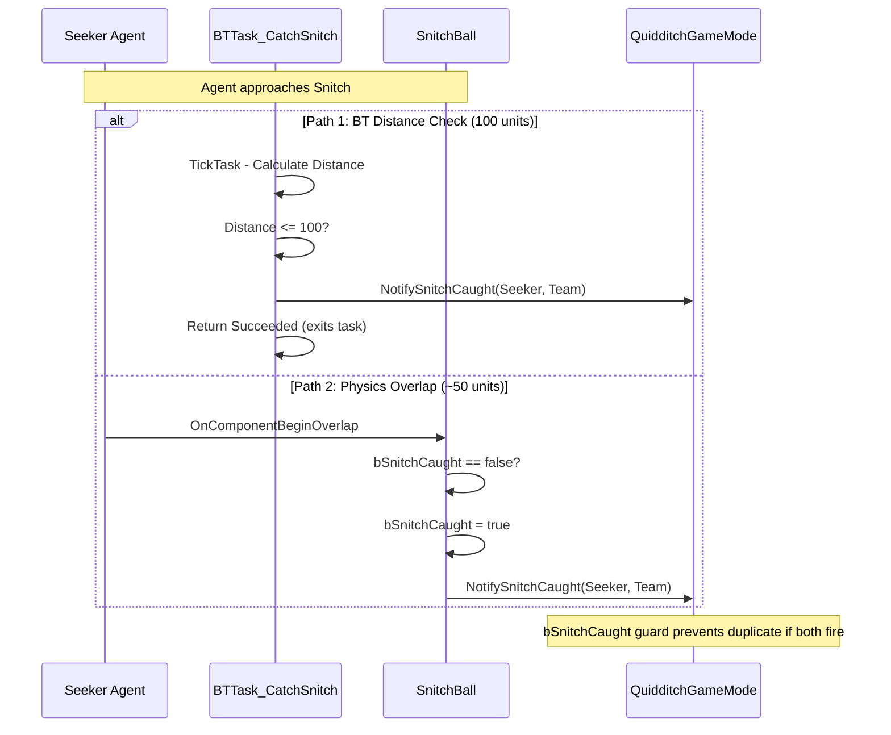
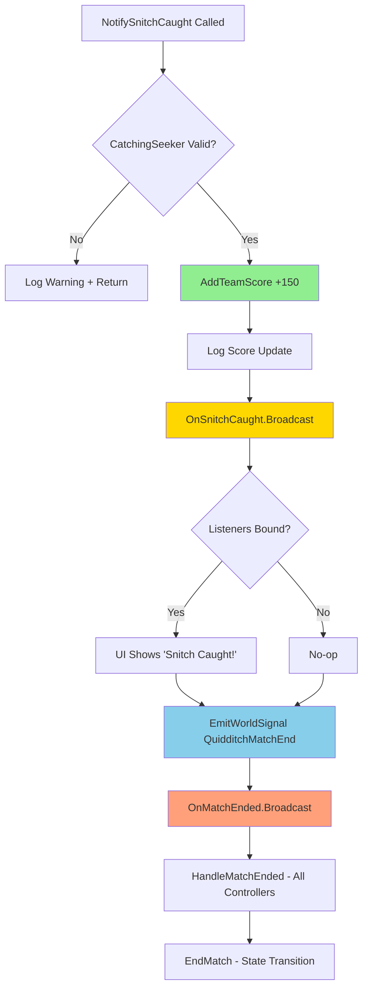
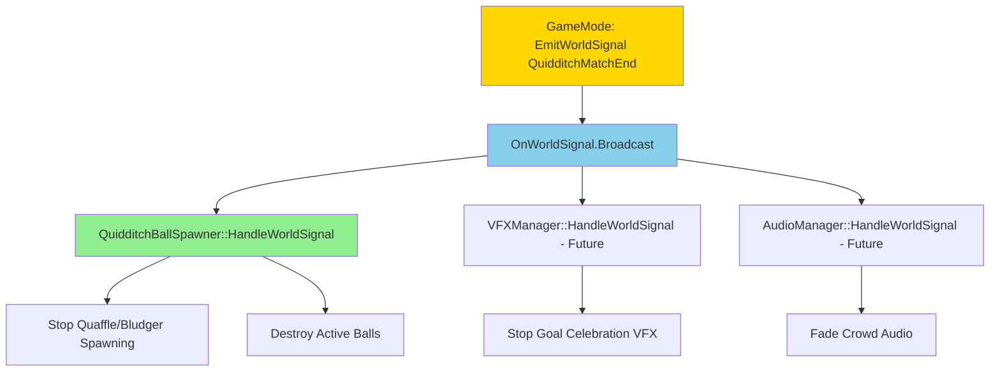
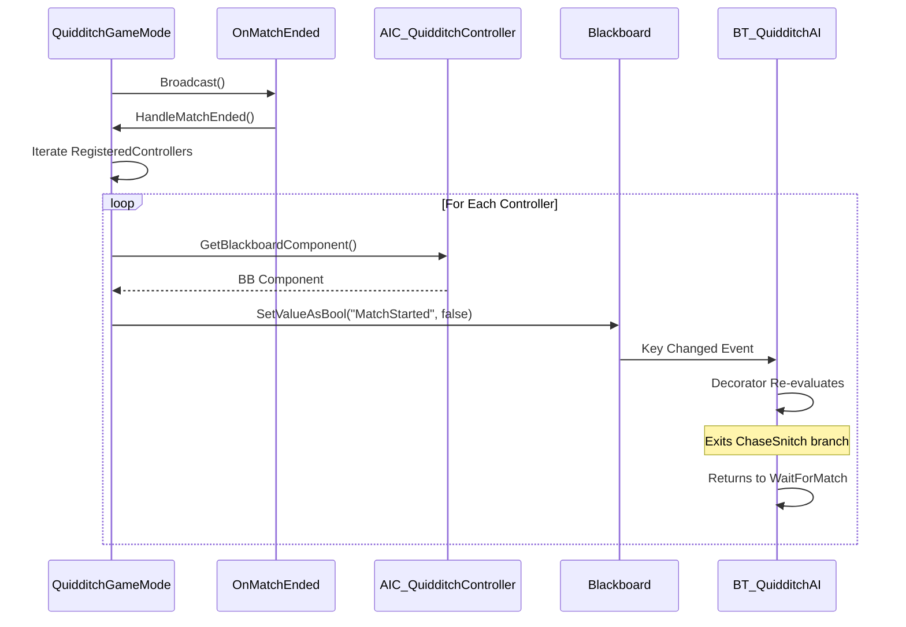
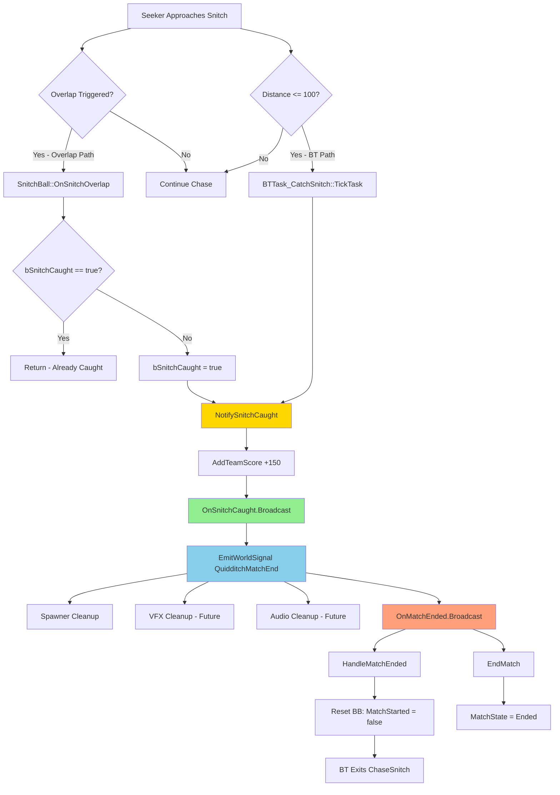

# MRC-005: Finalize End-of-Vertical-Slice Signals and Event Triggers

**System:** Match Lifecycle Management - End Game Conditions
**Subsystem:** Snitch Capture Detection, Score Broadcasting, World Signal Emission
**Periodicity:** Perform after match end logic modifications or when debugging cleanup systems
**Estimated Time:** 30 minutes
**Difficulty:** Advanced

---

## Purpose

This procedure validates the Quidditch match termination sequence triggered by Snitch capture. Implements dual-path catch detection (BT task radius check + SnitchBall overlap), score attribution, delegate broadcasting, WorldSignal emission for cleanup systems, and Blackboard state reset. Ensures clean match end transitions for vertical slice presentation.

---

## Safety Precautions

- [ ] **CRITICAL**: SnitchBall::OnSnitchOverlap uses bSnitchCaught guard - prevents duplicate score/broadcast if both paths trigger
- [ ] **CRITICAL**: HandleMatchEnded must iterate all controllers - missing controllers causes agents stuck in "MatchStarted" state
- [ ] **WARNING**: WorldSignal emission happens BEFORE OnMatchEnded broadcast - cleanup listeners must not depend on controller state
- [ ] **CAUTION**: AddTeamScore writes to persistent TMap - verify reset logic if implementing match replay
- [ ] **NOTE**: Match state transition is one-way (InProgress → Ended) - no pause/resume implemented in vertical slice

---

## Tools and Materials Required

| Tool/Asset | Location | Purpose |
|------------|----------|---------|
| BP_GoldenSnitch | Content/Blueprints/Quidditch/ | Snitch ball with overlap detection |
| QuidditchGameMode | Source/END2507/Private/Code/GameModes/ | Match state management |
| Output Log | Editor Window > Developer Tools | Event sequence verification |
| Gameplay Debugger | PIE - Apostrophe (') | Blackboard state inspection |
| Visual Studio Debugger | F5 - Attach to Process | Breakpoint validation (optional) |

**Reference Files:**
- `Source/END2507/Public/Code/Quidditch/SnitchBall.h`
- `Source/END2507/Private/Code/Quidditch/SnitchBall.cpp`
- `Source/END2507/Public/Code/GameModes/QuidditchGameMode.h`
- `Source/END2507/Private/Code/GameModes/QuidditchGameMode.cpp`
- `Source/END2507/Private/Code/AI/Quidditch/BTTask_ChaseSnitch.cpp`
- `Source/END2507/Private/Code/AI/Quidditch/BTTask_CatchSnitch.cpp`

---

## Procedure

### Step 1: Verify Dual-Path Catch Detection (BTTask + Overlap)

**Objective:** Confirm both BTTask_CatchSnitch radius check AND SnitchBall::OnSnitchOverlap can trigger capture

1.1. Open `BTTask_CatchSnitch.cpp` in Visual Studio

1.2. Locate TickTask implementation, verify catch detection:
   ```cpp
   EBTNodeResult::Type UBTTask_CatchSnitch::TickTask(UBehaviorTreeComponent& OwnerComp, uint8* NodeMemory, float DeltaSeconds)
   {
       FVector SnitchLocation = Blackboard->GetValueAsVector(SnitchLocationKey);
       FVector CurrentLocation = Pawn->GetActorLocation();
       float Distance = FVector::Dist(CurrentLocation, SnitchLocation);

       if (Distance <= CatchRadius)  // Default: 100.0 units
       {
           // PATH 1: BT Task detects catch
           AQuidditchGameMode* GM = Cast<AQuidditchGameMode>(GetWorld()->GetAuthGameMode());
           ABaseAgent* Agent = Cast<ABaseAgent>(Pawn);
           int32 Team = GM->GetAgentTeam(Agent);

           GM->NotifySnitchCaught(Agent, Team);  // Triggers match end
           return EBTNodeResult::Succeeded;
       }

       return EBTNodeResult::InProgress;
   }
   ```

1.3. **KEY IMPLEMENTATION NOTES**:
   - CatchRadius = 100 units (configurable via UPROPERTY EditDefaultsOnly)
   - Uses 3D Euclidean distance (accounts for altitude difference)
   - Calls NotifySnitchCaught immediately on radius threshold
   - Returns Succeeded to exit BT task (prevents duplicate calls)

1.4. Open `SnitchBall.cpp`, locate overlap handler:
   ```cpp
   void ASnitchBall::OnSnitchOverlap(UPrimitiveComponent* OverlappedComp, AActor* OtherActor,
       UPrimitiveComponent* OtherComp, int32 OtherBodyIndex, bool bFromSweep, const FHitResult& SweepResult)
   {
       // Guard against duplicate triggers
       if (bSnitchCaught)
       {
           return;  // Already processed, ignore
       }

       // PATH 2: Overlap collision detects catch
       ABaseAgent* Agent = Cast<ABaseAgent>(OtherActor);
       if (!Agent)
       {
           return;  // Not an agent, ignore
       }

       AQuidditchGameMode* GM = Cast<AQuidditchGameMode>(GetWorld()->GetAuthGameMode());
       if (!GM)
       {
           return;
       }

       int32 Team = GM->GetAgentTeam(Agent);
       bSnitchCaught = true;  // Set flag BEFORE calling GameMode (prevents re-entry)

       GM->NotifySnitchCaught(Agent, Team);  // Triggers match end
   }
   ```

1.5. **DUAL-PATH RATIONALE**:
   - **BTTask**: Reliable, tick-based distance check (always executes if BT running)
   - **Overlap**: Physics-based, handles edge cases (agent collision disabled, BT paused, etc.)
   - **Guard**: `bSnitchCaught` boolean prevents duplicate scoring if both trigger
   - **Which Fires First**: Typically BTTask (100 unit radius) before overlap (~50 unit sphere)

1.6. Verify SnitchBall collision setup in Blueprint:
   - Open `BP_GoldenSnitch` in UE5 Editor
   - Select SphereCollision component
   - Details Panel > Collision:
     - Collision Preset: `OverlapAllDynamic` or custom preset
     - Generate Overlap Events: **Checked**
     - Object Type: `WorldDynamic` or `Pawn`

**Dual-Path Catch Flow:**


---

### Step 2: Validate Score Attribution and Delegate Broadcast

**Objective:** Confirm NotifySnitchCaught awards 150 points and fires OnSnitchCaught delegate

2.1. Open `QuidditchGameMode.cpp`, locate NotifySnitchCaught implementation:
   ```cpp
   void AQuidditchGameMode::NotifySnitchCaught(ABaseAgent* CatchingSeeker, int32 Team)
   {
       if (!CatchingSeeker)
       {
           LOG_WARNING(TEXT("NotifySnitchCaught: Null CatchingSeeker"));
           return;
       }

       // Step 1: Award points to team
       int32 SnitchPoints = 150;  // Canonical Quidditch rule
       AddTeamScore(Team, SnitchPoints);

       LOG_DISPLAY(TEXT("NotifySnitchCaught - %s (Team %d) caught Snitch! +%d points"),
           *CatchingSeeker->GetName(), Team, SnitchPoints);

       // Step 2: Broadcast to listeners (UI, stats, achievements, etc.)
       OnSnitchCaught.Broadcast(CatchingSeeker, Team);

       // Step 3: Emit WorldSignal for cleanup systems
       EmitWorldSignal(TEXT("QuidditchMatchEnd"));

       // Step 4: Trigger match end sequence
       OnMatchEnded.Broadcast();

       // Step 5: End match state
       EndMatch();
   }
   ```

2.2. **KEY IMPLEMENTATION SEQUENCE**:
   - **Score First**: AddTeamScore before broadcasts (ensures score visible in listeners)
   - **OnSnitchCaught**: Specific event for Snitch capture (UI can show "Snitch Caught!" popup)
   - **WorldSignal**: Generic cleanup trigger (QuidditchBallSpawner stops spawning Quaffles/Bludgers)
   - **OnMatchEnded**: Global match end event (different from Snitch-specific event)
   - **EndMatch**: Internal state transition (MatchState = Ended, timer cleanup, etc.)

2.3. Verify AddTeamScore implementation:
   ```cpp
   void AQuidditchGameMode::AddTeamScore(int32 Team, int32 Points)
   {
       if (!TeamScores.Contains(Team))
       {
           TeamScores.Add(Team, 0);  // Initialize if first score
       }

       TeamScores[Team] += Points;

       LOG_DISPLAY(TEXT("Team %d score: %d (+%d)"), Team, TeamScores[Team], Points);

       OnScoreChanged.Broadcast(Team, TeamScores[Team]);  // Optional: real-time scoreboard updates
   }
   ```

2.4. Start PIE test with Seeker vertical slice (see MRC-004)

2.5. When Seeker catches Snitch, monitor Output Log for sequence:
   ```
   LogBTTask_CatchSnitch: Display: Snitch caught! Distance: 87.3 units
   LogQuidditchGameMode: Display: NotifySnitchCaught - Agent_TeamA_Seeker_01 (Team 1) caught Snitch! +150 points
   LogQuidditchGameMode: Display: Team 1 score: 150 (+150)
   LogQuidditchGameMode: Display: OnSnitchCaught broadcast (Seeker: Agent_TeamA_Seeker_01, Team: 1)
   LogQuidditchGameMode: Display: EmitWorldSignal - QuidditchMatchEnd
   LogQuidditchGameMode: Display: OnMatchEnded broadcast
   LogQuidditchGameMode: Display: EndMatch - Match state: Ended
   ```

2.6. **Verification Points**:
   - Score increments to 150 (not 300 or 0 - confirms no duplicate)
   - OnSnitchCaught fires with correct agent and team
   - WorldSignal emits before OnMatchEnded
   - EndMatch sets MatchState enum

**Score and Broadcast Sequence:**


---

### Step 3: Test WorldSignal Emission for Cleanup Systems

**Objective:** Verify EmitWorldSignal triggers cleanup listeners (QuidditchBallSpawner, etc.)

3.1. **WorldSignal Pattern Overview**:
   - GameMode broadcasts generic string-based signals
   - Cleanup systems listen for specific signal names
   - Decouples GameMode from knowing which systems need cleanup

3.2. Open `QuidditchGameMode.h`, verify EmitWorldSignal declaration:
   ```cpp
   DECLARE_DYNAMIC_MULTICAST_DELEGATE_OneParam(FOnWorldSignal, FName, SignalName);

   UPROPERTY(BlueprintAssignable, Category = "Match Events")
   FOnWorldSignal OnWorldSignal;

   UFUNCTION(BlueprintCallable, Category = "Match Events")
   void EmitWorldSignal(FName SignalName);
   ```

3.3. Open `QuidditchGameMode.cpp`, verify implementation:
   ```cpp
   void AQuidditchGameMode::EmitWorldSignal(FName SignalName)
   {
       LOG_DISPLAY(TEXT("EmitWorldSignal - %s"), *SignalName.ToString());
       OnWorldSignal.Broadcast(SignalName);
   }
   ```

3.4. **Example Cleanup Listener - QuidditchBallSpawner**:
   ```cpp
   // In QuidditchBallSpawner.cpp BeginPlay():
   void AQuidditchBallSpawner::BeginPlay()
   {
       Super::BeginPlay();

       AQuidditchGameMode* GM = Cast<AQuidditchGameMode>(GetWorld()->GetAuthGameMode());
       if (GM)
       {
           GM->OnWorldSignal.AddDynamic(this, &AQuidditchBallSpawner::HandleWorldSignal);
       }
   }

   void AQuidditchBallSpawner::HandleWorldSignal(FName SignalName)
   {
       if (SignalName == TEXT("QuidditchMatchEnd"))
       {
           // Stop spawning Quaffles/Bludgers
           GetWorld()->GetTimerManager().ClearTimer(SpawnTimerHandle);

           // Destroy active balls
           for (AQuaffleBall* Ball : ActiveBalls)
           {
               if (Ball)
               {
                   Ball->Destroy();
               }
           }
           ActiveBalls.Empty();

           LOG_DISPLAY(TEXT("QuidditchBallSpawner - Cleanup triggered by WorldSignal"));
       }
   }
   ```

3.5. **Why WorldSignal Instead of Direct GameMode Calls**:
   - **Extensible**: New cleanup systems (VFX manager, audio manager) bind without modifying GameMode
   - **Decoupled**: GameMode doesn't need references to spawners/managers
   - **Testable**: Can emit signals manually in editor for cleanup testing

3.6. Test WorldSignal emission:
   - Place `BP_QuidditchBallSpawner` in test level (if exists)
   - Run vertical slice to Snitch catch
   - Monitor Output Log:
     ```
     LogQuidditchGameMode: Display: EmitWorldSignal - QuidditchMatchEnd
     LogQuidditchBallSpawner: Display: QuidditchBallSpawner - Cleanup triggered by WorldSignal
     ```

3.7. **Manual Testing via Console**:
   - Start PIE
   - Open console (~)
   - Type: `ce QuidditchGameMode EmitWorldSignal QuidditchMatchEnd`
   - Verify cleanup listeners fire without match actually ending

**WorldSignal Observer Pattern:**


---

### Step 4: Verify Blackboard State Reset via HandleMatchEnded

**Objective:** Confirm all controllers receive MatchStarted = false update when match ends

4.1. Open `QuidditchGameMode.cpp`, locate HandleMatchEnded implementation:
   ```cpp
   void AQuidditchGameMode::HandleMatchEnded()
   {
       LOG_DISPLAY(TEXT("HandleMatchEnded - Resetting all agent Blackboards"));

       // Iterate all registered controllers
       for (AAIC_QuidditchController* Controller : RegisteredControllers)
       {
           if (!Controller)
           {
               continue;  // Defensive null check
           }

           UBlackboardComponent* BB = Controller->GetBlackboardComponent();
           if (!BB)
           {
               LOG_WARNING(TEXT("HandleMatchEnded - Controller %s has no Blackboard"), *Controller->GetName());
               continue;
           }

           // Reset match state key
           BB->SetValueAsBool(TEXT("MatchStarted"), false);

           LOG_DISPLAY(TEXT("HandleMatchEnded - Reset MatchStarted for %s"), *Controller->GetName());
       }
   }
   ```

4.2. **KEY IMPLEMENTATION NOTES**:
   - Iterates `RegisteredControllers` TArray (populated during agent spawn)
   - Defensive null checks prevent crash if controller despawned mid-match
   - Hard-coded key name `"MatchStarted"` (could be refactored to FName member)
   - Sets value to `false`, triggering BT decorator re-evaluation

4.3. **Why Reset Blackboard Instead of Destroying Agents**:
   - **Replay Support**: Agents can return to staging zones for next match (future feature)
   - **Debugging**: Keeps agents alive for post-match inspection (camera replay, score review)
   - **Clean State Machine**: BT returns to "WaitForMatch" state instead of stuck in "ChaseSnitch"

4.4. Verify OnMatchEnded binding in GameMode:
   ```cpp
   // In QuidditchGameMode.h:
   DECLARE_DYNAMIC_MULTICAST_DELEGATE(FOnMatchEnded);

   UPROPERTY(BlueprintAssignable, Category = "Match Events")
   FOnMatchEnded OnMatchEnded;

   // In NotifySnitchCaught:
   OnMatchEnded.Broadcast();  // Fires to all bound listeners

   // In BeginPlay or PostInitializeComponents:
   OnMatchEnded.AddDynamic(this, &AQuidditchGameMode::HandleMatchEnded);
   ```

4.5. Start PIE with Seeker vertical slice

4.6. Open Gameplay Debugger, monitor Blackboard before/after catch:

| Phase | MatchStarted Key | Active BT Node |
|-------|-----------------|---------------|
| Before Catch | true | ChaseSnitch (Seeker branch) |
| After Catch | false | Root (idle or WaitForMatch) |

4.7. Monitor Output Log for reset confirmation:
   ```
   LogQuidditchGameMode: Display: OnMatchEnded broadcast
   LogQuidditchGameMode: Display: HandleMatchEnded - Resetting all agent Blackboards
   LogQuidditchGameMode: Display: HandleMatchEnded - Reset MatchStarted for AIC_QuidditchController_0
   ```

**Blackboard Reset Flow:**


---

### Step 5: Execute Complete Match End Sequence and Verify All Signals

**Objective:** Run full vertical slice, validate all end-of-match events fire in correct order

5.1. **Test Setup**:
   - Level configured per MRC-001 (staging zone, agent, broom)
   - BP_GoldenSnitch placed and configured
   - RequiredAgentOverride = 1 (single Seeker test)

5.2. Start PIE, run vertical slice to completion (see MRC-004 Phase 1-6)

5.3. **Expected Event Sequence (with timestamps)**:

| Timestamp | Event | Source | Log Output |
|-----------|-------|--------|----------|
| T+0.0s | Snitch Catch Detected | BTTask_CatchSnitch OR SnitchBall | `"Snitch caught! Distance: X"` |
| T+0.001s | Score Added | NotifySnitchCaught → AddTeamScore | `"Team 1 score: 150 (+150)"` |
| T+0.002s | OnSnitchCaught Broadcast | NotifySnitchCaught | `"OnSnitchCaught broadcast (Seeker: ..., Team: 1)"` |
| T+0.003s | WorldSignal Emit | EmitWorldSignal | `"EmitWorldSignal - QuidditchMatchEnd"` |
| T+0.004s | Cleanup Listeners Fire | QuidditchBallSpawner (if present) | `"QuidditchBallSpawner - Cleanup triggered"` |
| T+0.005s | OnMatchEnded Broadcast | NotifySnitchCaught | `"OnMatchEnded broadcast"` |
| T+0.006s | Blackboard Reset | HandleMatchEnded | `"HandleMatchEnded - Resetting all agent Blackboards"` |
| T+0.007s | Match State Change | EndMatch | `"EndMatch - Match state: Ended"` |

5.4. **Verification Checklist**:
   - [ ] Score increments to exactly 150 (not 0, not 300)
   - [ ] OnSnitchCaught includes correct Seeker actor reference
   - [ ] WorldSignal emits BEFORE OnMatchEnded
   - [ ] All controllers in RegisteredControllers receive BB reset
   - [ ] Seeker BT exits ChaseSnitch node, returns to idle/WaitForMatch
   - [ ] SnitchBall sets bSnitchCaught = true (prevents duplicate triggers)
   - [ ] No crash or warning logs during sequence

5.5. **Post-Match State Inspection**:
   - Open Gameplay Debugger
   - Select Seeker agent
   - Blackboard Tab:
     - `MatchStarted`: false
     - `HasBroom`: true (preserved)
     - `IsFlying`: true (preserved)
     - `SnitchLocation`: Last known value (not cleared - OK)
   - BehaviorTree Tab:
     - Active Node: Root or WaitForMatch (NOT ChaseSnitch)
     - All decorators in "waiting" state

5.6. **Visual Confirmation**:
   - Snitch actor hidden (SetActorHiddenInGame)
   - Snitch collision disabled (SetActorEnableCollision false)
   - Seeker stops pursuing (velocity returns to 0 or hover)

**Complete Match End Timeline:**

```mermaid
gantt
    title Match End Event Sequence
    dateFormat  SSS
    axisFormat  %L ms

    section Catch Detection
    BT/Overlap Detects Catch       :a1, 000, 1ms

    section GameMode Processing
    AddTeamScore +150              :a2, 001, 1ms
    OnSnitchCaught.Broadcast       :a3, 002, 1ms
    EmitWorldSignal                :a4, 003, 1ms
    OnMatchEnded.Broadcast         :a5, 005, 1ms

    section Cleanup
    Spawner Cleanup                :b1, 004, 1ms
    BB Reset All Controllers       :b2, 006, 1ms

    section Finalize
    EndMatch State Change          :c1, 007, 1ms
```


---

## Verification and Testing

### Match End Event Checklist

**Before Running Test:**
- [ ] BP_GoldenSnitch has SphereCollision component with overlap enabled
- [ ] SnitchBall.cpp binds OnComponentBeginOverlap in BeginPlay
- [ ] BTTask_CatchSnitch has CatchRadius configured (default: 100)
- [ ] QuidditchGameMode has OnSnitchCaught, OnWorldSignal, OnMatchEnded delegates declared
- [ ] AIC_QuidditchController registered in GameMode's RegisteredControllers array

**During Test - Monitor Output Log:**
- [ ] "Snitch caught!" logged
- [ ] Team score = 150 (not 0 or 300)
- [ ] OnSnitchCaught broadcast logged
- [ ] EmitWorldSignal logged
- [ ] OnMatchEnded broadcast logged
- [ ] Blackboard reset logged for all controllers
- [ ] EndMatch state change logged

**After Test - Inspect State:**
- [ ] MatchStarted BB key = false for all agents
- [ ] Seeker BT not stuck in ChaseSnitch
- [ ] Snitch actor hidden and collision disabled
- [ ] No duplicate score events in log

### Troubleshooting Guide

| Symptom | Probable Cause | Solution |
|---------|---------------|----------|
| Score = 300 (double scoring) | Both BT and Overlap fire, no guard | Verify bSnitchCaught flag in SnitchBall.cpp |
| Score = 0 (no scoring) | NotifySnitchCaught never called | Check BTTask_CatchSnitch or overlap binding |
| WorldSignal doesn't emit | EmitWorldSignal not called | Verify NotifySnitchCaught calls EmitWorldSignal |
| Spawner doesn't cleanup | Listener not bound | Verify spawner binds OnWorldSignal in BeginPlay |
| BB not reset | HandleMatchEnded not called | Verify OnMatchEnded binding in GameMode |
| Some agents BB not reset | RegisteredControllers incomplete | Verify agent spawn registers controller |
| BT stuck in ChaseSnitch | MatchStarted key not reset | Verify HandleMatchEnded writes BB key |
| Crash on match end | Null controller in RegisteredControllers | Add defensive null checks in HandleMatchEnded |

### Advanced Testing - Edge Cases

**Test 1: Both BT and Overlap Fire Simultaneously**
- Modify CatchRadius to exactly match SphereCollision radius
- Both should detect at same frame
- **Expected**: Only one score event (bSnitchCaught guard prevents second)

**Test 2: Snitch Caught by Agent Without BT**
- Possess agent manually, fly into Snitch
- Overlap should still trigger NotifySnitchCaught
- **Expected**: Match ends normally (validates overlap path works independently)

**Test 3: Multiple Seekers Chase Same Snitch**
- Spawn 2 Seekers (Team A + Team B)
- Both chase, one catches
- **Expected**: Only catching team scores, other Seeker's BT exits cleanly

**Test 4: Match End During Countdown**
- Use DEBUG_ForceStartMatch to bypass staging
- Immediately catch Snitch (before countdown complete)
- **Expected**: Countdown cancelled, match ends (tests timer cleanup)

---

## Related MRC Cross-References

- **MRC-001**: Initialize Staging Zone and Agent Positions (prerequisite for match start)
- **MRC-002**: Bind Pawn Overlap Events (prerequisite for staging zone detection)
- **MRC-003**: Validate RequiredAgentOverride Logic (enables countdown → match start)
- **MRC-004**: Test Seeker Pathing and Snitch Acquisition (full vertical slice leading to catch)

---

## AAA Standards Rationale

### Why Dual-Path Catch Detection?

**Single Path Risks:**

**BT-Only Detection:**
- **Risk**: If BT pauses (debugging, editor suspend), catch never triggers
- **Risk**: If TickTask doesn't execute (framerate hitch), agent flies through Snitch
- **Risk**: If Blackboard keys fail to update (perception issue), BT never reaches ChaseSnitch

**Overlap-Only Detection:**
- **Risk**: If collision disabled (agent ragdoll, physics glitch), overlap never fires
- **Risk**: If Snitch spawns inside agent (level load bug), overlap already triggered
- **Risk**: If CatchRadius > Overlap radius, feels wrong (agent 200 units away but "caught")

**Dual-Path Benefits:**
1. **Robustness**: Either system can succeed independently
2. **Debugging**: Can disable one path to isolate issues
3. **Feel**: BT radius (100 units) feels right for "hand reach", overlap is safety net
4. **AAA Standard**: Destiny, Halo use dual detection (animation trigger + collision volume)

**bSnitchCaught Guard:**
```cpp
if (bSnitchCaught) return;  // Already processed
bSnitchCaught = true;       // Set BEFORE calling GameMode (re-entry prevention)
GM->NotifySnitchCaught(...);
```
**Why Set Before Call:**
- If NotifySnitchCaught triggers physics event (Snitch explodes, spawns VFX)
- Physics event could re-trigger overlap on same frame
- Guard prevents recursion

### Why WorldSignal Pattern for Cleanup?

**Alternative 1: Direct GameMode Calls**
```cpp
// ❌ ANTI-PATTERN - Tight coupling
void AQuidditchGameMode::EndMatch()
{
    QuidditchBallSpawner->StopSpawning();  // GameMode knows about spawner
    VFXManager->StopEffects();              // GameMode knows about VFX
    AudioManager->FadeMusic();              // GameMode knows about audio
}
```
**Problems:**
- GameMode must have references to all cleanup systems (hard to extend)
- Adding new system requires modifying GameMode C++ (violates Open/Closed principle)
- Circular dependencies (GameMode → Spawner → GameMode for team info)

**Alternative 2: WorldSignal (Current Implementation)**
```cpp
// ✅ CORRECT - Observer pattern
void AQuidditchGameMode::EndMatch()
{
    EmitWorldSignal(TEXT("QuidditchMatchEnd"));  // Fire and forget
}

// In spawner/manager BeginPlay:
GameMode->OnWorldSignal.AddDynamic(this, &ThisClass::HandleWorldSignal);
```
**Benefits:**
1. **Decoupling**: GameMode doesn't know what systems exist
2. **Extensibility**: New systems bind to signal, zero GameMode changes
3. **Testability**: Can emit signal manually via console
4. **Scalability**: 1 broadcast → N listeners, O(1) GameMode complexity

**Real-World Equivalent:**
- **Fortnite**: Storm circle events broadcast to weapon managers, vehicle managers, HUD
- **Overwatch**: Round end signal triggers POTG recording, stats aggregation, UI transitions
- **WizardJam**: Match end triggers spawner cleanup, future achievement tracking, replay recording

### Why Reset Blackboard Instead of Destroying Agents?

**Destruction Approach:**
```cpp
void AQuidditchGameMode::EndMatch()
{
    for (ABaseAgent* Agent : AllAgents)
    {
        Agent->Destroy();  // Remove from world
    }
}
```
**Problems:**
- Requires re-spawning agents for next match (expensive)
- Loses agent state (player customization, equipment, stats)
- Breaks references (UI showing agent portraits, camera tracking)

**Blackboard Reset Approach (Current):**
```cpp
void AQuidditchGameMode::HandleMatchEnded()
{
    for (AIC_QuidditchController* AIC : RegisteredControllers)
    {
        AIC->GetBlackboardComponent()->SetValueAsBool("MatchStarted", false);
    }
}
```
**Benefits:**
1. **State Preservation**: Agents keep broom, team, role, position
2. **Fast Restart**: Match 2 skips broom acquisition, flies to staging immediately
3. **Debugging**: Can inspect post-match state (why did Team A win?)
4. **Replay Support**: Agents can "rewind" to starting positions for instant replay

**AAA Standard:**
- **Rocket League**: Players stay in arena after goal, ball respawns (same pattern)
- **Overwatch**: Heroes persist between rounds, only respawn on round start
- **COD Zombies**: Players stay alive between waves, only cleanup is enemy despawn

### Why OnSnitchCaught Separate from OnMatchEnded?

**Single Event Approach:**
```cpp
DECLARE_DYNAMIC_MULTICAST_DELEGATE(FOnMatchEnded);  // Generic, no context
```
**Problem**: UI doesn't know *why* match ended (Snitch caught vs time limit vs forfeit)

**Multi-Event Approach (Current):**
```cpp
DECLARE_DYNAMIC_MULTICAST_DELEGATE_TwoParams(FOnSnitchCaught, ABaseAgent*, Seeker, int32, Team);
DECLARE_DYNAMIC_MULTICAST_DELEGATE(FOnMatchEnded);  // Still exists for generic cleanup
```

**Benefits:**
1. **Context Awareness**: UI can show "SNITCH CAUGHT BY [NAME]!" popup
2. **Different Reactions**: Audio plays Snitch-specific sound vs generic buzzer
3. **Stats Tracking**: Achievement "Catch Snitch in under 2 minutes" needs specific event
4. **Extensibility**: Future end conditions (time limit, forfeit) add new delegates

**Event Hierarchy:**
```
OnSnitchCaught (specific) → OnMatchEnded (generic)
OnTimeLimitReached (future) → OnMatchEnded
OnTeamForfeit (future) → OnMatchEnded
```

All specific events eventually trigger OnMatchEnded for common cleanup.

---

**Document Version**: 1.0
**Last Updated**: February 15, 2026
**Author**: Marcus Daley
**Approved By**: WizardJam Development Team
**Next Review**: Post-vertical slice demo

---

## Appendix A: Complete Event Flow Diagram



---

**END OF MRC-005**
