# MRC-[NUMBER]: Add [ROLE_NAME] AI Role

**Developer:** Marcus Daley
**Project:** WizardJam (END2507)
**Status:** Template - Replace placeholders before use
**Date Created:** February 15, 2026

---

## System Information

| Field | Value |
|-------|-------|
| MRC Number | MRC-XXX |
| System | WizardJam Quidditch AI |
| Subsystem | [Role Name] Role Implementation |
| Periodicity | One-time setup per new role |
| Estimated Time | [X] hours (ref: Seeker vertical slice = 12 hours) |
| Prerequisites | Seeker vertical slice complete, BT_QuidditchAI_Master exists |

---

## Role Configuration

| Field | Instructions |
|-------|-------------|
| Role Name | [e.g., Chaser, Beater, Keeper] |
| EQuidditchRole Enum Value | [e.g., EQuidditchRole::Chaser] - must exist in QuidditchTypes.h |
| Algorithm Reference | [e.g., Flock.cs, MsPacMan INVERTED, Cohesion] - source code reference |
| Agents Per Team | [e.g., 3 for Chaser, 2 for Beater, 1 for Keeper] |
| Required Ball Class | [e.g., QuaffleBall, BludgerBall, or None] |

---

## Implementation Steps

### Step 1: Create BTService_Find[Ball] (if new ball type needed)

**When to implement:** Only if this role requires a new ball type not already covered by BTService_FindSnitch/FindQuaffle/FindBludger.

**File locations:**
- Header: `Source/END2507/Public/Code/AI/Quidditch/BTService_Find[Ball].h`
- Source: `Source/END2507/Private/Code/AI/Quidditch/BTService_Find[Ball].cpp`

**Canonical example:** `BTService_FindSnitch.cpp` (lines 1-203)

#### Mandatory FBlackboardKeySelector Initialization Pattern

Every FBlackboardKeySelector property MUST have TWO pieces of initialization or it will silently fail:

```cpp
// ============================================================================
// STEP 1A: Constructor - Add Key Filters
// ============================================================================
UBTService_Find[Ball]::UBTService_Find[Ball]()
    : MaxSearchRange(5000.0f)  // Role-appropriate range
{
    NodeName = TEXT("Find [Ball]");
    bNotifyTick = true;

    // High frequency for fast-moving targets, lower for slow/static
    Interval = 0.1f;  // [Adjust based on ball movement speed]
    RandomDeviation = 0.02f;

    // REQUIRED: AddObjectFilter for Actor-type keys
    [Ball]ActorKey.AddObjectFilter(this,
        GET_MEMBER_NAME_CHECKED(UBTService_Find[Ball], [Ball]ActorKey),
        AActor::StaticClass());

    // REQUIRED: AddVectorFilter for Vector-type keys
    [Ball]LocationKey.AddVectorFilter(this,
        GET_MEMBER_NAME_CHECKED(UBTService_Find[Ball], [Ball]LocationKey));

    [Ball]VelocityKey.AddVectorFilter(this,
        GET_MEMBER_NAME_CHECKED(UBTService_Find[Ball], [Ball]VelocityKey));
}

// ============================================================================
// STEP 1B: InitializeFromAsset - Resolve Keys at BT Load Time
// ============================================================================
void UBTService_Find[Ball]::InitializeFromAsset(UBehaviorTree& Asset)
{
    Super::InitializeFromAsset(Asset);

    if (UBlackboardData* BBAsset = GetBlackboardAsset())
    {
        // REQUIRED: ResolveSelectedKey for EACH FBlackboardKeySelector
        [Ball]ActorKey.ResolveSelectedKey(*BBAsset);
        [Ball]LocationKey.ResolveSelectedKey(*BBAsset);
        [Ball]VelocityKey.ResolveSelectedKey(*BBAsset);
    }
}
```

**CRITICAL:** Without BOTH steps, `IsSet()` returns false even when key is configured in editor. This is a SILENT FAILURE.

#### Service Implementation Pattern

```cpp
void UBTService_Find[Ball]::TickNode(UBehaviorTreeComponent& OwnerComp, uint8* NodeMemory, float DeltaSeconds)
{
    Super::TickNode(OwnerComp, NodeMemory, DeltaSeconds);

    AAIController* AIController = OwnerComp.GetAIOwner();
    UBlackboardComponent* Blackboard = OwnerComp.GetBlackboardComponent();

    if (!AIController || !Blackboard)
    {
        return;
    }

    // ========================================================================
    // PERCEPTION-FIRST, FALLBACK TO WORLD SEARCH
    // ========================================================================
    AActor* Ball = FindBallInPerception(AIController);

    if (!Ball && AIController->GetWorld())
    {
        Ball = FindBallInWorld(AIController->GetWorld());
    }

    // ========================================================================
    // WRITE TO BLACKBOARD (or clear if not found)
    // ========================================================================
    if (Ball)
    {
        if ([Ball]ActorKey.IsSet())
        {
            Blackboard->SetValueAsObject([Ball]ActorKey.SelectedKeyName, Ball);
        }

        if ([Ball]LocationKey.IsSet())
        {
            Blackboard->SetValueAsVector([Ball]LocationKey.SelectedKeyName, Ball->GetActorLocation());
        }

        if ([Ball]VelocityKey.IsSet())
        {
            FVector Velocity = Ball->GetVelocity();
            Blackboard->SetValueAsVector([Ball]VelocityKey.SelectedKeyName, Velocity);
        }
    }
    else
    {
        // Clear keys if not found - prevents stale data
        if ([Ball]ActorKey.IsSet())
        {
            Blackboard->ClearValue([Ball]ActorKey.SelectedKeyName);
        }
    }
}
```

#### Required Blackboard Keys

Add these keys to `BB_QuidditchAI.uasset`:

| Key Name | Type | Written By | Read By | Initial Value |
|----------|------|-----------|---------|---------------|
| [Ball]Actor | Object:AActor | BTService_Find[Ball] | BTTask_[Action] | nullptr |
| [Ball]Location | Vector | BTService_Find[Ball] | BTTask_[Action] | ZeroVector |
| [Ball]Velocity | Vector | BTService_Find[Ball] | BTTask_Predict* | ZeroVector |

---

### Step 2: Create BTTask_[RoleAction] Role-Specific Tasks

**File locations:**
- Header: `Source/END2507/Public/Code/AI/Quidditch/BTTask_[Action].h`
- Source: `Source/END2507/Private/Code/AI/Quidditch/BTTask_[Action].cpp`

**Canonical examples:**
- Latent/continuous: `BTTask_ChaseSnitch.cpp` (uses TickTask for pursuit)
- Instant/one-shot: `BTTask_CatchSnitch.cpp` (uses ExecuteTask for event)

#### Task Type Decision Matrix

| Task Type | Use TickTask | Use ExecuteTask | Example |
|-----------|-------------|-----------------|---------|
| Continuous pursuit | Yes | No (returns InProgress) | ChaseSnitch, ControlFlight |
| One-shot action | No | Yes (returns Succeeded/Failed) | CatchSnitch, ThrowQuaffle |
| State check | No | Yes | CheckBroomChannel |

#### Latent Task Pattern (Continuous Pursuit)

```cpp
// ============================================================================
// Constructor - Initialize with sane defaults
// ============================================================================
UBTTask_[Action]::UBTTask_[Action]()
    : ActionRadius(200.0f)
    , bUseBoostForAction(true)
{
    NodeName = "[Action Description]";
    bNotifyTick = true;  // REQUIRED for TickTask to fire

    // Add filters for all FBlackboardKeySelector properties
    TargetKey.AddObjectFilter(this,
        GET_MEMBER_NAME_CHECKED(UBTTask_[Action], TargetKey),
        AActor::StaticClass());
}

// ============================================================================
// ExecuteTask - Entry point, validate state and return InProgress
// ============================================================================
EBTNodeResult::Type UBTTask_[Action]::ExecuteTask(
    UBehaviorTreeComponent& OwnerComp,
    uint8* NodeMemory)
{
    AAIController* AIController = OwnerComp.GetAIOwner();
    if (!AIController || !AIController->GetPawn())
    {
        return EBTNodeResult::Failed;
    }

    // Validate BroomComponent exists and is flying
    UAC_BroomComponent* BroomComp =
        AIController->GetPawn()->FindComponentByClass<UAC_BroomComponent>();

    if (!BroomComp || !BroomComp->IsFlying())
    {
        return EBTNodeResult::Failed;
    }

    // Validate Blackboard keys are set
    FVector TargetLocation;
    if (!GetTargetLocation(OwnerComp, TargetLocation))
    {
        return EBTNodeResult::Failed;
    }

    return EBTNodeResult::InProgress;  // Continue to TickTask
}

// ============================================================================
// TickTask - Continuous execution, updates every frame
// ============================================================================
void UBTTask_[Action]::TickTask(
    UBehaviorTreeComponent& OwnerComp,
    uint8* NodeMemory,
    float DeltaSeconds)
{
    AAIController* AIController = OwnerComp.GetAIOwner();
    APawn* AIPawn = AIController ? AIController->GetPawn() : nullptr;

    if (!AIPawn)
    {
        FinishLatentTask(OwnerComp, EBTNodeResult::Failed);
        return;
    }

    // ========================================================================
    // USE BROOM COMPONENT CORE API - NEVER DUPLICATE FLIGHT LOGIC
    // ========================================================================
    UAC_BroomComponent* BroomComp = AIPawn->FindComponentByClass<UAC_BroomComponent>();
    if (!BroomComp || !BroomComp->IsFlying())
    {
        FinishLatentTask(OwnerComp, EBTNodeResult::Failed);
        return;
    }

    FVector TargetLocation;
    if (!GetTargetLocation(OwnerComp, TargetLocation))
    {
        // Target lost - clean up and exit
        BroomComp->SetVerticalInput(0.0f);
        BroomComp->SetBoostEnabled(false);
        FinishLatentTask(OwnerComp, EBTNodeResult::Failed);
        return;
    }

    FVector CurrentLocation = AIPawn->GetActorLocation();
    FVector DirectionToTarget = (TargetLocation - CurrentLocation).GetSafeNormal();
    float DistanceToTarget = FVector::Dist(CurrentLocation, TargetLocation);

    // ========================================================================
    // ALTITUDE CONTROL - Use BroomComponent API
    // ========================================================================
    float AltitudeDiff = TargetLocation.Z - CurrentLocation.Z;
    float AltitudeTolerance = 100.0f;

    if (FMath::Abs(AltitudeDiff) > AltitudeTolerance)
    {
        float VerticalInput = FMath::Clamp(AltitudeDiff / 300.0f, -1.0f, 1.0f);
        BroomComp->SetVerticalInput(VerticalInput);
    }
    else
    {
        BroomComp->SetVerticalInput(0.0f);
    }

    // ========================================================================
    // BOOST CONTROL - Use BroomComponent API
    // ========================================================================
    if (bUseBoostForAction)
    {
        bool bShouldBoost = DistanceToTarget > 1000.0f;
        BroomComp->SetBoostEnabled(bShouldBoost);
    }

    // ========================================================================
    // HORIZONTAL MOVEMENT - Direct velocity control for AI
    // NEVER use AddMovementInput for AI (requires PlayerController)
    // ========================================================================
    ACharacter* Character = Cast<ACharacter>(AIPawn);
    if (Character)
    {
        UCharacterMovementComponent* MoveComp = Character->GetCharacterMovement();
        if (MoveComp && MoveComp->MovementMode == MOVE_Flying)
        {
            float TargetSpeed = MoveComp->MaxFlySpeed;
            FVector DesiredVelocity = DirectionToTarget * TargetSpeed;

            // Preserve vertical velocity managed by BroomComponent
            DesiredVelocity.Z = MoveComp->Velocity.Z;

            // Direct velocity assignment - no VInterpTo (causes circular orbits)
            MoveComp->Velocity = DesiredVelocity;
        }
    }

    // ========================================================================
    // ROTATION CONTROL - Face movement direction (visual correctness)
    // ========================================================================
    FVector RotationDirection = (TargetLocation - CurrentLocation);
    RotationDirection.Z = 0.0f;  // Horizontal plane only

    if (!RotationDirection.IsNearlyZero())
    {
        RotationDirection.Normalize();
        FRotator TargetRotation = RotationDirection.Rotation();
        FRotator CurrentRotation = AIPawn->GetActorRotation();
        FRotator NewRotation = FMath::RInterpTo(CurrentRotation, TargetRotation, DeltaSeconds, 5.0f);
        AIPawn->SetActorRotation(NewRotation);
    }

    // ========================================================================
    // SUCCESS CONDITION - Within action radius
    // ========================================================================
    if (DistanceToTarget < ActionRadius)
    {
        BroomComp->SetVerticalInput(0.0f);
        BroomComp->SetBoostEnabled(false);
        FinishLatentTask(OwnerComp, EBTNodeResult::Succeeded);
    }
}
```

#### Instant Task Pattern (One-Shot Action)

```cpp
EBTNodeResult::Type UBTTask_[Action]::ExecuteTask(
    UBehaviorTreeComponent& OwnerComp,
    uint8* NodeMemory)
{
    AAIController* AIController = OwnerComp.GetAIOwner();
    if (!AIController || !AIController->GetPawn())
    {
        return EBTNodeResult::Failed;
    }

    // Read Blackboard state
    UBlackboardComponent* Blackboard = OwnerComp.GetBlackboardComponent();
    AActor* TargetActor = Cast<AActor>(
        Blackboard->GetValueAsObject(TargetKey.SelectedKeyName)
    );

    if (!TargetActor)
    {
        return EBTNodeResult::Failed;
    }

    // Execute action (throw, hit, catch, etc.)
    bool bSuccess = PerformAction(AIController->GetPawn(), TargetActor);

    // Optionally update Blackboard with result
    if (ResultKey.IsSet())
    {
        Blackboard->SetValueAsBool(ResultKey.SelectedKeyName, bSuccess);
    }

    return bSuccess ? EBTNodeResult::Succeeded : EBTNodeResult::Failed;
}
```

#### CRITICAL RULE: NEVER Duplicate Flight Logic

AI and Player MUST share the same flight code via BroomComponent Core API:

| Function | Purpose | Used By |
|----------|---------|---------|
| `SetVerticalInput(float)` | Altitude control (-1 to +1) | Player Input + AI Tasks |
| `SetBoostEnabled(bool)` | Burst speed toggle | Player Input + AI Tasks |
| `IsFlying()` | Flight state check | All systems |
| `SetFlightEnabled(bool)` | Enter/exit flight mode | Mount/dismount logic |

**FORBIDDEN PATTERN:**
```cpp
// ❌ NEVER implement AI-specific flight math
void UBTTask_BadExample::TickTask(...)
{
    // Duplicating what BroomComponent already does
    FVector UpwardForce = FVector::UpVector * CustomAltitudeGain;
    MoveComp->AddForce(UpwardForce);  // WRONG - bypasses BroomComponent
}
```

---

### Step 3: Create BTDecorator_Is[Role] (if needed)

**When to implement:** Only if you want a C++-based role check decorator. For most cases, use UE5's built-in `BTDecorator_BlackboardBase` with `KeyQuery::IsEqualTo` on the `QuidditchRole` Name key.

**File locations:**
- Header: `Source/END2507/Public/Code/AI/BTDecorator_Is[Role].h`
- Source: `Source/END2507/Private/Code/AI/BTDecorator_Is[Role].cpp`

**Canonical example:** `BTDecorator_IsSeeker.cpp` (lines 1-56)

```cpp
// ============================================================================
// BTDecorator_Is[Role].cpp
// ============================================================================

#include "Code/AI/BTDecorator_Is[Role].h"
#include "Code/GameModes/QuidditchGameMode.h"
#include "Code/Quidditch/QuidditchTypes.h"
#include "AIController.h"
#include "BehaviorTree/BehaviorTreeComponent.h"
#include "GameFramework/Pawn.h"

UBTDecorator_Is[Role]::UBTDecorator_Is[Role]()
{
    NodeName = "Is [Role]";
}

bool UBTDecorator_Is[Role]::CalculateRawConditionValue(
    UBehaviorTreeComponent& OwnerComp,
    uint8* NodeMemory) const
{
    AAIController* AIController = OwnerComp.GetAIOwner();
    if (!AIController || !AIController->GetPawn())
    {
        return false;
    }

    APawn* AIPawn = AIController->GetPawn();

    // ========================================================================
    // USE GetWorld()->GetAuthGameMode() - NEVER GameplayStatics
    // ========================================================================
    AQuidditchGameMode* GameMode = Cast<AQuidditchGameMode>(
        AIController->GetWorld()->GetAuthGameMode()
    );

    if (!GameMode)
    {
        return false;
    }

    // Query agent's assigned role from GameMode
    EQuidditchRole AssignedRole = GameMode->GetAgentRole(AIPawn);

    // Return true if matches this role
    return (AssignedRole == EQuidditchRole::[Role]);
}

FString UBTDecorator_Is[Role]::GetStaticDescription() const
{
    return TEXT("Passes if agent role is [Role]");
}
```

**ALTERNATIVE (PREFERRED):** Use Blackboard-based decorator (no C++ required):

1. Right-click BT branch > Add Decorator > Blackboard Based
2. Set Blackboard Key: `QuidditchRole` (Name type)
3. Set Key Query: `Is Equal To`
4. Set Name Value: `[Role]` (e.g., "Chaser")

---

### Step 4: Wire BT_QuidditchAI Branch

**File location:** `Content/Code/AI/BT_QuidditchAI.uasset`

#### Behavior Tree Structure

```
BT_QuidditchAI_Master
│
└── [Priority 5] SELECTOR: Match Play (Role Branching)
    └── DECORATOR: BB.MatchStarted == true AND BB.IsFlying == true
        └── SELECTOR: Role Sub-Trees
            │
            ├── DECORATOR: BB.QuidditchRole == "[Role]"
            │   └── SUB-TREE: BT_[Role]
            │       │
            │       ├── SERVICE: BTService_Find[Ball] {Keys: [Ball]Actor, [Ball]Location, [Ball]Velocity}
            │       │
            │       └── SELECTOR: [Role] Priorities
            │           ├── [Priority 1] SEQUENCE: [Action 1]
            │           │   └── DECORATOR: [Condition]
            │           │       └── BTTask_[Action 1]
            │           ├── [Priority 2] SEQUENCE: [Action 2]
            │           └── [Priority 3] SEQUENCE: [Fallback]
```

#### Configuration Checklist

```
[ ] 1. Create BT_[Role] asset (Content/Code/AI/)
[ ] 2. Set Blackboard Asset to BB_QuidditchAI
[ ] 3. Add BTService_Find[Ball] to root node (if needed)
[ ] 4. Build Selector tree with priority sequences
[ ] 5. For each task node:
    [ ] Configure all FBlackboardKeySelector properties
    [ ] Verify green checkmarks (keys resolved)
    [ ] Test GetStaticDescription shows correct key names
[ ] 6. Open BT_QuidditchAI_Master
[ ] 7. Navigate to Priority 5 (Match Play) Selector
[ ] 8. Add new branch:
    [ ] Decorator: Blackboard Based, QuidditchRole == "[Role]"
    [ ] Task: Run Behavior Tree, Asset = BT_[Role]
[ ] 9. Save both trees
```

---

### Step 5: Test and Verify

#### Pre-Flight Checklist

```
[ ] All required BB keys exist in BB_QuidditchAI (39 total expected)
[ ] New role's keys added (see Step 1 table)
[ ] BT_[Role] sub-tree compiles without errors
[ ] All FBlackboardKeySelector properties show green checkmarks in editor
[ ] GetStaticDescription shows correct key names (not "not set")
```

#### Unit Tests (Single Agent)

```
[ ] Place 1 BP_QuidditchAgent in level
[ ] Set AgentDataAsset with QuidditchRole = [Role]
[ ] Set PlacedQuidditchTeam = TeamA
[ ] Place required ball actor (if applicable)
[ ] PIE and verify:
    [ ] Agent registers with GameMode
    [ ] BB.QuidditchRole = "EQuidditchRole::[Role]"
    [ ] BTDecorator_Is[Role] returns true (or BB compare passes)
    [ ] BTService_Find[Ball] writes valid BB keys when ball in world
    [ ] Role-specific tasks execute (check Output Log)
```

#### Integration Tests (Full Match)

```
[ ] Place 2 agents per team (4 total)
[ ] Assign different roles (Seeker, Chaser, Beater, Keeper)
[ ] Place staging zones for each role/team combination
[ ] Place all ball types (Snitch, Quaffle x1, Bludger x2)
[ ] PIE and verify:
    [ ] All agents acquire brooms independently
    [ ] All agents fly to correct staging zones (Bee and Flower pattern)
    [ ] Match starts after all agents ready
    [ ] Each agent executes role-specific behavior
    [ ] No BB keys show (invalid) in debugger
    [ ] No "OutputKey is not set!" errors in log
```

#### Code Review Checklist (AAA Standards)

```
[ ] No GameplayStatics usage - all cross-system communication via delegates
[ ] All FBlackboardKeySelector have AddFilter + InitializeFromAsset
[ ] All delegate bindings have corresponding unbindings (EndPlay/OnUnPossess)
[ ] Constructor initialization lists used (no header defaults)
[ ] Flight control uses BroomComponent Core API (SetVerticalInput, SetBoostEnabled)
[ ] No duplicated flight math - AI and Player share code
[ ] Direct velocity assignment (no VInterpTo causing circular orbits)
[ ] Rotation control on horizontal plane only (Z = 0)
[ ] Services use perception-first, TActorIterator fallback (no GameplayStatics)
[ ] Blackboard keys cleared when target lost (prevent stale data)
```

#### Known Issues to Watch

| Symptom | Cause | Fix |
|---------|-------|-----|
| "OutputKey is not set!" | Missing AddFilter or InitializeFromAsset | Verify both in constructor + override |
| BB key shows (invalid) | Key name mismatch or not initialized in SetupBlackboard | Check spelling, add initialization |
| Circular flight orbits | Using VInterpTo for velocity | Use direct assignment: `MoveComp->Velocity = DesiredVelocity` |
| AI doesn't perceive ball | Ball not registered with perception system | Add UAIPerceptionStimuliSource component |
| Agent ignores role branch | QuidditchRole not assigned by GameMode | Check HandleQuidditchRoleAssigned delegate |
| Agent stuck at staging zone | MatchStarted never becomes true | Verify GameMode countdown + OnMatchStarted broadcast |

---

## Blackboard Keys Required

### Minimum Keys (All Roles)

| Key Name | Type | Written By | Read By | Initial Value |
|----------|------|-----------|---------|---------------|
| SelfActor | Object | Controller.SetupBlackboard | Any task | Pawn |
| HomeLocation | Vector | Controller.SetupBlackboard | BTTask_ReturnToHome | Pawn spawn location |
| QuidditchRole | Name | Controller.HandleQuidditchRoleAssigned | Decorators | (unset) |
| IsFlying | Bool | BTService_SyncFlightState + delegates | Flight decorators | false |
| HasBroom | Bool | Controller.HandleFlightStateChanged | Broom decorators | false |
| MatchStarted | Bool | Controller.HandleMatchStarted | Match flow | false |

### Role-Specific Keys (Add to BB_QuidditchAI)

Replace `[Ball]` and `[Action]` with your role's specific terms.

| Key Name | Type | Written By | Read By | Initial Value |
|----------|------|-----------|---------|---------------|
| [Ball]Actor | Object:AActor | BTService_Find[Ball] | BTTask_[Action] | nullptr |
| [Ball]Location | Vector | BTService_Find[Ball] | BTTask_[Action] | ZeroVector |
| [Ball]Velocity | Vector | BTService_Find[Ball] | BTTask_Predict* | ZeroVector |
| [Action]Target | Vector | BTTask_[Action] | BTTask_ControlFlight | ZeroVector |
| [State]Flag | Bool | BTTask_[Action] | Decorators | false |

---

## Event Bindings and Delegates

### GameMode Delegates (Observer Pattern)

All agents bind these in `AIC_QuidditchController::BeginPlay()`:

| Delegate | Source | Listener | Handler | BB Key Updated | Cleanup Location |
|----------|--------|----------|---------|----------------|-----------------|
| OnMatchStarted | QuidditchGameMode | Controller | HandleMatchStarted | MatchStarted = true | EndPlay |
| OnMatchEnded | QuidditchGameMode | Controller | HandleMatchEnded | MatchStarted = false | EndPlay |
| OnQuidditchRoleAssigned | QuidditchGameMode | Controller | HandleQuidditchRoleAssigned | QuidditchRole = Name | EndPlay |

### Component Delegates

| Delegate | Source | Listener | Handler | BB Key Updated | Cleanup Location |
|----------|--------|----------|---------|----------------|-----------------|
| OnFlightStateChanged | BroomComponent | Controller | HandleFlightStateChanged | IsFlying, HasBroom | OnUnPossess |

### Adding Role-Specific Delegates

If your role requires new events (e.g., `OnQuaffleScored`, `OnBludgerHit`):

1. Declare in `QuidditchGameMode.h`:
   ```cpp
   DECLARE_DYNAMIC_MULTICAST_DELEGATE_OneParam(FOnQuaffleScored, EQuidditchTeam, ScoringTeam);
   UPROPERTY(BlueprintAssignable) FOnQuaffleScored OnQuaffleScored;
   ```

2. Bind in `AIC_QuidditchController::BeginPlay()`:
   ```cpp
   GameMode->OnQuaffleScored.AddDynamic(this, &ThisClass::HandleQuaffleScored);
   ```

3. Unbind in `AIC_QuidditchController::EndPlay()`:
   ```cpp
   if (GameMode)
   {
       GameMode->OnQuaffleScored.RemoveDynamic(this, &ThisClass::HandleQuaffleScored);
   }
   ```

4. Implement handler:
   ```cpp
   void AIC_QuidditchController::HandleQuaffleScored(EQuidditchTeam ScoringTeam)
   {
       // Update Blackboard state, broadcast to BT via decorator re-evaluation
   }
   ```

---

## AAA Best Practices Reference

See `Reference_AAA_Standards.md` for detailed explanations of these patterns:

### 1. Observer Pattern (Gas Station Pattern)

**What:** Broadcaster declares delegate, fires event. Listeners bind at BeginPlay, respond to broadcasts. NO POLLING.

**Why AAA:** Eliminates O(n) per-frame cost. Scales to hundreds of agents. Used in Unreal's own systems.

**Example:**
```cpp
// Broadcaster (GameMode)
OnMatchStarted.Broadcast(CountdownTime);

// Listener (Controller)
GameMode->OnMatchStarted.AddDynamic(this, &ThisClass::HandleMatchStarted);
```

### 2. Core API Pattern (Shared Player/AI Code)

**What:** One component (BroomComponent) exposes controller-agnostic functions. Both player input and AI BT tasks call the same API.

**Why AAA:** No code duplication. Identical behavior for player and AI. Single point of maintenance.

**Example:**
```cpp
// Player uses this (via Enhanced Input callback)
BroomComponent->SetVerticalInput(InputValue);

// AI uses the EXACT SAME FUNCTION (via BTTask)
BroomComponent->SetVerticalInput(CalculatedValue);
```

### 3. FBlackboardKeySelector Mandatory Initialization

**What:** Two-step init required - AddObjectFilter in constructor + ResolveSelectedKey in InitializeFromAsset.

**Why Critical:** Without both, IsSet() returns false even when configured. SILENT FAILURE.

**See:** Steps 1A and 1B above for canonical pattern.

### 4. Direct Velocity Flight (No NavMesh)

**What:** AI sets `CharacterMovementComponent->Velocity` directly instead of using `AAIController::MoveTo()`.

**Why Correct:** UE5 NavMesh is 2D ground plane. Cannot path to elevated 3D positions. Direct velocity enables true 3D flight.

**Example:** See Step 2 "Horizontal Movement" section.

### 5. Delegate Cleanup (Memory Safety)

**What:** Every `AddDynamic` has corresponding `RemoveDynamic` in EndPlay/OnUnPossess.

**Why Critical:** Stale delegate references cause crashes when listener destroyed but broadcaster exists. #1 cause of intermittent PIE crashes.

**Pattern:**
```cpp
void BeginPlay()
{
    GameMode->OnEvent.AddDynamic(this, &ThisClass::HandleEvent);
}

void EndPlay(const EEndPlayReason::Type Reason)
{
    if (GameMode)
    {
        GameMode->OnEvent.RemoveDynamic(this, &ThisClass::HandleEvent);
    }
    Super::EndPlay(Reason);
}
```

### 6. No GameplayStatics for Cross-System Calls

**FORBIDDEN:**
```cpp
// ❌ NEVER use GameplayStatics for cross-system communication
AQuidditchGameMode* GM = Cast<AQuidditchGameMode>(UGameplayStatics::GetGameMode(this));
```

**CORRECT:**
```cpp
// ✅ Use GetWorld()->GetAuthGameMode() in decorators (one-time query)
AQuidditchGameMode* GM = Cast<AQuidditchGameMode>(GetWorld()->GetAuthGameMode());

// ✅ Use delegate binding in controllers (event-driven)
GameMode->OnMatchStarted.AddDynamic(this, &ThisClass::HandleMatchStarted);
```

### 7. Constructor Initialization Lists

**What:** All UPROPERTY defaults set in constructor init list, not header or BeginPlay.

**Why Required:** UE5 UHT serializes from CDO. Header assignments may not survive. Init lists are guaranteed.

**Example:**
```cpp
UBTTask_ChaseSnitch::UBTTask_ChaseSnitch()
    : CatchRadius(200.0f)
    , AltitudeTolerance(100.0f)
    , bUseBoostForPursuit(true)
{
    NodeName = "Chase Snitch";
}
```

---

## File Template Checklist

When creating new BT node files:

```
[ ] Header guard follows pattern: [PROJECT]_[PATH]_[CLASS]_H
[ ] Includes: Forward declarations in header, full includes in .cpp
[ ] Copyright header with developer name, date, project
[ ] NodeName set in constructor
[ ] All FBlackboardKeySelector properties have AddFilter in constructor
[ ] InitializeFromAsset override calls ResolveSelectedKey for each selector
[ ] GetStaticDescription implemented for editor tooltip
[ ] No EditAnywhere (use EditDefaultsOnly or leave unexposed)
[ ] Delegate unbinding in cleanup functions
[ ] Constructor init list for all properties
```

---

## Mermaid Flowchart: Generic AI Role Addition Workflow

```mermaid
flowchart TD
    Start([Start: New AI Role Request]) --> RoleConfig[Define Role Configuration<br/>Name, Enum, Algorithm, Ball Type]
    RoleConfig --> NeedNewBall{New Ball<br/>Type?}

    NeedNewBall -->|Yes| CreateService[Create BTService_Find Ball<br/>Step 1]
    NeedNewBall -->|No| SkipService[Use Existing Service]

    CreateService --> AddFilters[Constructor: AddObjectFilter<br/>AddVectorFilter]
    AddFilters --> ResolveKeys[Override: InitializeFromAsset<br/>ResolveSelectedKey]
    ResolveKeys --> ServiceDone[Service Complete]

    SkipService --> ServiceDone
    ServiceDone --> CreateTasks[Create BTTask_ RoleAction <br/>Step 2]

    CreateTasks --> TaskType{Task Type?}
    TaskType -->|Continuous| LatentTask[Use TickTask Pattern<br/>Return InProgress]
    TaskType -->|One-Shot| InstantTask[Use ExecuteTask Only<br/>Return Success/Fail]

    LatentTask --> UseCoreAPI[Use BroomComponent Core API<br/>SetVerticalInput, SetBoostEnabled]
    InstantTask --> UseCoreAPI

    UseCoreAPI --> TasksDone[Tasks Complete]
    TasksDone --> NeedDecorator{Need Custom<br/>Decorator?}

    NeedDecorator -->|Yes| CreateDecorator[Create BTDecorator_Is Role <br/>Step 3]
    NeedDecorator -->|No| UseBlackboard[Use Blackboard-Based Decorator]

    CreateDecorator --> DecoratorDone[Decorator Complete]
    UseBlackboard --> DecoratorDone

    DecoratorDone --> WireBT[Wire BT_QuidditchAI Branch<br/>Step 4]
    WireBT --> AddKeys[Add BB Keys to BB_QuidditchAI]
    AddKeys --> ConfigureNodes[Configure Node Key Selectors]
    ConfigureNodes --> VerifyGreen{All Keys<br/>Green?}

    VerifyGreen -->|No| FixKeys[Fix Key Mismatches]
    FixKeys --> ConfigureNodes
    VerifyGreen -->|Yes| UnitTest[Unit Test: Single Agent<br/>Step 5]

    UnitTest --> UnitPass{Tests<br/>Pass?}
    UnitPass -->|No| DebugUnit[Debug: Check BB, Logs, Delegates]
    DebugUnit --> UnitTest
    UnitPass -->|Yes| IntegrationTest[Integration Test: Full Match]

    IntegrationTest --> IntegrationPass{Tests<br/>Pass?}
    IntegrationPass -->|No| DebugIntegration[Debug: Multi-Agent Issues]
    DebugIntegration --> IntegrationTest
    IntegrationPass -->|Yes| CodeReview[AAA Code Review Checklist]

    CodeReview --> ReviewPass{Standards<br/>Met?}
    ReviewPass -->|No| Refactor[Refactor: Fix Violations]
    Refactor --> CodeReview
    ReviewPass -->|Yes| Complete([Role Implementation Complete])

    style Start fill:#90EE90
    style Complete fill:#90EE90
    style UseCoreAPI fill:#FFD700
    style CodeReview fill:#FFD700
    style VerifyGreen fill:#FF6B6B
    style UnitPass fill:#FF6B6B
    style IntegrationPass fill:#FF6B6B
    style ReviewPass fill:#FF6B6B
```



---

## Related MRC Cards

| MRC Number | Title | Relationship |
|------------|-------|--------------|
| MRC-001 | Initialize Staging Zone | Prerequisite: Agents need staging zones for match start |
| MRC-002 | Seeker Vertical Slice | Reference: First complete role implementation |
| MRC-XXX | [Your new role] | This card |

---

## Revision History

| Date | Version | Changes |
|------|---------|---------|
| 2026-02-15 | 1.0 | Template created from Seeker implementation patterns |

---

**END OF TEMPLATE**

*Replace all placeholders ([Role], [Ball], [Action], MRC-XXX, etc.) before implementation*
