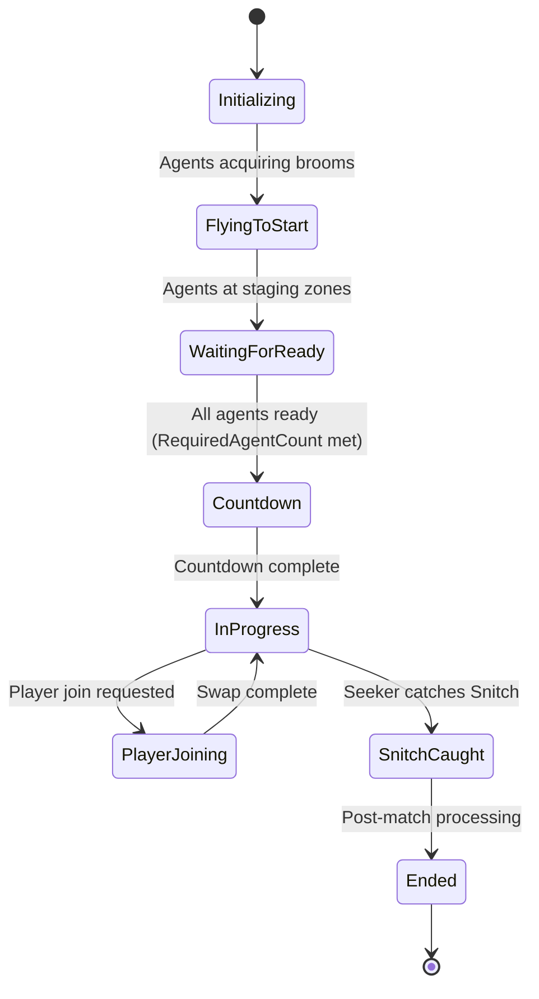

# Seeker Vertical Slice - Maintenance Requirement Cards

**Project:** WizardJam (END2507)
**Developer:** Marcus Daley
**Date:** February 15, 2026
**Classification:** Quidditch AI - Seeker Role Validation

---

## Document Purpose

This document contains 5 Navy-style Maintenance Requirement Cards (MRCs) for setting up and validating
the Seeker vertical slice in the WizardJam Quidditch AI system. Each card is a self-contained procedure
that can be executed independently, provided prerequisites are met.

**Execution Order:** MRC-SEK-001 through MRC-SEK-005 (sequential dependency)

---

# MRC-SEK-001: Initialize Staging Zone and Agent Positions

**Classification:** Critical
**Estimated Time:** 15 minutes
**Personnel Required:** Developer / Designer
**Tools Required:** Unreal Editor 5.4, VS Code

## PREREQUISITES

- WizardJam project compiles without errors (full rebuild, not Live Coding)
- Test level exists in Content Browser (any open level will work)
- BP_QuidditchGameMode Blueprint exists (child of AQuidditchGameMode)
- BP_QuidditchAgent Blueprint exists (child of ABaseAgent)
- BP_QuidditchAIController Blueprint exists (child of AAIC_QuidditchController)

## PROCEDURE

### Step 1: Set GameMode Override in World Settings

1. Open your test level in Unreal Editor
2. Open **World Settings** (Window -> World Settings or the toolbar icon)
3. Under **Game Mode**, set **GameMode Override** to `BP_QuidditchGameMode`
4. Verify the following sub-properties auto-populate from the GameMode:
   - Default Pawn Class: Should be your agent pawn class or `BP_QuidditchAgent`
   - AI Controller Class: Should show `BP_QuidditchAIController`

### Step 2: Configure RequiredAgentOverride for Single-Agent Testing

1. Open `BP_QuidditchGameMode` in the Blueprint editor (double-click in Content Browser)
2. In the **Details** panel, locate **Quidditch | Debug** category
3. Set **RequiredAgentOverride** to `1`
4. This overrides the calculated agent count (which defaults to 7 per team = 14 total)
5. Compile and Save the Blueprint

### Step 3: Place QuidditchStagingZone in Level

1. In the Content Browser, find `AQuidditchStagingZone` (or its Blueprint child `BP_QuidditchStagingZone` if it exists)
2. Drag it into the level viewport
3. Position it **above ground level** (Z = 500 to 1000 units recommended) - agents will fly up to it
4. In the **Details** panel, configure Zone Identity:
   - **ZoneIdentifier**: `TeamA_Seeker`
   - **TeamHint**: `1` (corresponds to `EQuidditchTeam::TeamA` which is uint8 value 1)
   - **RoleHint**: `1` (corresponds to `EQuidditchRole::Seeker` which is uint8 value 1)
5. Verify the zone's `TriggerVolume` (SphereComponent) has **Generate Overlap Events** enabled
6. Verify the zone's `PerceptionSource` (UAIPerceptionStimuliSourceComponent) exists and is active

### Step 4: Place Agent Spawn Point

1. Place a `BP_QuidditchAgent` instance in the level at ground level
2. In the **Details** panel, configure:
   - **AIControllerClass**: `BP_QuidditchAIController`
   - **Auto Possess AI**: `Placed in World` or `Spawned`
   - **PlacedQuidditchTeam** (or via AgentDataAsset): `TeamA`
   - **PlacedPreferredRole** (or via AgentDataAsset): `Seeker`
3. Position agent within 3000 units of where the BP_BroomCollectible will be placed (SightRadius default)

### Step 5: Verify Collision and Navigation Setup

1. Select the QuidditchStagingZone and check in the Details panel:
   - `TriggerVolume` collision preset allows overlap with Pawn channel
   - `TriggerRadius` is at least 200 units (default)
2. Confirm there is no NavMesh Bounds Volume required - this system uses direct velocity control, not NavMesh
3. Save the level

## VERIFICATION

- [ ] World Settings shows BP_QuidditchGameMode as GameMode Override
- [ ] BP_QuidditchGameMode has RequiredAgentOverride = 1 in its defaults
- [ ] QuidditchStagingZone is placed above ground (Z > 0) with TeamHint=1, RoleHint=1
- [ ] QuidditchStagingZone has active TriggerVolume with overlap events enabled
- [ ] QuidditchStagingZone has UAIPerceptionStimuliSourceComponent for AI detection
- [ ] BP_QuidditchAgent is placed with correct team/role and AIControllerClass set
- [ ] Level is saved

## CAUTIONS

> **RequiredAgentOverride=0 means "use calculated value"** which computes to 7 per team (14 total).
> For single-Seeker testing, this MUST be set to 1. If left at 0, the match will never start because
> the GameMode will wait for 14 agents to register and reach staging zones.

> **TeamHint and RoleHint are int32 values**, not enums in the editor. The enum backing values are:
> - EQuidditchTeam: None=0, TeamA=1, TeamB=2
> - EQuidditchRole: None=0, Seeker=1, Chaser=2, Beater=3, Keeper=4

> **Staging zone must have overlap-enabled collision.** If the TriggerVolume's collision response is set
> to Block or Ignore instead of Overlap, the HandlePawnBeginOverlap delegate in the controller will
> never fire and the agent will never register as "arrived."

## REFERENCES

- Source: `Source/END2507/Public/Code/GameModes/QuidditchGameMode.h` (RequiredAgentOverride at line 335)
- Source: `Source/END2507/Public/Code/Quidditch/QuidditchStagingZone.h` (TeamHint/RoleHint at lines 69-73)
- Source: `Source/END2507/Public/Code/Quidditch/QuidditchTypes.h` (EQuidditchMatchState enum at line 67)
- Next: MRC-SEK-002 (Controller and Blackboard configuration)

---

# MRC-SEK-002: Configure Agent Controller and Blackboard

**Classification:** Critical
**Estimated Time:** 20 minutes
**Personnel Required:** Developer
**Tools Required:** Unreal Editor 5.4, VS Code

## PREREQUISITES

- MRC-SEK-001 completed (level setup with GameMode, staging zone, and agent)
- BB_QuidditchAI Blackboard asset exists in Content Browser
- BT_QuidditchAI Behavior Tree asset exists in Content Browser
- BP_QuidditchAIController Blueprint exists (child of AAIC_QuidditchController)

## PROCEDURE

### Step 1: Verify BB_QuidditchAI Blackboard Keys

1. Open `BB_QuidditchAI` in the Blackboard editor (double-click in Content Browser)
2. Verify ALL of the following keys exist with the correct types. If any are missing, add them:

| Key Name | Type | Purpose |
|---|---|---|
| `TargetLocation` | Vector | General flight destination |
| `TargetActor` | Object (Base: AActor) | Actor to follow |
| `IsFlying` | Bool | Current flight state |
| `SelfActor` | Object (Base: AActor) | Reference to controlled pawn |
| `PerceivedCollectible` | Object (Base: AActor) | Nearest collectible from perception |
| `MatchStarted` | Bool | Whether match is active |
| `ShouldSwapTeam` | Bool | Team swap flag |
| `QuidditchRole` | Name | Assigned role as FName |
| `HasBroom` | Bool | Whether agent has a broom |
| `HomeLocation` | Vector | Spawn position |
| `GoalCenter` | Vector | Goal position (Keeper use) |
| `SnitchActor` | Object (Base: AActor) | Reference to Snitch ball |
| `SnitchLocation` | Vector | Snitch world position |
| `SnitchVelocity` | Vector | Snitch movement vector |
| `StagingZoneActor` | Object (Base: AActor) | Perceived staging zone |
| `StagingZoneLocation` | Vector | Staging zone position |
| `ReachedStagingZone` | Bool | Whether agent is at staging zone |
| `StageLocation` | Vector | Staging zone target position |
| `NearestSeeker` | Object (Base: AActor) | Nearest opposing Seeker |
| `IsReady` | Bool | Agent ready status |

### Step 2: Verify BP_QuidditchAIController Configuration

1. Open `BP_QuidditchAIController` in the Blueprint editor
2. In the **Details** panel, verify under **Quidditch | AI**:
   - **BehaviorTreeAsset**: Set to `BT_QuidditchAI`
   - **BlackboardAsset**: Can be left empty (the BT provides it), or explicitly set to `BB_QuidditchAI`

### Step 3: Cross-Check FName Key Names Against BB Asset

1. In BP_QuidditchAIController Details panel, verify under **Quidditch | Blackboard**:
   - `TargetLocationKeyName` = `TargetLocation`
   - `TargetActorKeyName` = `TargetActor`
   - `IsFlyingKeyName` = `IsFlying`
   - `SelfActorKeyName` = `SelfActor`
2. Under **Quidditch | Blackboard** (private section, may need to check C++ defaults):
   - `PerceivedCollectibleKeyName` = `PerceivedCollectible`
3. Under **Quidditch | Sync**:
   - `MatchStartedKeyName` = `MatchStarted`
   - `ShouldSwapTeamKeyName` = `ShouldSwapTeam`
   - `QuidditchRoleKeyName` = `QuidditchRole`
   - `HasBroomKeyName` = `HasBroom`
4. Each FName string MUST match the BB asset key name exactly (case-sensitive)

### Step 4: Verify Agent Blueprint Uses Correct Controller

1. Open the BP_QuidditchAgent Blueprint
2. In the **Details** panel, under **Pawn**:
   - **AIControllerClass**: Must be `BP_QuidditchAIController`
   - **Auto Possess AI**: Must be `Placed in World` or `Spawned`
3. Verify the agent has a `UAC_BroomComponent` attached (required for flight state sync)

### Step 5: Verify SetupBlackboard Initial Values

1. Review `AIC_QuidditchController.cpp`, `SetupBlackboard()` function (line 257)
2. Confirm the following initial values are written at possess time:
   - `SelfActor` = InPawn (the controlled pawn)
   - `HomeLocation` = InPawn->GetActorLocation() (spawn position)
   - `IsFlying` = false
   - `MatchStarted` = false
   - `ShouldSwapTeam` = false
   - `HasBroom` = false
   - `TargetLocation` = (0,0,0)
   - `SnitchLocation` = (0,0,0)
   - `SnitchVelocity` = (0,0,0)
   - `StageLocation` = (0,0,0)
   - `StagingZoneLocation` = (0,0,0)
   - `GoalCenter` = (0,0,0)
   - `ReachedStagingZone` = false
   - `IsReady` = false

## VERIFICATION

- [ ] BB_QuidditchAI contains all 20+ keys listed in Step 1 with correct types
- [ ] BP_QuidditchAIController has BehaviorTreeAsset = BT_QuidditchAI
- [ ] All FName key name properties match BB asset key names exactly (case-sensitive)
- [ ] BP_QuidditchAgent uses BP_QuidditchAIController as AIControllerClass
- [ ] BP_QuidditchAgent has UAC_BroomComponent attached
- [ ] SetupBlackboard initializes all expected keys with default values

## CAUTIONS

> **FName mismatch = silent failure.** If a key name like `MatchStarted` is spelled `matchStarted`
> or `Match_Started` in the controller, the Blackboard write will succeed silently but the BT
> decorators reading the correct key name will never see the value change. Always verify exact
> case-sensitive string match between controller FName properties and BB asset key names.

> **The FBlackboardKeySelector dual-init requirement (AddObjectFilter + InitializeFromAsset) is
> already handled by all 17 BT nodes.** This MRC only concerns the controller-side FName strings
> that are used with direct `SetValueAs*()` calls on the BlackboardComponent.

> **Object-type keys must have the correct Base Class.** If a key is set to `Object (Base: UObject)`
> but the code casts it to `AActor`, the cast will succeed but the BT editor dropdown won't show
> the key for nodes filtered to AActor. Set base class to `AActor` for all actor reference keys.

## REFERENCES

- Source: `Source/END2507/Public/Code/AI/AIC_QuidditchController.h` (FName properties at lines 145-226)
- Source: `Source/END2507/Private/Code/AI/AIC_QuidditchController.cpp` (SetupBlackboard at line 257)
- Source: `Source/END2507/Private/Code/AI/AIC_QuidditchController.cpp` (constructor init list at line 23)
- Previous: MRC-SEK-001 | Next: MRC-SEK-003

---

# MRC-SEK-003: Validate Broom Acquisition Pipeline

**Classification:** Routine
**Estimated Time:** 10 minutes
**Personnel Required:** Developer / QA
**Tools Required:** Unreal Editor 5.4 (PIE mode), Output Log

## PREREQUISITES

- MRC-SEK-001 and MRC-SEK-002 completed
- BP_BroomCollectible Blueprint exists with:
  - UAIPerceptionStimuliSourceComponent (for AI sight detection)
  - IInteractable interface implementation
- Level has BP_QuidditchAgent placed with functioning controller and BT

## PROCEDURE

### Step 1: Place BroomCollectible Within Perception Range

1. Find `BP_BroomCollectible` in the Content Browser
2. Place it in the level within **2000 units** of the agent spawn point
   - The default SightRadius on AIC_QuidditchController is 2000.0f (constructor line 32)
   - Place closer (500-1000 units) for fastest testing
3. Ensure the broom is at ground level (same Z as the agent)
4. Save the level

### Step 2: Verify BroomCollectible Has AI Perception Stimuli Source

1. Open BP_BroomCollectible in the Blueprint editor
2. In the Components panel, verify `UAIPerceptionStimuliSourceComponent` exists
3. In its Details, verify:
   - **Auto Register as Source**: Enabled
   - **Register as Source for Senses**: Contains `AISense_Sight`
4. Without this component, the AI perception system will never detect the broom

### Step 3: PIE Test - Broom Perception and Collection

1. Open **Output Log** (Window -> Developer Tools -> Output Log)
2. Set log filter to show `LogQuidditchAI` category
3. Press **Play** (PIE) in the editor
4. Watch Output Log for these messages in sequence:
   - `[AIC_QuidditchController] Possessed 'BP_QuidditchAgent_C_0'` - Controller activated
   - `PERCEIVED: BP_BroomCollectible_C_0 (Class: BP_BroomCollectible_C)` - Broom detected
   - BTService_FindCollectible should write to `PerceivedCollectible` key

### Step 4: Verify Broom Interaction

1. Continue watching Output Log during PIE
2. The BT should execute:
   - BTService_FindCollectible writes broom to `PerceivedCollectible` BB key
   - BTTask_Interact (or MoveTo) navigates agent to broom location
   - Agent reaches broom and calls `IInteractable::OnInteract`
3. If using BTTask_MountBroom after interaction, verify it calls `SetFlightEnabled(true)`
4. Watch for: `MOUNTED -> BB.IsFlying=true, BB.HasBroom=true` in the log

### Step 5: Verify Blackboard State After Broom Mount

1. During PIE, open the **Behavior Tree debugger** (AI -> Behavior Tree)
2. Select the agent from the dropdown
3. In the Blackboard panel, verify:
   - `HasBroom` = true
   - `IsFlying` = true
   - `PerceivedCollectible` = cleared (broom consumed)
4. The agent should now be in Flying movement mode

## VERIFICATION

- [ ] BP_BroomCollectible is placed within SightRadius (2000 units) of agent
- [ ] BP_BroomCollectible has active UAIPerceptionStimuliSourceComponent with AISense_Sight
- [ ] Output Log shows perception detection message for BroomCollectible
- [ ] BTService_FindCollectible writes to PerceivedCollectible BB key (visible in BT debugger)
- [ ] Agent navigates to and interacts with broom
- [ ] After broom mount: BB.HasBroom=true, BB.IsFlying=true
- [ ] Agent enters Flying movement mode (CharacterMovementComponent)

## CAUTIONS

> **If the broom is outside SightRadius (default 2000 units), perception will never fire.** The
> AI perception system only detects actors within the configured sight range. Place the broom
> within 1000 units of the agent for reliable first-test detection. You can increase
> SightRadius in BP_QuidditchAIController defaults if needed.

> **BroomCollectible MUST have UAIPerceptionStimuliSourceComponent.** Without it, the broom is
> invisible to the AI perception system regardless of distance. This was a confirmed bug from
> Day 21 (January 21, 2026).

> **BTTask_MountBroom writes "IsFlying" and "HasBroom" as hardcoded FName fallback strings** in
> addition to using the FlightStateKey selector. The controller's HandleFlightStateChanged
> delegate also writes these keys when BroomComponent.OnFlightStateChanged fires. Both paths
> should produce the same result.

## REFERENCES

- Source: `Source/END2507/Public/Code/AI/BTTask_MountBroom.h` (bMountBroom flag at line 62)
- Source: `Source/END2507/Private/Code/AI/AIC_QuidditchController.cpp` (HandleFlightStateChanged at line 742)
- Source: `Source/END2507/Private/Code/AI/AIC_QuidditchController.cpp` (HandlePerceptionUpdated at line 623)
- CLAUDE.md: Day 21 AI Broom Collection SUCCESS lesson learned
- Previous: MRC-SEK-002 | Next: MRC-SEK-004

---

# MRC-SEK-004: Validate Flight-to-Staging Pipeline

**Classification:** Routine
**Estimated Time:** 15 minutes
**Personnel Required:** Developer / QA
**Tools Required:** Unreal Editor 5.4 (PIE mode), Output Log, BT Debugger

## PREREQUISITES

- MRC-SEK-001 through MRC-SEK-003 completed
- Agent has successfully acquired broom (BB.HasBroom=true, BB.IsFlying=true)
- QuidditchStagingZone placed in level with correct TeamHint/RoleHint (from MRC-SEK-001)
- BT_QuidditchAI has the FlyToStaging sequence configured with:
  - BTService_FindStagingZone (writes StagingZoneActor and StagingZoneLocation to BB)
  - BTService_SyncFlightState (keeps flight state synchronized)
  - BTTask_FlyToStagingZone (reads StagingZoneLocation, flies to it)

## PROCEDURE

### Step 1: Verify BTService_FindStagingZone Locates Zone

1. Start PIE and wait for agent to acquire broom (MRC-SEK-003 flow)
2. Open **BT Debugger** (AI -> Behavior Tree) and select the agent
3. Watch for the BT to transition from AcquireBroom sequence to FlyToStaging sequence
4. In the Blackboard panel, verify:
   - `StagingZoneActor` shows the placed staging zone actor reference
   - `StagingZoneLocation` shows a non-zero vector matching the zone's world position
5. BTService_FindStagingZone uses perception PRIMARY, then TActorIterator FALLBACK:
   - Perception: Detects zone via UAIPerceptionStimuliSourceComponent
   - Fallback: Iterates all AQuidditchStagingZone actors in the world

### Step 2: Verify Direct Velocity Control (NOT NavMesh)

1. During flight, select the agent pawn in the editor viewport (click while PIE is running)
2. Open the **Details** panel and find `CharacterMovementComponent`
3. Verify:
   - **Movement Mode** = `Flying`
   - **Velocity** shows non-zero values changing each frame
4. This confirms direct velocity assignment, not NavMesh pathfinding
5. The flight task uses `CharacterMovementComponent->Velocity = DesiredVelocity` directly

### Step 3: Verify Zero NavMesh Usage

1. In the Output Log during PIE, set filter to `LogNavigation`
2. Verify there are **NO** navigation-related log messages from the Quidditch AI
3. No `MoveTo`, `MoveToLocation`, `MoveToActor`, or pathfinding requests should appear
4. The entire flight system uses direct velocity control on CharacterMovementComponent
5. This is by design - NavMesh is incompatible with 3D flight above the navigation mesh

### Step 4: Verify Staging Zone Overlap Detection

1. Watch the agent fly toward the staging zone in the viewport
2. When the agent enters the staging zone's TriggerVolume:
   - Controller's `HandlePawnBeginOverlap` fires (line 948 in AIC_QuidditchController.cpp)
   - It checks `StagingZone->TeamHint` against agent's team and `StagingZone->RoleHint` against agent's role
   - If they match, sets `bNotifiedStagingZoneArrival = true`
3. Watch Output Log for: `LANDED on staging zone 'BP_QuidditchStagingZone_C_0'`
4. In the Blackboard panel, verify:
   - `ReachedStagingZone` = true
   - `IsReady` = true

### Step 5: Verify GameMode Ready Count Increment

1. After agent reaches staging zone, check Output Log for GameMode messages
2. `HandleAgentReachedStagingZone` should fire on the GameMode
3. `AgentsReadyCount` should increment to 1
4. With RequiredAgentOverride=1, this triggers `CheckAllAgentsReady()`
5. Watch for match state transition: `WaitingForReady -> Countdown`

## VERIFICATION

- [ ] BTService_FindStagingZone writes valid zone reference to StagingZoneActor BB key
- [ ] StagingZoneLocation BB key contains correct non-zero world position
- [ ] Agent movement uses Flying mode with direct velocity assignment
- [ ] Output Log shows ZERO NavMesh/MoveTo messages (filter: LogNavigation)
- [ ] HandlePawnBeginOverlap fires when agent enters staging zone trigger volume
- [ ] BB.ReachedStagingZone=true and BB.IsReady=true after arrival
- [ ] GameMode.AgentsReadyCount increments and state transitions toward Countdown

## CAUTIONS

> **BTTask_FlyToStagingZone has 5 navigation solutions** that may affect behavior:
> 1. FlightSteeringComponent for obstacle avoidance (if bUseFlightSteering=true)
> 2. Extended ArrivalRadius (default increased for flight tolerance)
> 3. Velocity-based overshoot detection (catches high-speed passes through zone)
> 4. Stuck detection with position history sampling
> 5. Timeout fallback system (if bEnableTimeout=true)
>
> If the agent oscillates near the zone without triggering overlap, check: ArrivalRadius may be
> larger than the zone's TriggerRadius, causing the task to succeed before overlap fires. The zone's
> TriggerRadius should be >= the task's ArrivalRadius.

> **If the agent leaves the staging zone, HandlePawnEndOverlap resets arrival state.**
> `bNotifiedStagingZoneArrival` is set back to false, `BB.ReachedStagingZone` = false, and
> `GameMode.HandleAgentLeftStagingZone()` decrements the ready count. This prevents false
> starts if agents drift out of their zones.

> **NEVER add NavMesh Bounds Volume for flight AI.** NavMesh is for ground-based pathfinding only.
> All Quidditch flight uses direct CharacterMovementComponent.Velocity assignment. Adding NavMesh
> may cause unexpected interference with the movement system.

## REFERENCES

- Source: `Source/END2507/Public/Code/AI/BTTask_FlyToStagingZone.h` (5 navigation solutions documented)
- Source: `Source/END2507/Private/Code/AI/AIC_QuidditchController.cpp` (HandlePawnBeginOverlap at line 948)
- Source: `Source/END2507/Private/Code/AI/AIC_QuidditchController.cpp` (HandlePawnEndOverlap at line 1030)
- Source: `Source/END2507/Private/Code/GameModes/QuidditchGameMode.cpp` (HandleAgentReachedStagingZone)
- Previous: MRC-SEK-003 | Next: MRC-SEK-005

---

# MRC-SEK-005: Validate Match Play and Snitch Catch

**Classification:** Critical
**Estimated Time:** 15 minutes
**Personnel Required:** Developer / QA
**Tools Required:** Unreal Editor 5.4 (PIE mode), Output Log, BT Debugger

## PREREQUISITES

- MRC-SEK-001 through MRC-SEK-004 completed
- Agent is at staging zone with BB.ReachedStagingZone=true
- RequiredAgentOverride=1 in BP_QuidditchGameMode (single-Seeker testing)
- BP_SnitchBall (or BP_GoldenSnitch) Blueprint exists with:
  - Actor tag `Snitch` or `GoldenSnitch`
  - UAIPerceptionStimuliSourceComponent for AI detection
  - Movement behavior (Wander/Evade/Boundary/ObstacleAvoidance systems)

## PROCEDURE

### Step 1: Verify Match Countdown Fires

1. With RequiredAgentOverride=1 and agent at staging zone, the GameMode should:
   - Transition to `WaitingForReady` -> detect 1/1 agents ready -> transition to `Countdown`
   - Broadcast `OnMatchStarted` with CountdownSeconds parameter (default from MatchStartCountdown property)
2. Watch Output Log for: `HandleMatchStarted - BB.MatchStarted = true`
3. The controller's `HandleMatchStarted` handler (line 533) sets `BB.MatchStarted = true`
4. In BT Debugger Blackboard panel, verify: `MatchStarted` = true
5. If countdown does not trigger, use `DEBUG_ForceStartMatch()`:
   - In PIE console (`~` key): `ke * DEBUG_ForceStartMatch`

### Step 2: Verify BTTask_WaitForMatchStart Completes

1. In the BT Debugger, watch the WaitForMatch sequence
2. BTTask_WaitForMatchStart should be reading `BB.MatchStarted` (or `BB.bMatchStarted`)
3. When `MatchStarted` becomes true, the task should succeed
4. The BT should transition from WaitForMatch to the ChaseSnitch/PlayMatch sequence
5. Confirm the agent does NOT start chasing before match starts (decorator should gate this)

### Step 3: Place Snitch and Verify BTService_FindSnitch

1. Place `BP_SnitchBall` (or `BP_GoldenSnitch`) in the level
   - Position it within 5000 units of the staging zone (MaxSnitchRange default in BTService_FindSnitch)
   - The Snitch should have actor tag `Snitch` or `GoldenSnitch` for fallback detection
2. BTService_FindSnitch runs at **0.1s interval** (highest frequency service in the system)
3. Detection uses two methods:
   - **PRIMARY**: AI Perception (checks SnitchClass match or `Snitch`/`GoldenSnitch` actor tags)
   - **FALLBACK**: TActorIterator world search by SnitchClass then by `Snitch` tag
4. In BT Debugger Blackboard panel, verify after match start:
   - `SnitchActor` = reference to the placed Snitch actor
   - `SnitchLocation` = Snitch's current world position (updates every 0.1s)
   - `SnitchVelocity` = Snitch's current velocity vector

### Step 4: Verify BTTask_ChaseSnitch Pursuit

1. After BTService_FindSnitch writes Snitch data, BTTask_ChaseSnitch activates
2. This task is gated by `BTDecorator_IsSeeker` - only Seeker role agents execute it
3. Watch the agent in the viewport - it should fly toward the Snitch
4. ChaseSnitch uses direct velocity control:
   - Reads `SnitchLocation` from BB every tick
   - Calculates direction to Snitch
   - Sets `CharacterMovementComponent->Velocity` directly (line 138 in BTTask_ChaseSnitch.cpp)
   - Uses `BroomComponent->SetVerticalInput()` for altitude adjustment
   - Enables boost when distance > BoostDistanceThreshold (default 1000 units)
5. The task returns `Succeeded` when distance < CatchRadius (default **200cm**)

### Step 5: Verify Snitch Catch and Match End

1. When BTTask_ChaseSnitch succeeds (within 200cm), BTTask_CatchSnitch executes
2. BTTask_CatchSnitch checks distance < CatchRadius (default **150cm**):
   - If Seeker is within 150cm: calls `TryCatchSnitch()`
   - `TryCatchSnitch()` calls `GameMode->NotifySnitchCaught(Seeker, SeekerTeam)` (line 125 in BTTask_CatchSnitch.cpp)
3. GameMode.NotifySnitchCaught:
   - Awards SnitchCatchPoints (default 150) to the catching team
   - Broadcasts `OnSnitchCaught` delegate
   - Broadcasts `OnMatchEnded` delegate
   - Transitions match state to `SnitchCaught` then `Ended`
4. Watch Output Log for:
   - `[CatchSnitch] <AgentName> caught the Golden Snitch! +150 points`
   - `HandleMatchEnded - BB.MatchStarted = false`
5. If bDestroySnitchOnCatch=true (default), the Snitch actor is destroyed
6. The controller's HandleMatchEnded sets `BB.MatchStarted = false`

## VERIFICATION

- [ ] Match countdown fires when agent reaches staging zone (RequiredAgentOverride=1)
- [ ] Controller's HandleMatchStarted sets BB.MatchStarted=true
- [ ] BTTask_WaitForMatchStart completes, BT transitions to ChaseSnitch sequence
- [ ] BTService_FindSnitch writes SnitchActor, SnitchLocation, SnitchVelocity to BB
- [ ] BTTask_ChaseSnitch pursues Snitch via direct velocity control (no NavMesh)
- [ ] Agent reaches within CatchRadius (200cm ChaseSnitch -> 150cm CatchSnitch)
- [ ] BTTask_CatchSnitch calls GameMode.NotifySnitchCaught successfully
- [ ] OnMatchEnded broadcasts and match state transitions to Ended
- [ ] BB.MatchStarted resets to false after match ends

## CAUTIONS

> **The Snitch has a 4-system movement model** (Wander + Evade + Boundary + ObstacleAvoidance).
> For initial testing, you may want to disable Snitch movement or place it stationary to verify
> the catch pipeline works before testing against a moving target. You can disable movement by
> setting the Snitch's movement speed to 0 in its Blueprint defaults.

> **BTService_FindSnitch runs at 0.1s interval** - this is the highest-frequency service in the
> BT. This is necessary because the Snitch moves quickly and the Seeker needs near-real-time
> position updates for effective pursuit.

> **CatchSnitch radius (150cm) < ChaseSnitch success radius (200cm).** The ChaseSnitch task
> succeeds at 200cm distance, but CatchSnitch requires the agent to be within 150cm to actually
> trigger the catch. This means there is a 50cm gap where ChaseSnitch succeeds but CatchSnitch
> may fail if the Snitch moves away. The BT should handle this by re-entering the chase loop.

> **OnMatchEnded broadcast was a confirmed bug (never broadcast) - FIXED February 15, 2026.**
> The fix was applied in the Feb 15 forensic audit. If testing on an older build, verify that
> `NotifySnitchCaught()` actually calls `OnMatchEnded.Broadcast()`.

## REFERENCES

- Source: `Source/END2507/Private/Code/AI/Quidditch/BTTask_CatchSnitch.cpp` (TryCatchSnitch at line 94)
- Source: `Source/END2507/Private/Code/AI/Quidditch/BTTask_ChaseSnitch.cpp` (TickTask at line 70)
- Source: `Source/END2507/Private/Code/AI/Quidditch/BTService_FindSnitch.cpp` (0.1s interval at line 25)
- Source: `Source/END2507/Private/Code/AI/AIC_QuidditchController.cpp` (HandleMatchStarted at line 533)
- Source: `Source/END2507/Public/Code/GameModes/QuidditchGameMode.h` (NotifySnitchCaught at line 232)
- Previous: MRC-SEK-004

---

# SEEKER PIPELINE FLOWCHART

```mermaid
graph LR
    A["Spawn & Register"] -->|"OnPossess"| B["AcquireBroom"]
    B -->|"HasBroom=true"| C["FlyToStaging"]
    C -->|"ReachedStagingZone=true"| D["WaitForMatch"]
    D -->|"MatchStarted=true"| E["ChaseSnitch"]
    E -->|"Within CatchRadius"| F["CatchSnitch"]
    F -->|"NotifySnitchCaught"| G["MatchEnd"]
```

### Pipeline Stage Details

| Stage | BT Nodes Active | BB Keys Written | BB Keys Read |
|---|---|---|---|
| Spawn & Register | (none - OnPossess) | SelfActor, HomeLocation, IsFlying=false, HasBroom=false, MatchStarted=false | (none) |
| AcquireBroom | BTService_FindCollectible, BTTask_Interact, BTTask_MountBroom | PerceivedCollectible, HasBroom=true, IsFlying=true | PerceivedCollectible |
| FlyToStaging | BTService_FindStagingZone, BTTask_FlyToStagingZone | StagingZoneActor, StagingZoneLocation, ReachedStagingZone=true | StagingZoneLocation, IsFlying |
| WaitForMatch | BTTask_WaitForMatchStart | (none - reads only) | MatchStarted |
| ChaseSnitch | BTService_FindSnitch, BTTask_ChaseSnitch | SnitchActor, SnitchLocation, SnitchVelocity | SnitchLocation |
| CatchSnitch | BTTask_CatchSnitch | SnitchActor=cleared | SnitchActor |
| MatchEnd | (none - delegate) | MatchStarted=false | (none) |

---

# MATCH STATE MACHINE

### State Transition Triggers

| From | To | Trigger | Delegate Broadcast |
|---|---|---|---|
| Initializing | FlyingToStart | First agent registers with GameMode | OnMatchStateChanged |
| FlyingToStart | WaitingForReady | Agent reaches staging zone overlap | OnAgentReadyAtStart |
| WaitingForReady | Countdown | AgentsReadyCount >= RequiredAgentCount | OnAllAgentsReady |
| Countdown | InProgress | Timer expires (MatchStartCountdown seconds) | OnMatchStarted(CountdownSeconds) |
| InProgress | SnitchCaught | NotifySnitchCaught() called | OnSnitchCaught |
| SnitchCaught | Ended | Post-match processing | OnMatchEnded |

---

# DELEGATE BINDING MAP

| Delegate Name | Broadcaster | Listener | BB Key Updated | When Bound | When Unbound |
|---|---|---|---|---|---|
| `OnMatchStarted` | AQuidditchGameMode | AAIC_QuidditchController | MatchStarted=true | OnPossess (BindToGameModeEvents) | EndPlay (UnbindFromGameModeEvents) |
| `OnMatchEnded` | AQuidditchGameMode | AAIC_QuidditchController | MatchStarted=false | OnPossess (BindToGameModeEvents) | EndPlay (UnbindFromGameModeEvents) |
| `OnQuidditchRoleAssigned` | AQuidditchGameMode | AAIC_QuidditchController | QuidditchRole=RoleName | OnPossess (BindToGameModeEvents) | EndPlay (UnbindFromGameModeEvents) |
| `OnAgentSelectedForSwap` | AQuidditchGameMode | AAIC_QuidditchController | ShouldSwapTeam=true | OnPossess (BindToGameModeEvents) | EndPlay (UnbindFromGameModeEvents) |
| `OnTeamSwapComplete` | AQuidditchGameMode | AAIC_QuidditchController | ShouldSwapTeam=false | OnPossess (BindToGameModeEvents) | EndPlay (UnbindFromGameModeEvents) |
| `OnMatchStateChanged` | AQuidditchGameMode | (HUD, observers) | (varies by consumer) | BeginPlay | EndPlay |
| `OnAgentReadyAtStart` | AQuidditchGameMode | (HUD for ready count) | (none directly) | BeginPlay | EndPlay |
| `OnAllAgentsReady` | AQuidditchGameMode | (GameMode internal) | (triggers countdown) | (internal) | (internal) |
| `OnFlightStateChanged` | UAC_BroomComponent | AAIC_QuidditchController | IsFlying, HasBroom | OnPossess | OnUnPossess |
| `OnActorBeginOverlap` | APawn | AAIC_QuidditchController | ReachedStagingZone=true, IsReady=true | OnPossess (BindToPawnOverlapEvents) | OnUnPossess (UnbindFromPawnOverlapEvents) |
| `OnActorEndOverlap` | APawn | AAIC_QuidditchController | ReachedStagingZone=false, IsReady=false | OnPossess (BindToPawnOverlapEvents) | OnUnPossess (UnbindFromPawnOverlapEvents) |

---

# QUICK REFERENCE: BB KEY INVENTORY

| Key Name | Type | Initial Value | Set By | Read By |
|---|---|---|---|---|
| `SelfActor` | Object (AActor) | Controlled Pawn | SetupBlackboard (OnPossess) | Various BT tasks |
| `HomeLocation` | Vector | Pawn spawn location | SetupBlackboard (OnPossess) | BTTask_ReturnToHome |
| `TargetLocation` | Vector | (0,0,0) | SetFlightTarget(), BT tasks | BTTask_FlyToStagingZone, BTTask_ControlFlight |
| `TargetActor` | Object (AActor) | (unset) | SetFlightTargetActor(), perception | BT tasks |
| `IsFlying` | Bool | false | HandleFlightStateChanged delegate | BTDecorator_IsFlying, BT tasks |
| `HasBroom` | Bool | false | HandleFlightStateChanged delegate | BTDecorator (broom gate), BT sequence |
| `PerceivedCollectible` | Object (AActor) | (unset) | BTService_FindCollectible | BTTask_Interact, BTTask_MoveToCollectible |
| `MatchStarted` | Bool | false | HandleMatchStarted / HandleMatchEnded delegates | BTTask_WaitForMatchStart, BTDecorator |
| `ShouldSwapTeam` | Bool | false | HandleAgentSelectedForSwap / HandleTeamSwapComplete | BTTask_SwapTeam |
| `QuidditchRole` | Name | (unset) | HandleQuidditchRoleAssigned / RegisterAgentWithGameMode | BTDecorator_IsSeeker, role-gated tasks |
| `GoalCenter` | Vector | (0,0,0) | (Keeper setup) | BTTask_PositionInGoal, BTTask_BlockShot |
| `SnitchActor` | Object (AActor) | (unset) | BTService_FindSnitch | BTTask_CatchSnitch |
| `SnitchLocation` | Vector | (0,0,0) | BTService_FindSnitch | BTTask_ChaseSnitch |
| `SnitchVelocity` | Vector | (0,0,0) | BTService_FindSnitch | BTTask_PredictIntercept (future) |
| `StagingZoneActor` | Object (AActor) | (unset) | BTService_FindStagingZone | BTTask_FlyToStagingZone |
| `StagingZoneLocation` | Vector | (0,0,0) | BTService_FindStagingZone | BTTask_FlyToStagingZone |
| `ReachedStagingZone` | Bool | false | HandlePawnBeginOverlap / HandlePawnEndOverlap | BTDecorator, match flow |
| `StageLocation` | Vector | (0,0,0) | (staging zone services) | BTTask_FlyToStagingZone |
| `NearestSeeker` | Object (AActor) | (unset) | (Snitch AI services) | AIC_SnitchController |
| `IsReady` | Bool | false | HandlePawnBeginOverlap / HandlePawnEndOverlap | BTDecorator, match flow |

---

# TROUBLESHOOTING QUICK REFERENCE

| Symptom | Likely Cause | Fix |
|---|---|---|
| Agent does not perceive broom | Missing UAIPerceptionStimuliSourceComponent on broom | Add component, enable Auto Register as Source for AISense_Sight |
| Agent perceives broom but does not move | BTService_FindCollectible not writing to BB | Check AddObjectFilter + InitializeFromAsset on the service |
| BB key shows (invalid) | Key exists in BB asset but never initialized | Verify SetupBlackboard writes initial value for that key |
| Agent flies but never reaches staging zone | ArrivalRadius > TriggerRadius | Increase staging zone TriggerRadius or decrease task ArrivalRadius |
| Agent reaches zone but match doesn't start | RequiredAgentOverride is 0 (calculated=14) | Set RequiredAgentOverride=1 in BP_QuidditchGameMode |
| Agent starts chasing before match begins | Missing BTDecorator checking MatchStarted | Add decorator that gates on BB.MatchStarted=true |
| ChaseSnitch succeeds but CatchSnitch fails | 200cm vs 150cm radius gap | Normal behavior - BT should re-enter chase loop |
| Match never ends after catch | OnMatchEnded not broadcasting | Verify Feb 15 fix is applied in QuidditchGameMode.cpp |
| Agent oscillates near staging zone | Overshoot at flight speed | Enable bEnableVelocityArrival on BTTask_FlyToStagingZone |
| FName key mismatch (silent failure) | Typo in controller FName vs BB asset key name | Compare strings character-by-character, case-sensitive |
