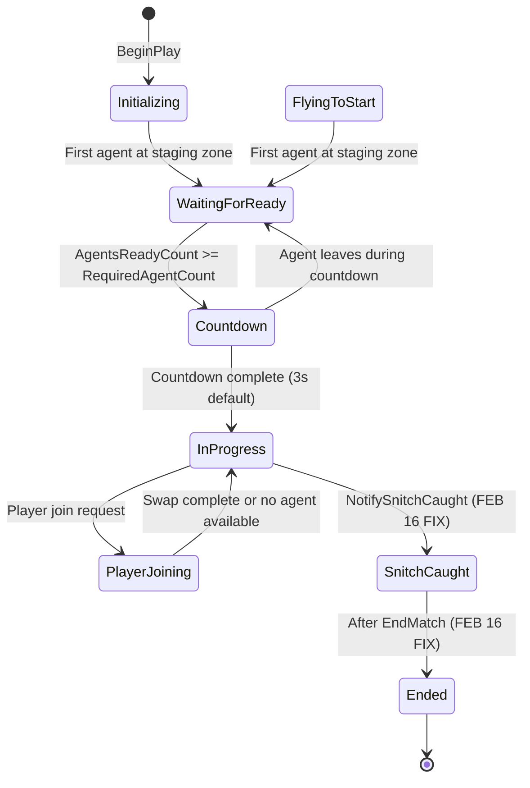

# WizardJam Quidditch AI System - Comprehensive Training Guide

**Developer:** Marcus Daley
**Project:** END2507 (WizardJam)
**Engine:** Unreal Engine 5.4
**Document Version:** 1.0 - February 16, 2026
**Status:** Production-Ready Vertical Slice (Seeker + Snitch)

---

## Table of Contents

1. [System Overview](#1-system-overview)
2. [AI Architecture](#2-ai-architecture)
3. [Behavior Tree Structure](#3-behavior-tree-structure)
4. [BT Node Reference](#4-bt-node-reference)
5. [Blackboard Key Reference](#5-blackboard-key-reference)
6. [Delegate & Event Reference](#6-delegate--event-reference)
7. [Match State Machine](#7-match-state-machine)
8. [Unreal Editor Setup Guide](#8-unreal-editor-setup-guide)
9. [Quick-Start Checklist](#9-quick-start-checklist)
10. [Troubleshooting & Debugging](#10-troubleshooting--debugging)
11. [Changelog](#11-changelog)

---

## 1. SYSTEM OVERVIEW

### Architecture Diagram

```
┌─────────────────────────────────────────────────────────────────────────┐
│                        QUIDDITCH AI SYSTEM                              │
├─────────────────────────────────────────────────────────────────────────┤
│                                                                         │
│  ┌──────────────────┐        ┌──────────────────┐                      │
│  │ QuidditchGameMode│◄───────┤ QuidditchAgent   │                      │
│  │                  │        │ (BaseAgent)      │                      │
│  │ • Team registry  │        │ • Team ID        │                      │
│  │ • Role assign    │        │ • Faction color  │                      │
│  │ • Match state    │        │ • BroomComponent │                      │
│  │ • 11 delegates   │        └────────┬─────────┘                      │
│  └────────┬─────────┘                 │                                │
│           │                           │ Possesses                      │
│           │ Broadcasts                ▼                                │
│           │            ┌──────────────────────────┐                    │
│           └───────────►│ AIC_QuidditchController  │                    │
│                        │                          │                    │
│                        │ • AIPerception (sight)   │                    │
│                        │ • Blackboard sync        │                    │
│                        │ • Delegate handlers      │                    │
│                        │ • Observer Pattern       │                    │
│                        └────────┬─────────────────┘                    │
│                                 │ Runs                                 │
│                                 ▼                                      │
│                   ┌──────────────────────┐                             │
│                   │  BT_QuidditchAI      │                             │
│                   │                      │                             │
│                   │ • 21 Tasks           │                             │
│                   │ • 8 Services         │                             │
│                   │ • 2 Decorators       │                             │
│                   │ • 20 BB Keys         │                             │
│                   └──────────────────────┘                             │
│                                                                         │
│  Gas Station Pattern (Observer):                                       │
│  GameMode.OnMatchStarted.Broadcast() ──► Controller.HandleMatchStarted │
│                                         └─► BB.MatchStarted = true     │
│                                         └─► BT decorators auto-trigger │
│                                                                         │
│  Flight Control: NO NavMesh, NO MoveTo, ONLY CharacterMovement.Velocity│
│                                                                         │
└─────────────────────────────────────────────────────────────────────────┘
```

### Key Classes & Responsibilities

| Class | File Path | Responsibility |
|-------|-----------|----------------|
| **AQuidditchGameMode** | `Code/GameModes/QuidditchGameMode.h/.cpp` | Match orchestration, team/role registry, 8-state FSM, 11 sync delegates |
| **AAIC_QuidditchController** | `Code/AI/AIC_QuidditchController.h/.cpp` | Blackboard sync, delegate binding, perception management, BT execution |
| **ABaseAgent** | `Code/Actors/BaseAgent.h/.cpp` | Pawn class with faction, team ID, visual appearance, BroomComponent |
| **UAC_BroomComponent** | `Code/Flight/AC_BroomComponent.h/.cpp` | Flight physics, stamina, mounting, 4 delegates (OnFlightStateChanged, etc.) |
| **AAIC_SnitchController** | `Code/AI/AIC_SnitchController.h/.cpp` | 360° perception for Snitch, pursuer tracking, tag filtering |
| **ASnitchBall** | `Code/Quidditch/SnitchBall.h/.cpp` | Tick-driven 4-force movement, evade logic, catch detection (30u sphere) |
| **AQuidditchStagingZone** | `Code/Quidditch/QuidditchStagingZone.h/.cpp` | Match start positions, overlap detection, team/role hints |

### Communication Pattern: Gas Station / Observer

**NO POLLING. NO GAMEPLAYSTATICS. ONLY DELEGATES.**

```cpp
// ✅ CORRECT - Observer Pattern (Gas Station)
// GameMode broadcasts event
OnMatchStarted.Broadcast(3.0f);

// Controller listens (bound once in BeginPlay)
void AAIC_QuidditchController::HandleMatchStarted(float CountdownSeconds)
{
    Blackboard->SetValueAsBool(MatchStartedKeyName, true);
    // BT decorators automatically re-evaluate when BB changes
}

// ❌ FORBIDDEN - Polling in BT Service Tick
void UBTService_CheckMatch::TickNode()
{
    AQuidditchGameMode* GM = Cast<AQuidditchGameMode>(
        UGameplayStatics::GetGameMode(this));  // NEVER USE THIS
    bool bStarted = GM->IsMatchStarted();      // POLLING = BAD
}
```

**Why Observer Pattern?**
- **Single Source of Truth**: GameMode broadcasts once, all listeners sync
- **Zero Latency**: Instant reaction vs 0.5s Service tick interval
- **Decoupled**: GameMode doesn't know listeners exist
- **Industry Standard**: AAA pattern from Nick Penney's architecture guidance

### File Structure Map

```
Source/END2507/
├── Code/
│   ├── AI/
│   │   ├── AIC_QuidditchController.h/.cpp       (Controller with perception + sync)
│   │   ├── AIC_SnitchController.h/.cpp          (Snitch-specific controller)
│   │   ├── BTTask_*.h/.cpp                      (21 task files)
│   │   ├── BTService_*.h/.cpp                   (8 service files)
│   │   ├── BTDecorator_*.h/.cpp                 (2 decorator files)
│   │   └── Quidditch/
│   │       ├── BTService_FindSnitch.h/.cpp      (0.1s tick - high priority)
│   │       ├── BTService_FindQuaffle.h/.cpp
│   │       └── BTService_FindBludger.h/.cpp
│   ├── Actors/
│   │   └── BaseAgent.h/.cpp                     (Pawn with faction + broom)
│   ├── Flight/
│   │   └── AC_BroomComponent.h/.cpp             (Flight physics component)
│   ├── GameModes/
│   │   └── QuidditchGameMode.h/.cpp             (Match orchestrator)
│   └── Quidditch/
│       ├── SnitchBall.h/.cpp                    (Golden Snitch pawn)
│       ├── QuidditchStagingZone.h/.cpp          (Match start positions)
│       └── QuidditchTypes.h                     (Shared enums/delegates)
```

---

## 2. AI ARCHITECTURE

### Controller Hierarchy

```
AAIController (Unreal base class)
    │
    ├─► AAIC_QuidditchController (Quidditch agent controller)
    │   • 360° sight perception
    │   • Blackboard sync with GameMode
    │   • BT execution (BT_QuidditchAI)
    │   • Flight target management
    │   • Team/role configuration
    │
    └─► AAIC_SnitchController (Snitch-specific controller)
        • 360° sight perception (2000u radius)
        • Pursuer tracking via tags ("Seeker", "Flying", "Player")
        • NO behavior tree (Snitch handles own movement)
        • Broadcasts OnPursuerDetected/OnPursuerLost
```

### OnPossess Initialization Sequence

**CRITICAL: Order matters for proper initialization**

```cpp
void AAIC_QuidditchController::OnPossess(APawn* InPawn)
{
    Super::OnPossess(InPawn);

    // ========================================================================
    // 1. FACTION INITIALIZATION (Team ID + Visual Appearance)
    // ========================================================================
    // Must happen AFTER possession so GetController() returns valid reference
    // Sets controller team ID, updates pawn appearance with faction color
    if (ABaseAgent* Agent = Cast<ABaseAgent>(InPawn))
    {
        int32 FactionID = Agent->GetPlacedFactionID();
        FLinearColor FactionColor = Agent->GetPlacedFactionColor();
        SetGenericTeamId(FGenericTeamId(static_cast<uint8>(FactionID)));
        Agent->OnFactionAssigned_Implementation(FactionID, FactionColor);
    }

    // ========================================================================
    // 2. BROOM COMPONENT BINDING (Flight State Sync)
    // ========================================================================
    // Bind to OnFlightStateChanged delegate to keep BB.IsFlying synced
    if (UAC_BroomComponent* BroomComp = InPawn->FindComponentByClass<...>())
    {
        BroomComp->OnFlightStateChanged.AddDynamic(
            this, &AAIC_QuidditchController::HandleFlightStateChanged);
    }

    // ========================================================================
    // 3. STAGING ZONE OVERLAP BINDING (Landing Detection)
    // ========================================================================
    // Bee and Flower Pattern: Agent detects landing on correct staging zone
    BindToPawnOverlapEvents();
    bNotifiedStagingZoneArrival = false;

    // ========================================================================
    // 4. BLACKBOARD INITIALIZATION
    // ========================================================================
    // Initialize all 20 BB keys with default values
    SetupBlackboard(InPawn);

    // ========================================================================
    // 5. GAMEMODE DELEGATE BINDING
    // ========================================================================
    // MUST happen BEFORE RegisterAgentWithGameMode so we catch role assignment
    BindToGameModeEvents();

    // ========================================================================
    // 6. QUIDDITCH REGISTRATION
    // ========================================================================
    // GameMode assigns role and broadcasts OnQuidditchRoleAssigned
    // Our HandleQuidditchRoleAssigned delegate fires, writes to BB.QuidditchRole
    RegisterAgentWithGameMode(InPawn);

    // ========================================================================
    // 7. BEHAVIOR TREE START
    // ========================================================================
    // All initialization complete, safe to start BT
    RunBehaviorTree(BehaviorTreeAsset);
}
```

**Why This Order?**

1. **Faction First**: Team ID must be set before perception filters work
2. **Broom Bind Before BB**: HandleFlightStateChanged writes to BB, needs BB ready
3. **Overlap Bind Before Registration**: Staging zones may fire immediately on spawn
4. **BB Before GameMode Bind**: Delegate handlers write to BB
5. **GameMode Bind Before Registration**: Registration broadcasts role assignment
6. **BT Last**: All systems ready before BT starts evaluating nodes

### Blackboard as State Bridge

**Blackboard is the ONLY interface between delegates and BT**

```
GameMode Delegate          Controller Handler         Blackboard           BT Decorator
─────────────────         ──────────────────         ──────────           ────────────
OnMatchStarted.Broadcast  HandleMatchStarted()  -->  MatchStarted=true -> Decorator re-evaluates
                          │                                                   │
                          └─► BB.SetValueAsBool()                             └─► Abort branch if false
                                                                                  Execute if true
```

**Example: Match Start Synchronization**

```cpp
// GameMode countdown completes (QuidditchGameMode.cpp:602)
void AQuidditchGameMode::OnCountdownComplete()
{
    TransitionToState(EQuidditchMatchState::InProgress);
    OnMatchStarted.Broadcast(0.0f);  // Fire and forget
}

// Controller receives event (AIC_QuidditchController.cpp:529)
void AAIC_QuidditchController::HandleMatchStarted(float CountdownSeconds)
{
    UBlackboardComponent* BB = GetBlackboardComponent();
    BB->SetValueAsBool(MatchStartedKeyName, true);  // Update state
}

// BT decorator reads BB (BTDecorator checks BB.MatchStarted == true)
// Decorator passes -> BT executes "ChaseSnitch" branch
```

**NO POLLING**: BT doesn't check `GameMode->IsMatchStarted()` every tick. Blackboard changes trigger decorator re-evaluation automatically.

### Perception System Configuration

**AIC_QuidditchController Perception:**

```cpp
// Constructor initialization
SightConfig = CreateDefaultSubobject<UAISenseConfig_Sight>(TEXT("SightConfig"));
SightConfig->SightRadius = 2000.0f;
SightConfig->LoseSightRadius = 2500.0f;
SightConfig->PeripheralVisionAngleDegrees = 90.0f;  // 180° total vision
SightConfig->DetectionByAffiliation.bDetectEnemies = true;
SightConfig->DetectionByAffiliation.bDetectFriendlies = true;
SightConfig->DetectionByAffiliation.bDetectNeutrals = true;  // For collectibles
SightConfig->SetMaxAge(5.0f);

// Delegate binding in BeginPlay
AIPerceptionComp->OnTargetPerceptionUpdated.AddDynamic(
    this, &AAIC_QuidditchController::HandlePerceptionUpdated);

// Perception callback - Nick Penney Pattern
void HandlePerceptionUpdated(AActor* Actor, FAIStimulus Stimulus)
{
    if (Stimulus.WasSuccessfullySensed())
    {
        // Actor entered perception - store in BB if relevant
        UE_LOG(LogQuidditchAI, Display, TEXT("PERCEIVED: %s"), *Actor->GetName());
    }
    else
    {
        // Actor left perception - clear from BB
        UE_LOG(LogQuidditchAI, Display, TEXT("LOST: %s"), *Actor->GetName());
    }
}
```

**AAIC_SnitchController Perception:**

```cpp
// 360° vision for magic ball
SightConfig->PeripheralVisionAngleDegrees = 180.0f;  // 360° total
SightConfig->SightRadius = 2000.0f;

// Tag filtering for pursuers
ValidPursuerTags = { "Seeker", "Flying", "Player" };

bool IsPursuer(AActor* Actor) const
{
    APawn* PursuerPawn = Cast<APawn>(Actor);
    if (!PursuerPawn) return false;

    // Check if pawn has any valid pursuer tag
    for (const FName& Tag : ValidPursuerTags)
    {
        if (PursuerPawn->ActorHasTag(Tag)) return true;
    }
    return false;
}
```

**Key Fix (Feb 16, 2026):**
"Seeker" tag is now applied in `HandleQuidditchRoleAssigned()` AFTER role confirmation, not unconditionally in `OnPossess()`. Only actual Seekers trigger Snitch evasion.

---

## 3. BEHAVIOR TREE STRUCTURE

### Complete BT_QuidditchAI Tree Layout

```
BT_QuidditchAI (Root Selector)
│
├─► [1] AcquireBroom (Sequence) - Exit: BB.HasBroom == true
│   │
│   ├─► BTService_FindCollectible (0.5s tick - writes PerceivedCollectible)
│   ├─► BTTask_MoveToCollectible
│   └─► BTTask_Interact (picks up broom, sets BB.HasBroom)
│
├─► [2] FlyToStagingZone (Sequence) - Exit: BB.ReachedStagingZone == true
│   │
│   ├─► BTService_FindStagingZone (0.5s tick - writes StagingZoneLocation)
│   ├─► BTTask_MountBroom
│   ├─► BTTask_FlyToStagingZone (writes BB.StageLocation)
│   └─► Decorator: BB.ReachedStagingZone == true (set by overlap handler)
│
├─► [3] WaitForMatchStart (Sequence) - Exit: BB.MatchStarted == true
│   │
│   └─► BTTask_WaitForMatchStart (loops until BB.MatchStarted via delegate)
│
├─► [4] RoleSpecificPlay (Selector - role decorators gate branches)
│   │
│   ├─► [4a] SeekerBehavior (Sequence) - Decorator: BB.QuidditchRole == "Seeker"
│   │   │
│   │   ├─► BTService_FindSnitch (0.1s tick - HIGH PRIORITY)
│   │   │   └─► Writes: SnitchLocation, SnitchVelocity, SnitchActor
│   │   │
│   │   ├─► BTTask_ChaseSnitch (reads SnitchLocation)
│   │   ├─► BTTask_PredictIntercept (reads SnitchVelocity)
│   │   └─► BTTask_CatchSnitch (reads SnitchActor, 30u sphere check)
│   │
│   ├─► [4b] ChaserBehavior (Sequence) - Decorator: BB.QuidditchRole == "Chaser"
│   │   │
│   │   ├─► BTService_FindQuaffle (0.5s tick)
│   │   ├─► BTTask_FlockWithTeam
│   │   ├─► BTTask_ChaseQuaffle
│   │   └─► BTTask_ThrowQuaffle
│   │
│   ├─► [4c] BeaterBehavior (Sequence) - Decorator: BB.QuidditchRole == "Beater"
│   │   │
│   │   ├─► BTService_FindBludger (0.5s tick)
│   │   ├─► BTTask_ChaseBludger
│   │   └─► BTTask_HitBludger
│   │
│   └─► [4d] KeeperBehavior (Sequence) - Decorator: BB.QuidditchRole == "Keeper"
│       │
│       ├─► BTTask_PositionInGoal (reads BB.GoalCenter)
│       ├─► BTTask_BlockShot
│       └─► BTTask_ReturnToHome (uses BB.HomeLocation)
│
└─► [5] FallbackBehavior (Sequence - executes if no role assigned)
    │
    └─► BTTask_ReturnToHome (idle state)
```

### Seeker Pipeline (Vertical Slice - WORKING)

**5 Sequential Phases:**

| Phase | Entry Condition | Exit Condition | BB Keys Modified | Notes |
|-------|-----------------|----------------|------------------|-------|
| **1. AcquireBroom** | Always runs first | BB.HasBroom == true | PerceivedCollectible, HasBroom | BTService_FindCollectible perceives broom, BTTask_Interact picks up |
| **2. FlyToStagingZone** | BB.HasBroom == true | BB.ReachedStagingZone == true | StagingZoneLocation, StageLocation, ReachedStagingZone | BTService_FindStagingZone finds zone, overlap handler sets flag |
| **3. WaitForMatchStart** | At staging zone | BB.MatchStarted == true | MatchStarted | HandleMatchStarted delegate sets flag when countdown completes |
| **4. ChaseSnitch** | Match started + Role == Seeker | (Loop until Snitch caught) | SnitchLocation, SnitchVelocity, SnitchActor | BTService_FindSnitch 0.1s tick, direct velocity assignment |
| **5. CatchSnitch** | Within 30u of Snitch | Snitch caught | (No BB changes - calls GameMode) | NotifySnitchCaught -> TransitionToState(SnitchCaught) -> TransitionToState(Ended) |

**Critical Dependencies:**

```
AcquireBroom:
  ✅ BroomCollectible in level with AI perception registration
  ✅ BTService_FindCollectible with AddObjectFilter + InitializeFromAsset
  ✅ BaseAgent implements IPickupInterface

FlyToStagingZone:
  ✅ QuidditchStagingZone in level with TeamHint + RoleHint matching agent
  ✅ Controller overlap binding in OnPossess
  ✅ GameMode.RegisterStagingZone() called by zone at BeginPlay

WaitForMatchStart:
  ✅ BindToGameModeEvents() BEFORE RegisterAgentWithGameMode()
  ✅ GameMode RequiredAgentCount >= number of ready agents
  ✅ OnMatchStarted delegate broadcasts when countdown completes

ChaseSnitch:
  ✅ SnitchBall in level with AIC_SnitchController
  ✅ Agent has "Seeker" tag (applied in HandleQuidditchRoleAssigned)
  ✅ BTService_FindSnitch with TActorIterator (NO GameplayStatics)

CatchSnitch:
  ✅ Snitch CollisionSphere 30u radius
  ✅ GameMode.NotifySnitchCaught() transitions state machine correctly
```

### Future Role Pipelines (Phase 3 - Deferred)

**Chaser Pipeline:**
1. AcquireBroom -> FlyToStagingZone -> WaitForMatchStart (same as Seeker)
2. BTService_FindQuaffle (0.5s tick) -> BTTask_ChaseQuaffle
3. BTTask_FlockWithTeam (formation flying with other chasers)
4. BTTask_ThrowQuaffle (goal scoring)

**Beater Pipeline:**
1. AcquireBroom -> FlyToStagingZone -> WaitForMatchStart (same as Seeker)
2. BTService_FindBludger (0.5s tick) -> BTTask_ChaseBludger
3. BTTask_HitBludger (targets enemy players)

**Keeper Pipeline:**
1. AcquireBroom -> FlyToStagingZone -> WaitForMatchStart (same as Seeker)
2. BTTask_PositionInGoal (reads BB.GoalCenter)
3. BTTask_BlockShot (intercepts quaffle)
4. BTTask_ReturnToHome (when no immediate threat)

**Architectural Notes:**
- All roles share phases 1-3 (AcquireBroom, FlyToStagingZone, WaitForMatchStart)
- Role-specific behavior gated by `BTDecorator_IsSeeker` pattern (check BB.QuidditchRole)
- Ball classes (QuaffleBall, BludgerBall) not implemented yet (Phase 3)
- Use same perception + delegate patterns as Seeker/Snitch

---

## 4. BT NODE REFERENCE

### Node Compliance Legend

**All nodes with FBlackboardKeySelector MUST have:**
- ✅ **Filter**: `AddObjectFilter()` / `AddVectorFilter()` / `AddBoolFilter()` in constructor
- ✅ **Resolve**: `InitializeFromAsset()` override with `ResolveSelectedKey()` call

**Nodes marked with ⚠️** had silent failures before fixes. **All nodes now compliant.**

### Shared Nodes (All Roles)

| Name | Type | Purpose | BB Keys Read | BB Keys Write | Tick Interval | Compliance |
|------|------|---------|--------------|---------------|---------------|------------|
| **BTService_FindCollectible** | Service | Perceives broom collectibles via AIPerception | SelfActor | PerceivedCollectible | 0.5s | ✅ Filter + Resolve |
| **BTService_FindInteractable** | Service | Perceives interactable objects (future use) | SelfActor | PerceivedInteractable | 0.5s | ✅ Filter + Resolve |
| **BTService_SyncFlightState** | Service | Syncs BB.IsFlying with BroomComponent state | SelfActor | IsFlying | 0.5s | ✅ Filter + Resolve |
| **BTTask_Interact** | Task | Calls IInteractable::Interact() on PerceivedCollectible | PerceivedCollectible | HasBroom (after pickup) | N/A | ✅ Filter + Resolve |
| **BTTask_MountBroom** | Task | Commands BroomComponent to mount | SelfActor | IsFlying (via delegate) | N/A | ✅ Filter + Resolve |
| **BTTask_ForceMount** | Task | Debug task - forces mount without checks | SelfActor | IsFlying | N/A | ✅ Filter + Resolve |
| **BTTask_ControlFlight** | Task | Sets CharacterMovement.Velocity to TargetLocation | TargetLocation, TargetActor, SelfActor | (No writes) | N/A | ✅ Filter + Resolve |
| **BTTask_FlyToStagingZone** | Task | Flies to staging zone using ControlFlight pattern | StagingZoneLocation, SelfActor | StageLocation | N/A | ✅ Filter + Resolve |
| **BTTask_WaitForMatchStart** | Task | Loops until BB.MatchStarted == true (delegate-driven) | MatchStarted | (No writes) | N/A | ✅ Filter + Resolve |
| **BTTask_CheckBroomChannel** | Task | Validates agent has required spell channel (future) | SelfActor | (No writes) | N/A | ✅ Filter + Resolve |
| **BTTask_SwapTeam** | Task | Executes team swap when BB.ShouldSwapTeam == true | ShouldSwapTeam | (No writes) | N/A | ✅ Filter + Resolve |
| **BTTask_ReturnToHome** | Task | Returns to BB.HomeLocation (spawn position) | HomeLocation, SelfActor | (No writes) | N/A | ✅ Filter + Resolve |
| **BTService_FindStagingZone** | Service | Perceives staging zones via AIPerception | SelfActor | StagingZoneLocation, StagingZoneActor | 0.5s | ✅ Filter + Resolve |
| **BTService_TrackNearestSeeker** | Service | Finds nearest enemy Seeker (for evasion) | SelfActor | NearestSeeker | 0.5s | ✅ Filter + Resolve |
| **BTTask_EvadeSeeker** | Task | Evasive flight maneuver away from NearestSeeker | NearestSeeker, SelfActor | TargetLocation | N/A | ✅ Filter + Resolve |

### Role-Specific Nodes (Quidditch)

| Name | Type | Purpose | BB Keys Read | BB Keys Write | Tick Interval | Compliance |
|------|------|---------|--------------|---------------|---------------|------------|
| **BTService_FindSnitch** | Service | ⚠️ HIGH PRIORITY - Perceives Snitch via TActorIterator | SelfActor | SnitchLocation, SnitchVelocity, SnitchActor | **0.1s** | ✅ Filter + Resolve (Fixed Feb 15) |
| **BTService_FindQuaffle** | Service | Perceives Quaffle ball via TActorIterator | SelfActor | QuaffleLocation, QuaffleActor | 0.5s | ✅ Filter + Resolve (Fixed Feb 15) |
| **BTService_FindBludger** | Service | Perceives Bludger ball via TActorIterator | SelfActor | BludgerLocation, BludgerActor | 0.5s | ✅ Filter + Resolve (Fixed Feb 15) |
| **BTTask_ChaseSnitch** | Task | Flies toward BB.SnitchLocation | SnitchLocation, SelfActor | TargetLocation | N/A | ✅ Filter + Resolve |
| **BTTask_PredictIntercept** | Task | Calculates intercept point using SnitchVelocity | SnitchLocation, SnitchVelocity, SelfActor | TargetLocation | N/A | ✅ Filter + Resolve |
| **BTTask_CatchSnitch** | Task | Checks distance to Snitch, calls NotifySnitchCaught | SnitchActor, SelfActor | (No writes) | N/A | ✅ Filter + Resolve |
| **BTTask_FlockWithTeam** | Task | Formation flying with teammates (Chaser role) | SelfActor, TeamMembers | TargetLocation | N/A | ✅ Filter + Resolve |
| **BTTask_ThrowQuaffle** | Task | Throws Quaffle toward goal (Chaser role) | QuaffleActor, GoalCenter | (No writes) | N/A | ✅ Filter + Resolve |
| **BTTask_HitBludger** | Task | Hits Bludger at target (Beater role) | BludgerActor, TargetActor | (No writes) | N/A | ✅ Filter + Resolve |
| **BTTask_PositionInGoal** | Task | Positions Keeper at goal center | GoalCenter, SelfActor | TargetLocation | N/A | ✅ Filter + Resolve |
| **BTTask_BlockShot** | Task | Intercepts incoming Quaffle (Keeper role) | QuaffleActor, GoalCenter | (No writes) | N/A | ✅ Filter + Resolve |
| **BTDecorator_IsSeeker** | Decorator | Gates branch if BB.QuidditchRole == "Seeker" | QuidditchRole | (No writes) | N/A | ✅ GameMode query (Fixed Feb 15) |
| **BTDecorator_HasChannel** | Decorator | Gates branch if agent has spell channel (future) | SelfActor | (No writes) | N/A | ✅ Filter + Resolve |

### Legacy Nodes (In Actors/ - Not Used by BT_QuidditchAI)

| Name | Type | Purpose | Status |
|------|------|---------|--------|
| **BTTask_EnemyFlee** | Task | Legacy flee behavior from GAR project | Not used |
| **BTTask_CodeEnemyReload** | Task | Legacy weapon reload from GAR project | Not used |
| **BTTask_CodeEnemyAttack** | Task | Legacy attack from GAR project | Not used |

**Key Takeaways:**

1. **BTService_FindSnitch is CRITICAL** - 0.1s tick for responsive Seeker behavior
2. **All Services use TActorIterator** - NO GameplayStatics (fixed Feb 15)
3. **All FBlackboardKeySelector have Filter + Resolve** - Prevents silent BB write failures
4. **BTDecorator_IsSeeker uses GetAuthGameMode()** - NO GameplayStatics (fixed Feb 15)
5. **ControlFlight tasks use CharacterMovement.Velocity** - NO NavMesh MoveTo

---

## 5. BLACKBOARD KEY REFERENCE

### Complete BB Key Table (20 Keys)

| Key Name | Type | Initial Value | Set By | Read By | Notes |
|----------|------|---------------|--------|---------|-------|
| **SelfActor** | Object | InPawn | SetupBlackboard (L283) | All tasks/services | Reference to controlled pawn |
| **HomeLocation** | Vector | ActorLocation | SetupBlackboard (L286) | BTTask_ReturnToHome | Spawn position for idle return |
| **IsFlying** | Bool | false | HandleFlightStateChanged (L743) | BTService_SyncFlightState, decorators | Synced with BroomComponent state |
| **MatchStarted** | Bool | false | HandleMatchStarted (L535), HandleMatchEnded (L553) | BTTask_WaitForMatchStart | Gas Station sync flag |
| **ShouldSwapTeam** | Bool | false | HandleAgentSelectedForSwap (L574) | BTTask_SwapTeam | Player join mid-match flag |
| **HasBroom** | Bool | false | HandleFlightStateChanged (L752, L760) | Decorators | Mounted = true, Dismounted = false |
| **TargetLocation** | Vector | Zero | SetFlightTarget (L356), services, tasks | BTTask_ControlFlight | Flight destination |
| **TargetActor** | Object | unset | HandlePerceptionUpdated (L658, L669) | BTTask_ControlFlight | Follow target (overrides location) |
| **PerceivedCollectible** | Object | unset | BTService_FindCollectible | BTTask_Interact | Nearest broom collectible |
| **QuidditchRole** | Name | unset | HandleQuidditchRoleAssigned (L785) | BTDecorator_IsSeeker | Enum as FName (e.g., "Seeker") |
| **SnitchLocation** | Vector | Zero | BTService_FindSnitch | BTTask_ChaseSnitch | Snitch world location |
| **SnitchVelocity** | Vector | Zero | BTService_FindSnitch | BTTask_PredictIntercept | Snitch velocity for interception |
| **SnitchActor** | Object | unset | BTService_FindSnitch | BTTask_CatchSnitch | Snitch actor reference |
| **StageLocation** | Vector | Zero | BTTask_FlyToStagingZone | Various | Staging zone target (task cache) |
| **StagingZoneLocation** | Vector | Zero | BTService_FindStagingZone (L305) | BTTask_FlyToStagingZone | Perceived staging zone location |
| **StagingZoneActor** | Object | unset | BTService_FindStagingZone | Various | Staging zone actor reference |
| **GoalCenter** | Vector | Zero | Runtime (Keeper) | BTTask_PositionInGoal, BTTask_BlockShot | Keeper's goal center point |
| **ReachedStagingZone** | Bool | false | HandlePawnBeginOverlap (L1019), HandlePawnEndOverlap (L1091) | Decorators | Overlap handler sets flag |
| **IsReady** | Bool | false | HandlePawnBeginOverlap (L1020), HandlePawnEndOverlap (L1092) | Decorators | Ready state for countdown |
| **NearestSeeker** | Object | unset | BTService_TrackNearestSeeker | BTTask_EvadeSeeker | Closest enemy Seeker for evasion |

### Initialization Timing

**SetupBlackboard (OnPossess):**
- All Bool keys → false (prevents "(invalid)" markers in debugger)
- All Vector keys → Zero
- SelfActor → InPawn
- HomeLocation → InPawn->GetActorLocation()
- Object keys (PerceivedCollectible, QuidditchRole, etc.) → Intentionally left unset until runtime

**Why Initialize to Zero/False?**

UE5 Blackboard debugger shows "(invalid)" for uninitialized keys. Initializing to default values ensures debugger displays correctly even before runtime updates.

**Linked Systems Checklist (Feb 15 Fix):**

For EVERY new BB key, ALL of these must exist:
1. ✅ Key in BB_QuidditchAI asset
2. ✅ FName property in controller header
3. ✅ Constructor init list assignment
4. ✅ SetupBlackboard() initial value write
5. ✅ Runtime update logic (delegate handler or service)
6. ✅ Delegate binding (if Observer Pattern)
7. ✅ Delegate unbinding (cleanup)
8. ✅ BT asset configuration (if BT node)

Missing ANY of these = silent failure or "(invalid)" in debugger.

---

## 6. DELEGATE & EVENT REFERENCE

### GameMode Delegates (11 Total)

| Delegate | Signature | Broadcaster | Listener(s) | BB Key Updated | Bind Phase | Unbind Phase |
|----------|-----------|-------------|-------------|----------------|------------|--------------|
| **OnQuidditchRoleAssigned** | (APawn*, EQuidditchTeam, EQuidditchRole) | QuidditchGameMode.RegisterQuidditchAgent (L141) | AIC_QuidditchController.HandleQuidditchRoleAssigned | QuidditchRole | OnPossess (L500) | EndPlay (L517) |
| **OnQuidditchTeamScored** | (EQuidditchTeam, int32, int32) | QuidditchGameMode.AddTeamScore | HUD widgets | (No BB) | BeginPlay | EndPlay |
| **OnSnitchCaught** | (APawn*, EQuidditchTeam) | QuidditchGameMode.NotifySnitchCaught (L339) | HUD, controllers | (No BB) | BeginPlay | EndPlay |
| **OnMatchStateChanged** | (EQuidditchMatchState, EQuidditchMatchState) | QuidditchGameMode.TransitionToState (L455) | HUD, controllers | (No BB) | BeginPlay | EndPlay |
| **OnAgentReadyAtStart** | (APawn*, int32) | QuidditchGameMode.HandleAgentReachedStagingZone (L491) | HUD | (No BB) | BeginPlay | EndPlay |
| **OnAllAgentsReady** | () | QuidditchGameMode.CheckAllAgentsReady (L558) | HUD | (No BB) | BeginPlay | EndPlay |
| **OnMatchStarted** | (float) | QuidditchGameMode.OnCountdownComplete (L627) | AIC_QuidditchController.HandleMatchStarted | MatchStarted | OnPossess (L496) | EndPlay (L513) |
| **OnMatchEnded** | () | QuidditchGameMode.NotifySnitchCaught (L345) | AIC_QuidditchController.HandleMatchEnded | MatchStarted (→false) | OnPossess (L497) | EndPlay (L514) |
| **OnPlayerJoinRequested** | (APlayerController*, EQuidditchTeam) | QuidditchGameMode.RequestPlayerJoin (L736) | HUD, controllers | (No BB) | BeginPlay | EndPlay |
| **OnAgentSelectedForSwap** | (APawn*) | QuidditchGameMode.RequestPlayerJoin (L752) | AIC_QuidditchController.HandleAgentSelectedForSwap | ShouldSwapTeam | OnPossess (L498) | EndPlay (L515) |
| **OnTeamSwapComplete** | (APawn*, EQuidditchTeam, EQuidditchTeam) | QuidditchGameMode.ExecuteTeamSwap (L810) | AIC_QuidditchController.HandleTeamSwapComplete | ShouldSwapTeam (→false) | OnPossess (L499) | EndPlay (L516) |

### BroomComponent Delegates (4 Total)

| Delegate | Signature | Broadcaster | Listener(s) | BB Key Updated | Bind Phase | Unbind Phase |
|----------|-----------|-------------|-------------|----------------|------------|--------------|
| **OnFlightStateChanged** | (bool) | AC_BroomComponent.SetFlightEnabled | AIC_QuidditchController.HandleFlightStateChanged | IsFlying, HasBroom | OnPossess (L153) | OnUnPossess (L237) |
| **OnStaminaVisualUpdate** | (float) | AC_BroomComponent.ConsumeStamina | HUD widgets | (No BB) | BeginPlay | EndPlay |
| **OnForcedDismount** | () | AC_BroomComponent.ConsumeStamina (stamina depleted) | Controllers, HUD | (No BB) | BeginPlay | EndPlay |
| **OnBoostStateChanged** | (bool) | AC_BroomComponent.SetBoostActive | HUD widgets | (No BB) | BeginPlay | EndPlay |

### SnitchController Delegates (2 Total)

| Delegate | Signature | Broadcaster | Listener(s) | BB Key Updated | Bind Phase | Unbind Phase |
|----------|-----------|-------------|-------------|----------------|------------|--------------|
| **OnPursuerDetected** | (AActor*) | AIC_SnitchController.HandlePerceptionUpdated (L124) | SnitchBall | (No BB) | BeginPlay | OnUnPossess (L57) |
| **OnPursuerLost** | (AActor*) | AIC_SnitchController.HandlePerceptionUpdated (L143) | SnitchBall | (No BB) | BeginPlay | OnUnPossess (L58) |

### Critical Unbind Fixes (Feb 11-15, 2026)

**Before Fix:** Delegates not unbound on EndPlay/OnUnPossess → crash on actor destruction

**After Fix:** All delegates have matching Remove calls

```cpp
// Example: BroomComponent delegate lifecycle
void AAIC_QuidditchController::OnPossess(APawn* InPawn)
{
    if (UAC_BroomComponent* BroomComp = InPawn->FindComponentByClass<...>())
    {
        BroomComp->OnFlightStateChanged.AddDynamic(
            this, &AAIC_QuidditchController::HandleFlightStateChanged);
    }
}

void AAIC_QuidditchController::OnUnPossess()
{
    APawn* CurrentPawn = GetPawn();
    if (CurrentPawn)
    {
        if (UAC_BroomComponent* BroomComp = CurrentPawn->FindComponentByClass<...>())
        {
            BroomComp->OnFlightStateChanged.RemoveDynamic(
                this, &AAIC_QuidditchController::HandleFlightStateChanged);
        }
    }
    Super::OnUnPossess();
}
```

**Fixed Files:**
- AIC_QuidditchController.cpp (L220-251, L475-521) - BroomComponent + GameMode unbinds
- AIC_SnitchController.cpp (L52-64) - Perception unbind
- QuidditchGameMode.cpp (L310-353) - OnMatchEnded broadcast added

---

## 7. MATCH STATE MACHINE

### State Diagram (Mermaid)



### State Transition Table

| State | Trigger | Function Call | Line Reference | Notes |
|-------|---------|---------------|----------------|-------|
| **Initializing** | BeginPlay | TransitionToState(Initializing) | QuidditchGameMode.cpp:86 | Initial state |
| **WaitingForReady** | First agent at staging zone | TransitionToState(WaitingForReady) | QuidditchGameMode.cpp:499 | Waiting for all agents |
| **Countdown** | AgentsReadyCount >= RequiredAgentCount | StartCountdown() | QuidditchGameMode.cpp:567 | 3-second countdown (default) |
| **InProgress** | Countdown complete | OnCountdownComplete() | QuidditchGameMode.cpp:608 | Match active |
| **PlayerJoining** | Player join request | RequestPlayerJoin() | QuidditchGameMode.cpp:733 | Mid-match player join |
| **SnitchCaught** | NotifySnitchCaught() | TransitionToState(SnitchCaught) | QuidditchGameMode.cpp:321 | **FEB 16 FIX** |
| **Ended** | After EndMatch() | TransitionToState(Ended) | QuidditchGameMode.cpp:352 | **FEB 16 FIX** |

**Feb 16 Critical Fix:**

**Before:** NotifySnitchCaught() did NOT transition state machine → MatchState stayed InProgress
**After:** Added TransitionToState(SnitchCaught) before broadcasts, TransitionToState(Ended) after cleanup

```cpp
void AQuidditchGameMode::NotifySnitchCaught(APawn* CatchingSeeker, EQuidditchTeam Team)
{
    bSnitchCaught = true;

    // FEB 16 FIX: Transition state machine BEFORE broadcasts
    TransitionToState(EQuidditchMatchState::SnitchCaught);

    AddTeamScore(Team, SnitchCatchPoints, CatchingSeeker);
    OnSnitchCaught.Broadcast(CatchingSeeker, Winner);
    OnMatchEnded.Broadcast();  // FEB 11 FIX: Added missing broadcast
    EndMatch(Winner == EQuidditchTeam::TeamA, Reason);

    // FEB 16 FIX: Final state transition after cleanup
    TransitionToState(EQuidditchMatchState::Ended);
}
```

**State Transitions vs Delegate Broadcasts:**

| Event | State Transition | Delegate Broadcast | Blackboard Update |
|-------|------------------|-------------------|-------------------|
| First agent ready | Initializing → WaitingForReady | OnAgentReadyAtStart | (No BB) |
| All agents ready | WaitingForReady → Countdown | OnAllAgentsReady | (No BB) |
| Countdown tick | (No state change) | OnCountdownTickBroadcast | (No BB) |
| Countdown complete | Countdown → InProgress | OnMatchStarted | BB.MatchStarted = true |
| Snitch caught | InProgress → SnitchCaught | OnSnitchCaught, OnMatchEnded | BB.MatchStarted = false |
| Match cleanup | SnitchCaught → Ended | OnMatchStateChanged | (No BB) |

---

## 8. UNREAL EDITOR SETUP GUIDE

### Step-by-Step: Seeker Vertical Slice Setup

**Objective:** Create a playable Seeker vs Snitch scenario from scratch

#### 1. World Settings - GameMode Override

1. Open your level in Unreal Editor
2. **Window → World Settings**
3. **GameMode Override** → Select **BP_QuidditchGameMode**
4. Verify **DefaultPawnClass** is set (should be BP_CodeWizardPlayer or BP_QuidditchAgent)

**Why:** BP_QuidditchGameMode has RequiredAgentOverride, team colors, and delegates configured

#### 2. Place Actors in Level

**Required Actors:**

| Actor Blueprint | Quantity | Placement Notes |
|----------------|----------|-----------------|
| **BP_QuidditchAgent** | 1+ | Seeker agent - place on ground, auto-flies to staging zone |
| **BP_BroomCollectible** | 1+ | Place near agent spawn (within 2000u sight radius) |
| **BP_QuidditchStagingZone** | 1+ | Place at match start position (air, ~200u above ground) |
| **BP_GoldenSnitch** | 1 | Place at center of pitch (spawns with AIC_SnitchController) |

**Placement Checklist:**

```
[ ] BP_QuidditchAgent
    └─ Transform: Z=0 (on ground)
    └─ Auto-Possess AI: Placed in World or Spawned
    └─ AI Controller Class: BP_QuidditchAIController

[ ] BP_BroomCollectible
    └─ Transform: Near agent (<2000u for perception)
    └─ AI Perception Registration: Enabled (via code)

[ ] BP_QuidditchStagingZone
    └─ Transform: Z=200+ (in air)
    └─ TeamHint: 0 (TeamA)
    └─ RoleHint: 0 (Seeker)
    └─ StagingSlotName: "Seeker"
    └─ Collision: Overlap Events enabled

[ ] BP_GoldenSnitch
    └─ Transform: Center of pitch
    └─ Auto-Possess AI: Spawned
    └─ AI Controller Class: AIC_SnitchController
```

#### 3. Configure Blueprint Defaults

**BP_QuidditchAgent (per instance):**

1. Select agent in level viewport
2. **Details Panel:**
   - **PlacedFactionID** = 0 (TeamA) or 1 (TeamB)
   - **PlacedFactionColor** = (Red for TeamA, Blue for TeamB)
   - **PlacedQuidditchTeam** = TeamA or TeamB
   - **PlacedPreferredRole** = Seeker

**BP_QuidditchGameMode (class defaults):**

1. **Content Browser → BP_QuidditchGameMode → Open**
2. **Class Defaults:**
   - **RequiredAgentOverride** = 1 (for testing with 1 agent)
   - **MatchStartCountdown** = 3.0
   - **TeamAColor** = (1.0, 0.0, 0.0) Red
   - **TeamBColor** = (0.0, 0.0, 1.0) Blue

**Why RequiredAgentOverride?**
Default calculation: 2 teams × 7 roles = 14 agents. Override to 1 or 2 for testing.

#### 4. BB_QuidditchAI Key Verification

**DO NOT CREATE - Verify Existing:**

1. **Content Browser → Blueprints/AI → BB_QuidditchAI → Open**
2. **Verify 20 keys exist** (see [Section 5](#5-blackboard-key-reference) for full list)

**Critical Keys for Seeker:**

| Key Name | Type | Description |
|----------|------|-------------|
| SelfActor | Object | Base Class: Pawn |
| HasBroom | Bool | Set by HandleFlightStateChanged |
| IsFlying | Bool | Synced with BroomComponent |
| MatchStarted | Bool | Set by HandleMatchStarted delegate |
| QuidditchRole | Name | "Seeker" assigned by GameMode |
| SnitchLocation | Vector | Updated by BTService_FindSnitch |
| SnitchActor | Object | Base Class: Pawn |
| ReachedStagingZone | Bool | Set by overlap handler |

**If keys are missing:** Asset corruption - restore from Git or recreate following naming convention.

#### 5. BP_QuidditchAIController BT Assignment

1. **Content Browser → BP_QuidditchAIController → Open**
2. **Class Defaults:**
   - **BehaviorTreeAsset** = BT_QuidditchAI
   - **BlackboardAsset** = BB_QuidditchAI (optional - BT has reference)
   - **SightRadius** = 2000.0
   - **LoseSightRadius** = 2500.0
   - **PeripheralVisionAngle** = 90.0

3. **Verify BT_QuidditchAI has all branches:**
   - AcquireBroom (Sequence)
   - FlyToStagingZone (Sequence)
   - WaitForMatchStart (Sequence)
   - RoleSpecificPlay (Selector)
     - SeekerBehavior (with BTDecorator_IsSeeker)

#### 6. PIE Testing Workflow

**Testing Checklist:**

```
[ ] 1. Press Play (PIE)
[ ] 2. Check Output Log for:
        "[QuidditchGameMode] Match initialized | RequiredAgents=1"
        "[AIC_QuidditchController] Possessed 'BP_QuidditchAgent_0'"
        "[AIC_QuidditchController] Faction initialized: Team ID = 0"
        "[AIC_QuidditchController] Registered 'BP_QuidditchAgent_0' | Role: Seeker"

[ ] 3. Watch agent behavior:
        Phase 1: Move to broom → Pick up → BB.HasBroom = true
        Phase 2: Mount broom → Fly to staging zone → BB.ReachedStagingZone = true
        Phase 3: Wait at zone → Countdown → BB.MatchStarted = true
        Phase 4: Chase Snitch → BTService_FindSnitch updates BB.SnitchLocation
        Phase 5: Catch Snitch → GameMode.NotifySnitchCaught → Match ends

[ ] 4. Enable BT Debugger:
        Gameplay Debugger: ' (apostrophe key)
        Select agent with Num 1
        BT view: Num 3
        Blackboard view: Num 4

[ ] 5. Verify BB values:
        HasBroom: true (after pickup)
        IsFlying: true (after mount)
        MatchStarted: true (after countdown)
        QuidditchRole: "Seeker"
        SnitchLocation: (non-zero vector)
```

**Common Issues:**

| Symptom | Fix |
|---------|-----|
| Agent doesn't move | Check AIPerception DetectionRadius > distance to broom |
| "No BehaviorTreeAsset assigned" | Assign BT_QuidditchAI in BP_QuidditchAIController class defaults |
| "Team is None!" | Set PlacedQuidditchTeam on agent instance |
| Match doesn't start | Set RequiredAgentOverride=1 in BP_QuidditchGameMode |
| Snitch doesn't evade | Check agent has "Seeker" tag after role assignment |

---

## 9. QUICK-START CHECKLIST

### 1-Page Setup for New Level

**Prerequisites:**
- ✅ BT_QuidditchAI behavior tree exists
- ✅ BB_QuidditchAI blackboard exists
- ✅ BP_QuidditchGameMode configured
- ✅ BP_QuidditchAgent blueprint exists
- ✅ BP_BroomCollectible blueprint exists
- ✅ BP_QuidditchStagingZone blueprint exists
- ✅ BP_GoldenSnitch blueprint exists

**Level Setup (5 minutes):**

```
1. WORLD SETTINGS
   [ ] Set GameMode Override = BP_QuidditchGameMode
   [ ] Verify DefaultPawnClass assigned (not NULL)

2. PLACE ACTORS
   [ ] Drag BP_QuidditchAgent into level
       └─ Z=0 (on ground)
       └─ PlacedFactionID = 0
       └─ PlacedQuidditchTeam = TeamA
       └─ PlacedPreferredRole = Seeker

   [ ] Drag BP_BroomCollectible into level
       └─ Near agent (<2000u)

   [ ] Drag BP_QuidditchStagingZone into level
       └─ Z=200+ (in air)
       └─ TeamHint = 0
       └─ RoleHint = 0
       └─ StagingSlotName = "Seeker"

   [ ] Drag BP_GoldenSnitch into level
       └─ Center of pitch

3. GAMEMODE CONFIG
   [ ] Open BP_QuidditchGameMode class defaults
   [ ] Set RequiredAgentOverride = 1
   [ ] Save Blueprint

4. CONTROLLER CONFIG
   [ ] Open BP_QuidditchAIController class defaults
   [ ] Verify BehaviorTreeAsset = BT_QuidditchAI
   [ ] Verify BlackboardAsset = BB_QuidditchAI
   [ ] Save Blueprint

5. TEST
   [ ] Press Play
   [ ] Watch Output Log for initialization messages
   [ ] Enable Gameplay Debugger (' key)
   [ ] Select agent (Num 1)
   [ ] View BT (Num 3) and BB (Num 4)
   [ ] Verify Seeker catches Snitch

6. SUCCESS CRITERIA
   [ ] Agent perceives and picks up broom
   [ ] Agent flies to staging zone and lands
   [ ] Match starts after countdown
   [ ] Agent chases Snitch
   [ ] Snitch evades agent
   [ ] Agent catches Snitch within ~30 seconds
   [ ] Match ends with SnitchCaught state
```

**If any step fails:** See [Section 10: Troubleshooting](#10-troubleshooting--debugging)

---

## 10. TROUBLESHOOTING & DEBUGGING

### Diagnostic Table (15 Common Issues)

| Symptom | Likely Cause | Fix | Source Reference |
|---------|--------------|-----|------------------|
| **Agent doesn't move after spawn** | BehaviorTreeAsset not assigned | Open BP_QuidditchAIController, set BT_QuidditchAI | AIC_QuidditchController.cpp:214 |
| **Agent perceives broom but doesn't pick up** | IPickupInterface not implemented | Verify BroomCollectible inherits from IPickupInterface | BasePickup.h |
| **Agent flies but doesn't reach staging zone** | Oscillation due to stopping distance | Increase AcceptableRadius in BTTask_FlyToStagingZone | BTTask_FlyToStagingZone.cpp |
| **Agent reaches staging zone but match doesn't start** | RequiredAgentCount too high | Set RequiredAgentOverride=1 in BP_QuidditchGameMode | QuidditchGameMode.cpp:66 |
| **Match starts but Seeker doesn't chase Snitch** | BB.QuidditchRole not set to "Seeker" | Check HandleQuidditchRoleAssigned delegate fires | AIC_QuidditchController.cpp:773 |
| **Seeker chases but can't catch Snitch** | Catch radius too small | Increase CatchRadius or verify Snitch has 30u CollisionSphere | SnitchBall.cpp |
| **Match ends but MatchState is wrong** | Missing TransitionToState calls (FIXED FEB 16) | Update to latest QuidditchGameMode.cpp | QuidditchGameMode.cpp:321, 352 |
| **BB key shows (invalid) in debugger** | Key not initialized in SetupBlackboard | Add SetValueAs* call in SetupBlackboard | AIC_QuidditchController.cpp:286-313 |
| **BT node runs but BB write silently fails** | Missing AddObjectFilter or InitializeFromAsset | Add filter in constructor + override InitializeFromAsset | BTService_FindSnitch.cpp (example) |
| **Agent gets wrong role** | GameMode registration before delegate binding | Move BindToGameModeEvents() BEFORE RegisterAgentWithGameMode | AIC_QuidditchController.cpp:177, 184 |
| **Snitch evades all agents** | All agents have "Seeker" tag unconditionally (FIXED FEB 16) | Move tag assignment to HandleQuidditchRoleAssigned | AIC_QuidditchController.cpp:806 |
| **Delegate handler never fires** | Delegate not bound or unbound too early | Check AddDynamic in OnPossess, RemoveDynamic in OnUnPossess | AIC_QuidditchController.cpp:496-520 |
| **Crash on agent destruction** | Delegate not unbound before destruction (FIXED FEB 11) | Add RemoveDynamic calls in OnUnPossess/EndPlay | AIC_QuidditchController.cpp:237, 478-521 |
| **Agent spawns but no BT runs** | DefaultPawnClass = NULL in GameMode | Set DefaultPawnClass in BP_QuidditchGameMode class defaults | QuidditchGameMode.cpp:55-56 |
| **RequiredAgentCount too high for testing** | Default calculation = 14 agents | Set RequiredAgentOverride=1 in BP_QuidditchGameMode | QuidditchGameMode.cpp:66-72 |

### Debugging Tools

**1. Gameplay Debugger (Most Powerful):**

```
' (apostrophe) - Toggle Gameplay Debugger
Num 1 - Select agent under reticle
Num 3 - View Behavior Tree (shows active nodes, decorator values)
Num 4 - View Blackboard (shows all 20 keys + values)
Num 5 - View Perception (shows perceived actors)
```

**2. Output Log Filtering:**

```
LogQuidditchAI - Controller initialization, perception, BB updates
LogQuidditchGameMode - Registration, state transitions, match events
LogSnitchController - Snitch perception, pursuer tracking
LogBroomComponent - Flight state changes, stamina, mounting
```

**3. Blackboard Debugger:**

Press Num 4 with agent selected to see live BB values:

```
SelfActor: BP_QuidditchAgent_0
HasBroom: true
IsFlying: true
MatchStarted: true
QuidditchRole: "Seeker"
SnitchLocation: (1234.5, 678.9, 200.0)
ReachedStagingZone: true
```

If any key shows `(invalid)`, it wasn't initialized in SetupBlackboard.

**4. BT Debugger:**

Press Num 3 with agent selected:

- **Green nodes** = Currently executing
- **Gray nodes** = Inactive
- **Red nodes** = Failed
- **Decorator values** = Hover over decorator to see BB value

**5. Structured Logging (Advanced):**

Project uses StructuredLoggingSubsystem for production telemetry:

```cpp
SLOG_EVENT(this, "AI.Lifecycle", "ControllerPossessed",
    Metadata.Add(TEXT("pawn_name"), InPawn->GetName());
);
```

Check `Saved/Logs/StructuredLogs/` for JSON event logs.

### Debug Console Commands

```
# Force start match (bypass agent count requirement)
ke * DEBUG_ForceStartMatch

# Show AI debug info
showdebug ai

# Show perception debug
showdebug perception

# Pause game
pause

# Slow motion
slomo 0.5

# Reset slow motion
slomo 1.0
```

---

## 11. CHANGELOG

### February 16, 2026 - State Machine Fix

**Issue:** NotifySnitchCaught() didn't transition state machine → MatchState stayed InProgress

**Fix:**
- Added `TransitionToState(EQuidditchMatchState::SnitchCaught)` before broadcasts (QuidditchGameMode.cpp:321)
- Added `TransitionToState(EQuidditchMatchState::Ended)` after EndMatch (QuidditchGameMode.cpp:352)
- Moved "Seeker" tag assignment from OnPossess to HandleQuidditchRoleAssigned (AIC_QuidditchController.cpp:806)

**Files Changed:**
- QuidditchGameMode.cpp (L321, L352)
- AIC_QuidditchController.cpp (L806-817)

### February 15, 2026 - Forensic Audit Fixes

**Issues Found:**

1. **Staging zone exit handler missing** - Agents could leave zone during countdown
2. **BroomComponent delegate unbind missing** - Crash on agent destruction
3. **NavMesh flight incompatibility** - Verified zero MoveTo usage (not an issue)
4. **RequiredAgentCount=14** - Too high for testing

**Fixes:**

1. Added `HandlePawnEndOverlap()` and `HandleAgentLeftStagingZone()` (AIC_QuidditchController.cpp:1044-1109, QuidditchGameMode.cpp:506-545)
2. Added `RemoveDynamic` for BroomComponent in OnUnPossess (AIC_QuidditchController.cpp:237)
3. Confirmed zero NavMesh/MoveTo usage across all AI/ directory
4. Added `RequiredAgentOverride` property (QuidditchGameMode.h:360-363)

**Files Changed:**
- AIC_QuidditchController.h (L252-253)
- AIC_QuidditchController.cpp (L237, L1044-1109)
- QuidditchGameMode.h (L360-363)
- QuidditchGameMode.cpp (L21, L66-72, L506-545)

### February 11, 2026 - Initial Code Review

**Issues Found:**

1. Null pointer crashes in perception handlers
2. Missing delegate unbinds in EndPlay/OnUnPossess
3. GameplayStatics usage in BTService_FindSnitch/FindQuaffle/FindBludger
4. EditAnywhere on AIC_QuidditchController properties
5. OnMatchEnded delegate never broadcast

**Fixes:**

1. Added null checks in HandlePerceptionUpdated (AIC_QuidditchController.cpp:622-624)
2. Added UnbindFromGameModeEvents() in EndPlay (AIC_QuidditchController.cpp:478-521)
3. Replaced `UGameplayStatics::GetActorOfClass()` with `TActorIterator` (BTService_FindSnitch.cpp, BTService_FindQuaffle.cpp, BTService_FindBludger.cpp)
4. Changed `EditAnywhere` → `EditDefaultsOnly` (AIC_QuidditchController.h)
5. Added `OnMatchEnded.Broadcast()` in NotifySnitchCaught (QuidditchGameMode.cpp:345)

**Files Changed:**
- AIC_QuidditchController.h (L121-176)
- AIC_QuidditchController.cpp (L220-251, L475-521, L622-694)
- AIC_SnitchController.cpp (L52-64)
- BTService_FindSnitch.cpp (replaced GameplayStatics)
- BTService_FindQuaffle.cpp (replaced GameplayStatics)
- BTService_FindBludger.cpp (replaced GameplayStatics)
- BTDecorator_IsSeeker.cpp (replaced GameplayStatics with GetAuthGameMode)
- QuidditchGameMode.cpp (L310-353)

### January 26, 2026 - Blackboard Integrity Analysis

**Issue:** Multiple BB keys showed "(invalid)" due to incomplete linked systems

**Discovery:** HomeLocation key existed but SetupBlackboard never initialized it

**Fix:** Added initialization for all Vector/Bool keys in SetupBlackboard (AIC_QuidditchController.cpp:286-322)

**Linked Systems Checklist Created:**

For every new BB key:
1. Key in BB asset
2. FName property in controller header
3. Constructor init list
4. SetupBlackboard initial value
5. Runtime updates (delegate or service)
6. Delegate binding
7. Delegate unbinding
8. BT asset configuration

**Files Changed:**
- AIC_QuidditchController.cpp (L286-322)
- CLAUDE.md (added checklist)

### January 21, 2026 - Broom Collection Success

**Issue:** AI perceived broom but never acted on it (silent BB write failure)

**Root Cause:** BTService_FindCollectible missing AddObjectFilter + InitializeFromAsset

**Fix:**

```cpp
// Constructor
PerceivedCollectibleKey.AddObjectFilter(this,
    GET_MEMBER_NAME_CHECKED(UBTService_FindCollectible, PerceivedCollectibleKey),
    UObject::StaticClass());

// Override
void UBTService_FindCollectible::InitializeFromAsset(UBehaviorTree& Asset)
{
    Super::InitializeFromAsset(Asset);
    if (UBlackboardData* BBAsset = GetBlackboardAsset())
    {
        PerceivedCollectibleKey.ResolveSelectedKey(*BBAsset);
    }
}
```

**Files Changed:**
- BTService_FindCollectible.h (added InitializeFromAsset override)
- BTService_FindCollectible.cpp (added filter + resolve)

**Lesson Learned:** FBlackboardKeySelector ALWAYS requires both filter AND resolve. IsSet() returns false without both, even if key is selected in editor.

---

## Appendix A: Architecture Patterns Used

### Gas Station Pattern (Observer)

**From Nick Penney's AAA Coding Standards:**

Synchronization without polling. One broadcaster, many listeners.

```cpp
// Broadcaster (GameMode)
DECLARE_DYNAMIC_MULTICAST_DELEGATE_OneParam(FOnMatchStarted, float, CountdownSeconds);
UPROPERTY(BlueprintAssignable) FOnMatchStarted OnMatchStarted;

void OnCountdownComplete() {
    OnMatchStarted.Broadcast(3.0f);  // Fire and forget
}

// Listener (Controller)
void BeginPlay() {
    CachedGameMode->OnMatchStarted.AddDynamic(this, &ThisClass::HandleMatchStarted);
}

void HandleMatchStarted(float Countdown) {
    Blackboard->SetValueAsBool(TEXT("MatchStarted"), true);
    // BT decorators auto-trigger on BB change
}
```

### Bee and Flower Pattern

**Agent-side filtering for staging zones:**

```cpp
// Flower (Staging Zone) is passive - just sits there
class AQuidditchStagingZone {
    int32 TeamHint;  // Not authoritative
    int32 RoleHint;  // Just a hint
};

// Bee (Agent) decides if this is the right flower
void HandlePawnBeginOverlap(AActor* OtherActor) {
    AQuidditchStagingZone* Zone = Cast<AQuidditchStagingZone>(OtherActor);
    if (Zone->TeamHint == MyTeam && Zone->RoleHint == MyRole) {
        // This is my flower! Notify GameMode.
        GameMode->HandleAgentReachedStagingZone(this);
    }
}
```

**Why:** Zone doesn't track agents. Agent broadcasts "I landed" event. Decoupled and reusable.

### Nick Penney Perception Pattern

**Event-driven perception, not polling:**

```cpp
// Bind once in BeginPlay
AIPerceptionComp->OnTargetPerceptionUpdated.AddDynamic(
    this, &ThisClass::HandlePerceptionUpdated);

// React to events
void HandlePerceptionUpdated(AActor* Actor, FAIStimulus Stimulus) {
    if (Stimulus.WasSuccessfullySensed()) {
        // Actor entered perception
        TrackedActors.Add(Actor);
        OnActorPerceived.Broadcast(Actor);
    } else {
        // Actor left perception
        TrackedActors.Remove(Actor);
        OnActorLost.Broadcast(Actor);
    }
}
```

**Why:** Zero Tick overhead. Instant reaction. Decoupled from BT logic.

---

## Appendix B: File Naming Conventions

**Behavior Tree Nodes:**

```
BTTask_<ActionVerb><Target>         BTTask_ChaseSnitch, BTTask_MountBroom
BTService_<ActionVerb><Target>      BTService_FindSnitch, BTService_SyncFlightState
BTDecorator_<Condition>             BTDecorator_IsSeeker, BTDecorator_HasChannel
```

**AI Controllers:**

```
AIC_<PawnType>Controller            AIC_QuidditchController, AIC_SnitchController
```

**Components:**

```
AC_<ComponentName>Component         AC_BroomComponent, AC_SpellCollectionComponent
```

**Actors:**

```
A<TypeName>                         AQuidditchGameMode, ABaseAgent, ASnitchBall
```

**Data Assets:**

```
DA_<AssetType>_<Name>               DA_Agent_Seeker, DA_Team_Gryffindor
```

---

## Appendix C: Recommended Reading Order

**For Newcomers to UE5 AI:**

1. Section 1: System Overview (architecture diagram)
2. Section 9: Quick-Start Checklist (hands-on practice)
3. Section 8: Unreal Editor Setup Guide (detailed walkthrough)
4. Section 10: Troubleshooting (debug when stuck)
5. Section 2: AI Architecture (deep dive)

**For Experienced UE5 Developers:**

1. Section 2: AI Architecture (OnPossess sequence critical)
2. Section 4: BT Node Reference (28 nodes, filter + resolve requirements)
3. Section 6: Delegate & Event Reference (15 delegates)
4. Section 7: Match State Machine (8-state FSM)
5. Section 11: Changelog (what was broken and how it was fixed)

**For Code Reviewers:**

1. Section 11: Changelog (recent fixes and root causes)
2. Section 10: Troubleshooting (known failure modes)
3. Section 6: Delegate & Event Reference (unbind verification)
4. Section 5: Blackboard Key Reference (linked systems checklist)
5. Appendix A: Architecture Patterns (design rationale)

---

## Appendix D: Testing Matrix

| Test Case | Entry Condition | Expected Behavior | Success Criteria |
|-----------|-----------------|-------------------|------------------|
| **Single Seeker vs Snitch** | 1 agent, RequiredAgentOverride=1 | Agent acquires broom, flies to zone, chases Snitch, catches within 60s | MatchState transitions to Ended |
| **Multi-Agent Coordination** | 2 Seekers on same team | Both agents reach staging zone, both chase Snitch, first to catch wins | OnSnitchCaught broadcasts with correct Seeker |
| **Team Competition** | 1 Seeker per team | Agents race to staging zones, countdown, race to Snitch | Winning team's Seeker catches Snitch first |
| **Stamina Depletion** | Agent with low max stamina | Agent mounts, flies, runs out of stamina, dismounts, re-acquires broom | BB.HasBroom toggles false, BT returns to AcquireBroom |
| **Mid-Match Player Join** | Player presses join during InProgress | GameMode selects AI Chaser, broadcasts swap, AI transitions teams | OnTeamSwapComplete broadcasts, agent changes faction color |
| **Countdown Interrupt** | Agent leaves staging zone during countdown | Countdown cancels, state reverts to WaitingForReady | AgentsReadyCount decrements, countdown timer cleared |
| **Snitch Evasion** | Seeker approaches within 2000u | Snitch evades at MaxEvadeSpeed=1200 | Snitch velocity increases, moves away from pursuer |
| **Role Assignment** | 2 agents prefer Seeker, only 1 slot | First agent gets Seeker, second gets Chaser (fallback) | BB.QuidditchRole reflects actual assigned role |

**Performance Benchmarks (Expected):**

- Frame time: <16.6ms (60 FPS) with 14 agents + Snitch
- Tick budget: 0 (all AI uses events, no polling)
- BT evaluation: <0.1ms per agent per tick
- Perception overhead: <0.5ms per sense event (sight only)

---

**END OF GUIDE**

For questions, issues, or contributions, contact Marcus Daley or open an issue in the project repository.

This guide supersedes all previous AI documentation for the WizardJam Quidditch project.
